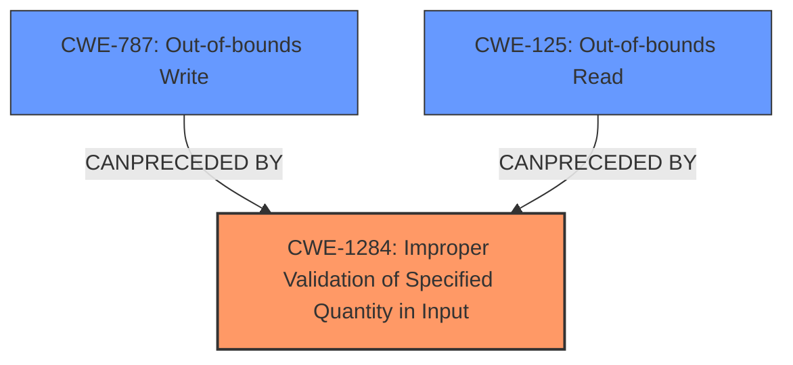

# Analysis for CVE-2024-54107

# Summary
| CWE ID | CWE Name | Confidence | CWE Abstraction Level | CWE Vulnerability Mapping Label | CWE-Vulnerability Mapping Notes |
|---|---|---|---|---|---|
| CWE-1284 | Improper Validation of Specified Quantity in Input | 0.75 | Base | Allowed | Primary CWE, reflects the root cause of the read/write vulnerability by indicating a failure to properly validate input quantities, which leads to memory access issues. |
| CWE-787 | Out-of-bounds Write | 0.65 | Base | Allowed | Secondary Candidate, represents a potential outcome if the input validation issue allows writing beyond buffer boundaries. |
| CWE-125 | Out-of-bounds Read | 0.65 | Base | Allowed | Secondary Candidate, represents a potential outcome if the input validation issue allows reading beyond buffer boundaries. |

## Evidence and Confidence

*   **Confidence Score:** 0.70
*   **Evidence Strength:** MEDIUM

## Relationship Analysis
The primary weakness, CWE-1284, represents **improper validation of input quantities**. This can **precede** both CWE-787 (Out-of-bounds Write) and CWE-125 (Out-of-bounds Read). The relationship is that insufficient validation of size or length can lead to out-of-bounds memory access.

## Vulnerability Chain
The vulnerability chain starts with **improper input validation** (CWE-1284). This leads to a **read/write vulnerability** in the image decoding module which potentially leads to an out-of-bounds read (CWE-125) or an out-of-bounds write (CWE-787). The final impact is affected **availability**.

CWE-1284 (Improper Validation of Specified Quantity in Input) -> CWE-125 (Out-of-bounds Read) / CWE-787 (Out-of-bounds Write) -> Impact (Availability).

## Summary of Analysis
The analysis identifies the **rootcause** as **improper input validation** in the image decoding module, leading to a **read/write vulnerability**.

The initial assessment considered the provided "CWE for similar CVE Descriptions" but focused on the root cause. "CWE-NVD-noinfo" is not specific enough to represent the weakness.

The "Retriever Results" suggested various CWEs, including CWE-125 (Out-of-bounds Read), CWE-190 (Integer Overflow or Wraparound), and CWE-1284 (Improper Validation of Specified Quantity in Input).

Based on the **Vulnerability Description Key Phrases**, the **rootcause** is **improper input validation**, which directly aligns with CWE-1284. The "CVE Reference Links Content Summary" indicates that the **read/write vulnerability** is caused by a flaw in how the image decoding module handles memory access. This reinforces the selection of CWE-1284 as the primary weakness. The read and write aspects suggest that CWE-125 and CWE-787 could be secondary weaknesses that occur as a result of the input validation issue.

The selection of CWE-1284 is at the optimal level of specificity because it addresses the core issue of **improper validation of input quantities**. The other CWEs considered represent potential consequences of this **rootcause**.

Relevant CWE Information:

# Enhanced Context (25 CWEs)

## CWE-824: Access of Uninitialized Pointer
**Abstraction Level**: Base
**Similarity Score**: 0.75
**Source**: dense

**Description**:
The product accesses or uses a pointer that has not been initialized.

**Mapping Guidance**:
- Usage: Allowed
- Rationale: This CWE entry is at the Base level of abstraction, which is a preferred level of abstraction for mapping to the root causes of vulnerabilities.

*Not Used:* While uninitialized pointers could lead to read/write issues, the description focuses on input validation, making this less relevant.

## CWE-125: Out-of-bounds Read
**Abstraction Level**: Base
**Similarity Score**: 0.75
**Source**: dense

**Description**:
The product reads data past the end, or before the beginning, of the intended buffer.

**Mapping Guidance**:
- Usage: Allowed
- Rationale: This CWE entry is at the Base level of abstraction, which is a preferred level of abstraction for mapping to the root causes of vulnerabilities.

*Used as Secondary Candidate:* This is a potential consequence of the input validation issue allowing out-of-bounds memory access.

## CWE-755: Improper Handling of Exceptional Conditions
**Abstraction Level**: Class
**Similarity Score**: 0.75
**Source**: dense

**Description**:
The product does not handle or incorrectly handles an exceptional condition.

**Mapping Guidance**:
- Usage: Discouraged
- Rationale: This CWE entry is a level-1 Class (i.e., a child of a Pillar). It might have lower-level children that would be more appropriate

*Not Used:* Too generic; the vulnerability is more specific than simply not handling exceptions.

## CWE-252: Unchecked Return Value
**Abstraction Level**: Base
**Similarity Score**: 0.75
**Source**: dense

**Description**:
The product does not check the return value from a method or function, which can prevent it from detecting unexpected states and conditions.

**Mapping Guidance**:
- Usage: Allowed
- Rationale: This CWE entry is at the Base level of abstraction, which is a preferred level of abstraction for mapping to the root causes of vulnerabilities.

*Not Used:* Not directly related to the described vulnerability.

## CWE-131: Incorrect Calculation of Buffer Size
**Abstraction Level**: Base
**Similarity Score**: 0.75
**Source**: dense

**Description**:
The product does not correctly calculate the size to be used when allocating a buffer, which could lead to a buffer overflow.

**Mapping Guidance**:
- Usage: Allowed
- Rationale: This CWE entry is at the Base level of abstraction, which is a preferred level of abstraction for mapping to the root causes of vulnerabilities.

*Not Used:* Although related to buffer overflows, the description points more directly to the **improper validation** of a specified quantity, making CWE-1284 a better fit.

## CWE-1285: Improper Validation of Specified Index, Position, or Offset in Input
**Abstraction Level**: Base
**Similarity Score**: 0.75
**Source**: dense

**Description**:
The product receives input that is expected to specify an index, position, or offset into an indexable resource such as a buffer or file, but it does not validate or incorrectly validates that the specified index/position/offset has the required properties.

**Mapping Guidance**:
- Usage: Allowed
- Rationale: This CWE entry is at the Base level of abstraction, which is a preferred level of abstraction for mapping to the root causes of vulnerabilities.

*Not Used:* Similar to CWE-1284, but focuses on index, position, or offset specifically. CWE-1284 is more general and applies better to the **improper validation of a quantity**.

## CWE-789: Memory Allocation with Excessive Size Value
**Abstraction Level**: Variant
**Similarity Score**: 0.74
**Source**: dense

**Description**:
The product allocates memory based on an untrusted, large size value, but it does not ensure that the size is within expected limits, allowing arbitrary amounts of memory to be allocated.

**Mapping Guidance**:
- Usage: Allowed
- Rationale: This CWE entry is at the Variant level of abstraction, which is a preferred level of abstraction for mapping to the root causes of vulnerabilities.

*Not Used:* The vulnerability doesn't explicitly state memory allocation issues, so this is less relevant.

## CWE-119: Improper Restriction of Operations within the Bounds of a Memory Buffer
**Abstraction Level**: Class
**Similarity Score**: 0.74
**Source**: dense

**Description**:
The product performs operations on a memory buffer, but it reads from or writes to a memory location outside the buffer's intended boundary. This may result in read or write operations on unexpected memory locations that could be linked to other variables, data structures, or internal program data.

**Mapping Guidance**:
- Usage: Discouraged
- Rationale: CWE-119 is commonly misused in low-information vulnerability reports when lower-level CWEs could be used instead, or when more details about the vulnerability are available.

*Not Used:* Too general, lower-level CWEs like