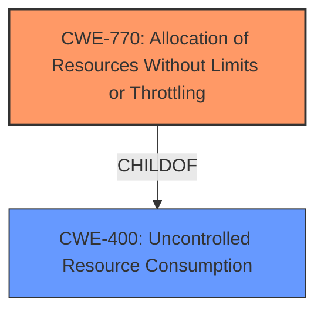

# Analysis for CVE-2024-54113

# Summary
| CWE ID  | CWE Name                                                         | Confidence | CWE Abstraction Level | CWE Vulnerability Mapping Label | CWE-Vulnerability Mapping Notes |
|---------|------------------------------------------------------------------|------------|-----------------------|---------------------------------|---------------------------------|
| CWE-770 | Allocation of Resources Without Limits or Throttling         | 0.75       | Base                  | Primary                          | Allowed                         |
| CWE-400 | Uncontrolled Resource Consumption                               | 0.60       | Class                  | Secondary                        | Discouraged                     |

## Evidence and Confidence

*   **Confidence Score:** 0.70
*   **Evidence Strength:** MEDIUM

## Relationship Analysis
The primary CWE identified is CWE-770 (Allocation of Resources Without Limits or Throttling), as the root cause involves the print module not terminating under abnormal circumstances. CWE-400 (Uncontrolled Resource Consumption) is a parent of CWE-770 and describes a high-level impact of the vulnerability, but is less specific. The hierarchical relationship between CWE-770 and CWE-400 influenced the selection.

## Vulnerability Chain
The vulnerability chain starts with the print module's failure to terminate under abnormal circumstances. This leads to uncontrolled resource allocation, ultimately impacting power consumption.
  - Root Cause: Improper process termination under abnormal conditions.
  - Weakness: CWE-770 Allocation of Resources Without Limits or Throttling
  - Impact: Affects power consumption.

## Summary of Analysis
The analysis is primarily based on the provided vulnerability description and the associated key phrases. The description indicates that the print module fails to terminate properly under abnormal scenarios, leading to potential resource allocation issues. This directly aligns with CWE-770, which describes allocation of resources without limits or throttling. The impact of affecting power consumption is a symptom of uncontrolled resource consumption.

The selection of CWE-770 is at the Base level of abstraction, offering a more specific characterization of the vulnerability compared to its parent, CWE-400. While CWE-400 could broadly apply, CWE-770 provides a more precise description of the root cause.

Relevant CWE Information:

# Enhanced Context (25 CWEs)
The following CWEs were identified as potentially relevant to this vulnerability:

## CWE-755: Improper Handling of Exceptional Conditions
**Abstraction Level**: Class
**Similarity Score**: 0.72
**Source**: dense

**Description**:
The product does not handle or incorrectly handles an exceptional condition.

**Mapping Guidance**:
- Usage: Discouraged
- Rationale: This CWE entry is a level-1 Class (i.e., a child of a Pillar). It might have lower-level children that would be more appropriate

## CWE-400: Uncontrolled Resource Consumption
**Abstraction Level**: Class
**Similarity Score**: 0.71
**Source**: dense

**Description**:
The product does not handle or incorrectly handles an exceptional condition.

**Mapping Guidance**:
- Usage: Discouraged
- Rationale: This CWE entry is a level-1 Class (i.e., a child of a Pillar). It might have lower-level children that would be more appropriate

## CWE-770: Allocation of Resources Without Limits or Throttling
**Abstraction Level**: Base
**Similarity Score**: 0.71
**Source**: dense

**Description**:
The product does not handle or incorrectly handles an exceptional condition.

**Mapping Guidance**:
- Usage: Discouraged
- Rationale: This CWE entry is a level-1 Class (i.e., a child of a Pillar). It might have lower-level children that would be more appropriate

## CWE-770: Allocation of Resources Without Limits or Throttling
**Abstraction Level**: base
**Similarity Score**: 4.33
**Source**: graph

**Description**:
CWE-770: Allocation of Resources Without Limits or Throttling

**Mapping Guidance**:
- Usage: Allowed
- Rationale: This CWE entry is at the Base level of abstraction, which is a preferred level of abstraction for mapping to the root causes of vulnerabilities.

**Relationships**:
- PARENTOF -> CWE-789
- PARENTOF -> CWE-774
- CANFOLLOW -> CWE-20
- PARENTOF -> CWE-1325
- CHILDOF -> CWE-400

## CWE-1325: Improperly Controlled Sequential Memory Allocation
**Abstraction Level**: base
**Similarity Score**: 4.39
**Source**: graph

**Description**:
CWE-1325: Improperly Controlled Sequential Memory Allocation

**Mapping Guidance**:
- Usage: Allowed
- Rationale: This CWE entry is at the Base level of abstraction, which is a preferred level of abstraction for mapping to the root causes of vulnerabilities.

### CWE-770: Allocation of Resources Without Limits or Throttling
**Technical Explanation:** CWE-770 (Allocation of Resources Without Limits or Throttling) describes a scenario where a product allocates resources without imposing restrictions on the size or number of resources allocated. In this case, the print module, under abnormal conditions, fails to terminate, potentially leading to uncontrolled allocation of resources. This aligns with the vulnerability description, where the **weakness** is a process residence issue causing the process to continue running, thus allocating resources.
**Security Implications:** This can lead to resource exhaustion, denial of service, and potentially affect the overall stability of the system. In this specific case, the impact is stated as affecting power consumption, which is a direct consequence of continuous resource allocation.
**Relationship Analysis:** CWE-770 is a child of CWE-400 (Uncontrolled Resource Consumption), indicating a more specific type of resource consumption issue.
**Mapping Guidance:** The Usage for CWE-770 is Allowed.
**Confidence:** 0.75

### CWE-400: Uncontrolled Resource Consumption
**Technical Explanation:** CWE-400 (Uncontrolled Resource Consumption) describes a condition where a product does not properly control the consumption of resources, which can lead to a variety of negative impacts, including denial of service. The provided description of the vulnerability states that the print module's failure to terminate under abnormal conditions may affect power consumption. This aligns with the concept of uncontrolled resource consumption as a process that continues running will consume power.
**Security Implications:** The security implications include denial of service, reduced system performance, and, in this case, increased power consumption.
**Relationship Analysis:** CWE-400 is a parent of CWE-770 (Allocation of Resources Without Limits or Throttling), as the uncontrolled allocation of resources is a specific type of uncontrolled resource consumption.
**Mapping Guidance:** The Usage for CWE-400 is Discouraged because more specific CWEs are available.
**Confidence:** 0.60

**Other CWEs Considered but Not Used:**

*   CWE-755 (Improper Handling of Exceptional Conditions): While abnormal scenarios are mentioned, the core issue is the lack of termination and subsequent resource allocation, making CWE-770 a more precise fit.
*   CWE-1325 (Improperly Controlled Sequential Memory Allocation): Not selected because the vulnerability description does not explicitly specify sequential memory allocations. The issue is more generally about a process failing to terminate and consuming resources.