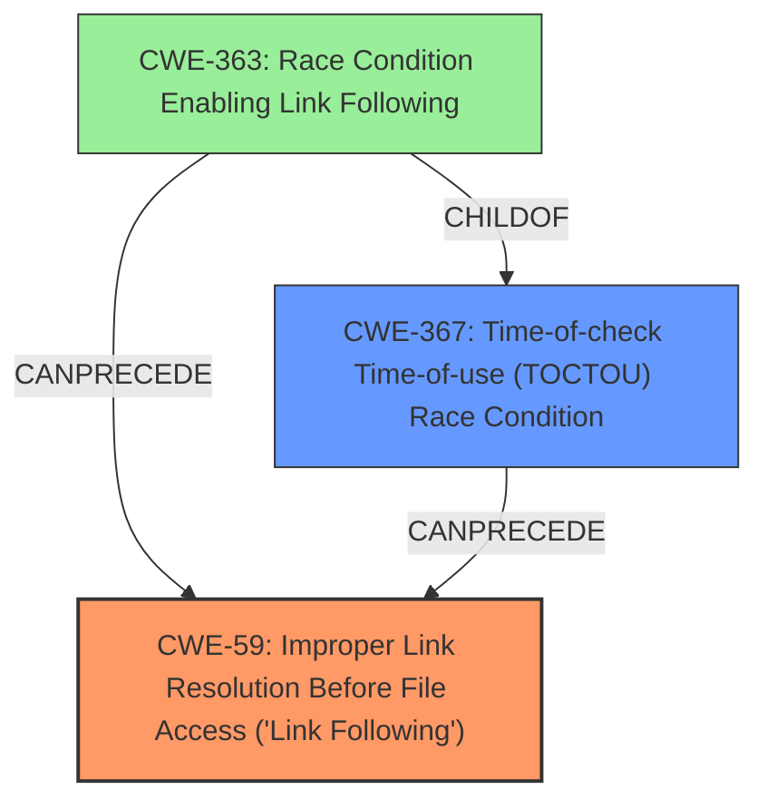

# Analysis Report for CVE-2024-54159

# Vulnerability Analysis Report: CVE-2024-54159

## Description

stalld through 1.19.7 allows local users to cause a denial of service (file overwrite) via a /tmp/rtthrottle symlink attack.

## Vulnerability Description Key Phrases

- **Impact:** denial of service
- **Vector:** /tmp/rtthrottle symlink attack
- **Attacker:** local users
- **Product:** stalld
- **Version:** through 1.19.7

## Analysis (with Relationship Data)

# Summary

| CWE ID | CWE Name | Confidence | CWE Abstraction Level | CWE Vulnerability Mapping Label | CWE-Vulnerability Mapping Notes |
|---|---|---|---|---|---|
| CWE-59 | Improper Link Resolution Before File Access ('Link Following') | 0.9 | Base | Allowed | Primary CWE |
| CWE-367 | Time-of-check Time-of-use (TOCTOU) Race Condition | 0.7 | Base | Allowed | Secondary Candidate |

## Evidence and Confidence

*   **Confidence Score:** 0.8
*   **Evidence Strength:** HIGH

## Relationship Analysis
The primary CWE is CWE-59, which describes the vulnerability where the program doesn't properly prevent a filename from resolving to an unintended resource via a link or shortcut. CWE-367 is a secondary consideration, representing a Time-of-Check Time-of-Use race condition, which can precede the link following. CWE-363 "Race Condition Enabling Link Following" is a child of CWE-367 and CANPRECEDE CWE-59, however there is no evidence to support the existence of a race condition. Therefore CWE-363 is not applicable. The abstraction level of CWE-59 (Base) is appropriate as it directly describes the weakness.



## Vulnerability Chain
The vulnerability chain starts with the **improper handling of symbolic links** (CWE-59), allowing a local user to redirect file writes via a symlink. This leads to a denial-of-service impact due to file overwrites. A potential race condition (CWE-367) could exist, but there is no explicit evidence to support that.

## Summary of Analysis
The analysis is strongly based on the provided evidence, specifically: "stalld through 1.19.7 allows local users to cause a denial of service (file overwrite) via a /tmp/rtthrottle symlink attack." The CVE Reference Links Content Summary further clarifies that the script does not properly prevent the filename from identifying a link, which directly aligns with CWE-59.

CWE-59 is selected as the primary CWE because it directly describes the **root cause** of the vulnerability: the **improper handling of symbolic links** allowing for file overwrite. CWE-367 (Time-of-check Time-of-use Race Condition) was considered because a race condition could potentially exist, however there is no evidence to support that.

The retriever results and graph relationships were used to confirm and refine the selection, ensuring that the chosen CWE is at the appropriate level of abstraction and accurately reflects the vulnerability.

Relevant CWE Information:
- CWE-59: Improper Link Resolution Before File Access ('Link Following')
- CWE-367: Time-of-check Time-of-use (TOCTOU) Race Condition
- CWE-363: Race Condition Enabling Link Following
# Enhanced Context (25 CWEs)
The following CWEs were identified as potentially relevant to this vulnerability:

## CWE-367: Time-of-check Time-of-use (TOCTOU) Race Condition
**Abstraction Level**: Base
**Similarity Score**: 0.75
**Source**: dense

**Description**:
The product checks the state of a resource before using that resource, but the resource's state can change between the check and the use in a way that invalidates the results of the check. This can cause the product to perform invalid actions when the resource is in an unexpected state.

**Mapping Guidance**:
- Usage: Allowed
- Rationale: This CWE entry is at the Base level of abstraction, which is a preferred level of abstraction for mapping to the root causes of vulnerabilities.
**Selected?**: Yes, as a secondary candidate.

## CWE-362: Concurrent Execution using Shared Resource with Improper Synchronization ('Race Condition')
**Abstraction Level**: Class
**Similarity Score**: 0.75
**Source**: dense

**Description**:
The product contains a concurrent code sequence that requires temporary, exclusive access to a shared resource, but a timing window exists in which the shared resource can be modified by another code sequence operating concurrently.

**Mapping Guidance**:
- Usage: Allowed-with-Review
- Rationale: This CWE entry is a Class and might have Base-level children that would be more appropriate
**Selected?**: No, there's no evidence of concurrent execution or shared resources being improperly synchronized. CWE-367 is a better fit as it is a type of race condition.

## CWE-59: Improper Link Resolution Before File Access ('Link Following')
**Abstraction Level**: Base
**Similarity Score**: 0.74
**Source**: dense

**Description**:
The product attempts to access a file based on the filename, but it does not properly prevent that filename from identifying a link or shortcut that resolves to an unintended resource.

**Mapping Guidance**:
- Usage: Allowed
- Rationale: This CWE entry is at the Base level of abstraction, which is a preferred level of abstraction for mapping to the root causes of vulnerabilities.
**Selected?**: Yes, as the primary CWE.

## CWE-378: Creation of Temporary File With Insecure Permissions
**Abstraction Level**: Base
**Similarity Score**: 0.73
**Source**: dense

**Description**:
Opening temporary files without appropriate measures or controls can leave the file, its contents and any function that it impacts vulnerable to attack.

**Mapping Guidance**:
- Usage: Allowed
- Rationale: This CWE entry is at the Base level of abstraction, which is a preferred level of abstraction for mapping to the root causes of vulnerabilities.
**Selected?**: No, the primary issue is the symlink attack, not insecure permissions of the temporary file itself.

## CWE-755: Improper Handling of Exceptional Conditions
**Abstraction Level**: Class
**Similarity Score**: 0.73
**Source**: dense

**Description**:
The product does not handle or incorrectly handles an exceptional condition.

**Mapping Guidance**:
- Usage: Discouraged
- Rationale: This CWE entry is a level-1 Class (i.e., a child of a Pillar). It might have lower-level children that would be more appropriate
**Selected?**: No, it's too general and doesn't fit the specific vulnerability.

## CWE-667: Improper Locking
**Abstraction Level**: Class
**Similarity Score**: 0.73
**Source**: dense

**Description**:
The product does not properly acquire or release a lock on a resource, leading to unexpected resource state changes and behaviors.

**Mapping Guidance**:
- Usage: Allowed-with-Review
- Rationale: This CWE entry is a Class and might have Base-level children that would be more appropriate
**Selected?**: No, there's no mention of locking issues in the vulnerability description.

## CWE-61: UNIX Symbolic Link (Symlink) Following
**Abstraction Level**: Compound
**Similarity Score**: 0.73
**Source**: dense

**Description**:
The product, when opening a file or directory, does not sufficiently account for when the file is a symbolic link that resolves to a target outside of the intended control sphere. This could allow an attacker to cause the product to operate on unauthorized files.

**Mapping Guidance**:
- Usage: Allowed
- Rationale: This is a well-known Composite of multiple weaknesses that must all occur simultaneously, although it is attack-oriented in nature.
**Selected?**: No, CWE-59 is a more direct and specific representation of the vulnerability.

## CWE-754: Improper Check for Unusual or Exceptional Conditions
**Abstraction Level**: Class
**Similarity Score**: 0.72
**Source**: dense

**Description**:
The product does not check or incorrectly checks for unusual or exceptional conditions that are not expected to occur frequently during day to day operation of the product.

**Mapping Guidance**:
- Usage: Allowed-with-Review
- Rationale: This CWE entry is a Class and might have Base-level children that would be more appropriate
**Selected?**: No, it's too general.

## CWE-923: Improper Restriction of Communication Channel to Intended Endpoints
**Abstraction Level**: Class
**Similarity Score**: 0.72
**Source**: dense

**Description**:
The product establishes a communication channel to (or from) an endpoint for privileged or protected operations, but it does not properly ensure that it is communicating with the correct endpoint.

**Mapping Guidance**:
- Usage: Allowed-with-Review
- Rationale:


## CWE Relationship Analysis

Current CWEs represent these abstraction levels: .


### Vulnerability Chain Analysis

**Chain starting from CWE-378:**
- 378 (Creation of Temporary File With Insecure Permissions) - ROOT


**Chain starting from CWE-59:**
- 59 (Improper Link Resolution Before File Access ('Link Following')) - ROOT


### CWE Relationship Diagram

```mermaid
graph TD
    classDef primary fill:#f96,stroke:#333,stroke-width:2px
    classDef secondary fill:#69f,stroke:#333
    classDef tertiary fill:#9e9,stroke:#333
```


*Report generated on 2025-07-13 22:32:48*
