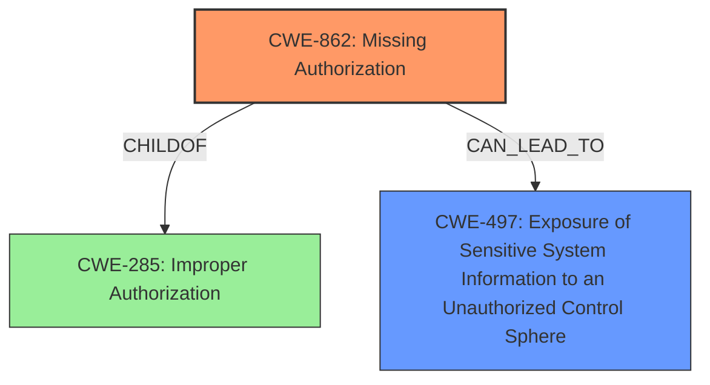

# Analysis for CVE-2024-54176

# Summary
| CWE ID  | CWE Name                      | Confidence | CWE Abstraction Level | CWE Vulnerability Mapping Label | CWE-Vulnerability Mapping Notes |
| :-------- | :---------------------------- | :--------- | :-------------------- | :------------------------------ | :------------------------------ |
| CWE-862 | Missing Authorization         | 1.0      | Class               | Allowed-with-Review             | Primary CWE                     |
| CWE-497 | Exposure of Sensitive System Information to an Unauthorized Control Sphere | 0.7      | Base                | Allowed                         | Secondary Candidate             |

## Evidence and Confidence

*   **Confidence Score:** 0.9
*   **Evidence Strength:** HIGH

## Relationship Analysis
The primary relationship that impacted my decision was the parent-child relationship between CWE-285 (Improper Authorization), CWE-863 (Incorrect Authorization), and CWE-862 (Missing Authorization). CWE-862, Missing Authorization, is a child of CWE-285 and represents a more specific case where authorization is completely missing. Since the vulnerability description explicitly mentions "**missing authorization**," CWE-862 is the more appropriate choice. CWE-497 is a related impact, where sensitive information is exposed, as a result of the missing authorization.

## Vulnerability Chain
The vulnerability chain starts with the **missing authorization**, leading to the exposure of sensitive information about other users.

`Missing Authorization` -> `Exposure of Sensitive Information`

- CWE-862: Root cause - **Missing Authorization**
- CWE-497: Impact - Exposure of Sensitive System Information

## Summary of Analysis
The initial analysis focused on identifying the root cause of the vulnerability. The vulnerability description and the CVE Reference Links Content Summary both explicitly state that the vulnerability is due to **missing authorization** for a function. This directly aligns with the definition of CWE-862 (Missing Authorization).

The relationship graph highlights the connection between CWE-862 and its parent, CWE-285 (Improper Authorization), but the explicit mention of **missing authorization** makes CWE-862 the more specific and appropriate choice. The technical impact, the ability to obtain sensitive information, further supports the classification.

The selected CWEs are at the optimal level of specificity because CWE-862 accurately captures the **missing authorization**, while CWE-497 reflects the impact of the vulnerability.

Relevant CWE Information:

# Enhanced Context (25 CWEs)
The following CWEs were identified as potentially relevant to this vulnerability:

## CWE-497: Exposure of Sensitive System Information to an Unauthorized Control Sphere
**Abstraction Level**: Base
**Similarity Score**: 0.77
**Source**: dense

**Description**:
The product does not properly prevent sensitive system-level information from being accessed by unauthorized actors who do not have the same level of access to the underlying system as the product does.

**Mapping Guidance**:
- Usage: Allowed
- Rationale: This CWE entry is at the Base level of abstraction, which is a preferred level of abstraction for mapping to the root causes of vulnerabilities.

## CWE-862: Missing Authorization
**Abstraction Level**: Class
**Similarity Score**: 1591.96
**Source**: sparse

**Description**:
The product does not perform an authorization check when an actor attempts to access a resource or perform an action.

**Mapping Guidance**:
- Usage: Allowed-with-Review
- Rationale: This CWE entry is a Class and might have Base-level children that would be more appropriate

# Complete CWE Specifications

CWE-284: Improper Access Control

CWE-863: Incorrect Authorization

CWE-522: Insufficiently Protected Credentials

CWE-327: Use of a Broken or Risky Cryptographic Algorithm

CWE-862: Missing Authorization

CWE-201: Insertion of Sensitive Information Into Sent Data

CWE-639: Authorization Bypass Through User-Controlled Key

CWE-306: Missing Authentication for Critical Function

CWE-269: Improper Privilege Management

CWE-208: Observable Timing Discrepancy