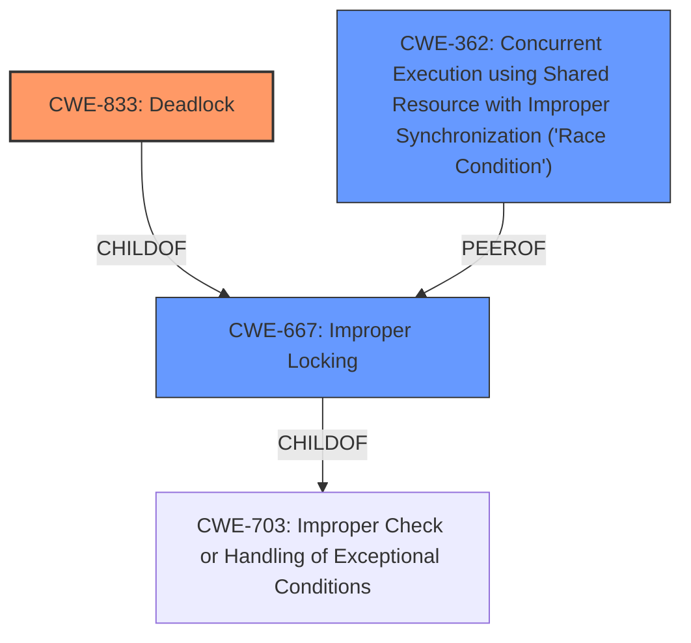

# Analysis Report for CVE-2024-54191

# Vulnerability Analysis Report: CVE-2024-54191

## Description

In the Linux kernel, the following vulnerability has been resolved Bluetooth iso Fix circular lock in iso_conn_big_sync This fixes the **circular locking dependency** warning below, by reworking iso_sock_recvmsg, to ensure that the socket lock is always released before calling a function that locks hdev. [ 561.670344] ====================================================== [ 561.670346] WARNING possible **circular locking dependency** detected [ 561.670349] 6.12.0-rc6+ #26 Not tainted [ 561.670351] ------------------------------------------------------ [ 561.670353] iso-tester/3289 is trying to acquire lock [ 561.670355] ffff88811f600078 (&hdev->lock){+.+.}-{33}, at iso_conn_big_sync+0x73/0x260 [bluetooth] [ 561.670405] but task is already holding lock [ 561.670407] ffff88815af58258 (sk_lock-AF_BLUETOOTH){+.+.}-{00}, at iso_sock_recvmsg+0xbf/0x500 [bluetooth] [ 561.670450] which lock already depends on the new lock. [ 561.670452] the existing dependency chain (in reverse order) is [ 561.670453] -> #2 (sk_lock-AF_BLUETOOTH){+.+.}-{00} [ 561.670458] lock_acquire+0x7c/0xc0 [ 561.670463] lock_sock_nested+0x3b/0xf0 [ 561.670467] bt_accept_dequeue+0x1a5/0x4d0 [bluetooth] [ 561.670510] iso_sock_accept+0x271/0x830 [bluetooth] [ 561.670547] do_accept+0x3dd/0x610 [ 561.670550] __sys_accept4+0xd8/0x170 [ 561.670553] __x64_sys_accept+0x74/0xc0 [ 561.670556] x64_sys_call+0x17d6/0x25f0 [ 561.670559] do_syscall_64+0x87/0x150 [ 561.670563] entry_SYSCALL_64_after_hwframe+0x76/0x7e [ 561.670567] -> #1 (sk_lock-AF_BLUETOOTH-BTPROTO_ISO){+.+.}-{00} [ 561.670571] lock_acquire+0x7c/0xc0 [ 561.670574] lock_sock_nested+0x3b/0xf0 [ 561.670577] iso_sock_listen+0x2de/0xf30 [bluetooth] [ 561.670617] __sys_listen_socket+0xef/0x130 [ 561.670620] __x64_sys_listen+0xe1/0x190 [ 561.670623] x64_sys_call+0x2517/0x25f0 [ 561.670626] do_syscall_64+0x87/0x150 [ 561.670629] entry_SYSCALL_64_after_hwframe+0x76/0x7e [ 561.670632] -> #0 (&hdev->lock){+.+.}-{33} [ 561.670636] __lock_acquire+0x32ad/0x6ab0 [ 561.670639] lock_acquire.part.0+0x118/0x360 [ 561.670642] lock_acquire+0x7c/0xc0 [ 561.670644] __mutex_lock+0x18d/0x12f0 [ 561.670647] mutex_lock_nested+0x1b/0x30 [ 561.670651] iso_conn_big_sync+0x73/0x260 [bluetooth] [ 561.670687] iso_sock_recvmsg+0x3e9/0x500 [bluetooth] [ 561.670722] sock_recvmsg+0x1d5/0x240 [ 561.670725] sock_read_iter+0x27d/0x470 [ 561.670727] vfs_read+0x9a0/0xd30 [ 561.670731] ksys_read+0x1a8/0x250 [ 561.670733] __x64_sys_read+0x72/0xc0 [ 561.670736] x64_sys_call+0x1b12/0x25f0 [ 561.670738] do_syscall_64+0x87/0x150 [ 561.670741] entry_SYSCALL_64_after_hwframe+0x76/0x7e [ 561.670744] other info that might help us debug this [ 561.670745] Chain exists of &hdev->lock --> sk_lock-AF_BLUETOOTH-BTPROTO_ISO --> sk_lock-AF_BLUETOOTH [ 561.670751] Possible unsafe locking scenario [ 561.670753] CPU0 CPU1 [ 561.670754] ---- ---- [ 561.670756] lock(sk_lock-AF_BLUETOOTH) [ 561.670758] lock(sk_lock AF_BLUETOOTH-BTPROTO_ISO) [ 561.670761] lock(sk_lock-AF_BLUETOOTH) [ 561.670764] lock(&hdev->lock) [ 561.670767] *** DEADLOCK ***

## Vulnerability Description Key Phrases

- **Rootcause:** circular locking dependency
- **Product:** Linux kernel
- **Version:** 6.12.0-rc6+
- **Component:** Bluetooth iso

## Analysis (with Relationship Data)

# Summary

| CWE ID  | CWE Name                                                                    | Confidence | CWE Abstraction Level | CWE Vulnerability Mapping Label | CWE-Vulnerability Mapping Notes |
| :------- | :-------------------------------------------------------------------------- | :--------- | :---------------------- | :------------------------------ | :------------------------------ |
| CWE-833 | Deadlock                                                                      | 0.9        | Base                    | Primary                         | Allowed                       |
| CWE-667 | Improper Locking                                                            | 0.7        | Class                   | Secondary                       | Allowed-with-Review           |
| CWE-362 | Concurrent Execution using Shared Resource with Improper Synchronization ('Race Condition') | 0.6 | Class | Secondary | Allowed-with-Review |

## Evidence and Confidence

*   **Confidence Score:** 0.8
*   **Evidence Strength:** HIGH

## Relationship Analysis

The primary CWE is CWE-833, Deadlock, which is a Base level CWE. CWE-667 (Improper Locking) and CWE-362 (Race Condition) are Class level CWEs and are related to concurrency issues, but less specific than Deadlock in this context.
The hierarchical relationships help clarify the nature of the vulnerability. CWE-833 is a specific type of concurrency issue which helps narrow down the selection.



## Vulnerability Chain

The vulnerability chain starts with **improper locking**, leading to a **circular locking dependency**, and resulting in a **deadlock**.

*   **Root Cause:** Improper Locking/Synchronization
*   **Weakness:** Circular Locking Dependency
*   **Impact:** Deadlock

## Summary of Analysis

The primary focus is on the **circular locking dependency**, which leads to a **deadlock** condition. The evidence strongly supports the selection of CWE-833 (Deadlock) as the primary CWE. The vulnerability description highlights the **circular locking dependency** and the resulting **deadlock**, making CWE-833 the most appropriate choice.

The retriever results also suggest considering CWE-833 (Deadlock), which aligns with the vulnerability description.

CWE-667 (Improper Locking) is considered as a secondary CWE, because it describes the root cause of the deadlock. The **circular locking dependency** indicates that locks are not being managed correctly.

CWE-362 (Race Condition) is a possible secondary CWE, since race conditions often involve shared resources and improper synchronization, which could contribute to locking issues.

The selected CWEs are at the optimal level of specificity, as they accurately reflect the root cause and impact of the vulnerability.

Relevant CWE Information:

# Enhanced Context (25 CWEs)
The following CWEs were identified as potentially relevant to this vulnerability:

## CWE-667: Improper Locking
**Abstraction Level**: Class
**Similarity Score**: 0.76
**Source**: dense

**Description**:
The product does not properly acquire or release a lock on a resource, leading to unexpected resource state changes and behaviors.

**Mapping Guidance**:
- Usage: Allowed-with-Review
- Rationale: This CWE entry is a Class and might have Base-level children that would be more appropriate

## CWE-833: Deadlock
**Abstraction Level**: Base
**Similarity Score**: 0.75
**Source**: dense

**Description**:
The product contains multiple threads or executable segments that are waiting for each other to release a necessary lock, resulting in deadlock.

**Mapping Guidance**:
- Usage: Allowed
- Rationale: This CWE entry is at the Base level of abstraction, which is a preferred level of abstraction for mapping to the root causes of vulnerabilities.

## CWE-824: Access of Uninitialized Pointer
**Abstraction Level**: Base
**Similarity Score**: 0.73
**Source**: dense

**Description**:
The product accesses or uses a pointer that has not been initialized.

**Mapping Guidance**:
- Usage: Allowed
- Rationale: This CWE entry is at the Base level of abstraction, which is a preferred level of abstraction for mapping to the root causes of vulnerabilities.

## CWE-754: Improper Check for Unusual or Exceptional Conditions
**Abstraction Level**: Class
**Similarity Score**: 0.73
**Source**: dense

**Description**:
The product does not check or incorrectly checks for unusual or exceptional conditions that are not expected to occur frequently during day to day operation of the product.

**Mapping Guidance**:
- Usage: Allowed-with-Review
- Rationale: This CWE entry is a Class and might have Base-level children that would be more appropriate

## CWE-362: Concurrent Execution using Shared Resource with Improper Synchronization ('Race Condition')
**Abstraction Level**: Class
**Similarity Score**: 0.72
**Source**: dense

**Description**:
The product contains a concurrent code sequence that requires temporary, exclusive access to a shared resource, but a timing window exists in which the shared resource can be modified by another code sequence operating concurrently.

**Mapping Guidance**:
- Usage: Allowed-with-Review
- Rationale: This CWE entry is a Class and might have Base-level children that would be more appropriate

## CWE-703: Improper Check or Handling of Exceptional Conditions
**Abstraction Level**: Pillar
**Similarity Score**: 0.72
**Source**: dense

**Description**:
The product does not properly anticipate or handle exceptional conditions that rarely occur during normal operation of the product.

**Mapping Guidance**:
- Usage: Discouraged
- Rationale: This CWE entry is extremely high-level, a Pillar.

## CWE-252: Unchecked Return Value
**Abstraction Level**: Base
**Similarity Score**: 0.72
**Source**: dense

**Description**:
The product does not check the return value from a method or function, which can prevent it from detecting unexpected states and conditions.

**Mapping Guidance**:
- Usage: Allowed
- Rationale: This CWE entry is at the Base level of abstraction, which is a preferred level of abstraction for mapping to the root causes of vulnerabilities.

## CWE-131: Incorrect Calculation of Buffer Size
**Abstraction Level**: Base
**Similarity Score**: 0.72
**Source**: dense

**Description**:
The product does not correctly calculate the size to be used when allocating a buffer, which could lead to a buffer overflow.

**Mapping Guidance**:
- Usage: Allowed
- Rationale: This CWE entry is at the Base level of abstraction, which is a preferred level of abstraction for mapping to the root causes of vulnerabilities.

## CWE-476: NULL Pointer Dereference
**Abstraction Level**: Base
**Similarity Score**: 0.71
**Source**: dense

**Description**:
The product dereferences a pointer that it expects to be valid but is NULL.

**Mapping Guidance**:
- Usage: Allowed
- Rationale: This CWE entry is at the Base level of abstraction, which is a preferred level of abstraction for mapping to the root causes of vulnerabilities.

## CWE-755: Improper Handling of Exceptional Conditions
**Abstraction Level**: Class
**Similarity Score**: 0.71
**Source**: dense

**Description**:
The product does not handle or incorrectly handles an exceptional condition.

**Mapping Guidance**:
- Usage: Discouraged
- Rationale: This CWE entry is a level-1 Class (i.e., a child of a Pillar). It might have lower-level children that would be more appropriate

## CWE-561: Dead Code
**Abstraction Level**: Base
**Similarity Score**: 839.46
**Source**: sparse

**Description**:
The product contains dead code, which can never be executed.

**Mapping Guidance**:
- Usage: Allowed
- Rationale: This CWE entry is at the Base level of abstraction, which is a preferred level of abstraction for mapping to the root causes of vulnerabilities.

## CWE-1164: Irrelevant Code
**Abstraction Level**: Class
**Similarity Score**: 765.71
**Source**: sparse

**Description**:
The product contains code that is not essential for execution,
	     i.e. makes no state changes and has no side effects that alter
	     data or control flow, such that removal of the code would have no impact
	     to functionality or correctness.

**Mapping Guidance**:
- Usage: Allowed-with-Review
- Rationale: This CWE entry is a Class and might have Base-level children that would be more appropriate

## CWE-


## CWE Relationship Analysis

Current CWEs represent these abstraction levels: .


### Vulnerability Chain Analysis

**Chain starting from CWE-1164:**
- 1164 (Irrelevant Code) - ROOT


**Chain starting from CWE-476:**
- 476 (NULL Pointer Dereference) - ROOT


### CWE Relationship Diagram

```mermaid
graph TD
    classDef primary fill:#f96,stroke:#333,stroke-width:2px
    classDef secondary fill:#69f,stroke:#333
    classDef tertiary fill:#9e9,stroke:#333
```


*Report generated on 2025-07-13 22:33:46*
