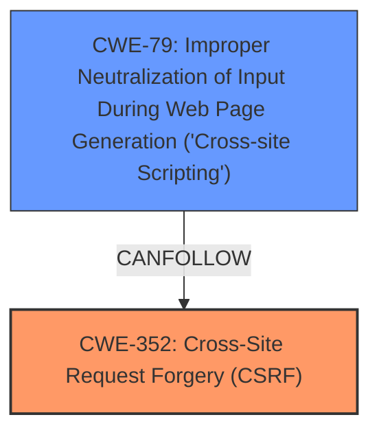

# Analysis for CVE-2024-54332

# Summary
| CWE ID  | CWE Name                                                                  | Confidence | CWE Abstraction Level | CWE Vulnerability Mapping Label | CWE-Vulnerability Mapping Notes |
| :-------- | :------------------------------------------------------------------------ | :--------- | :-------------------- | :------------------------------ | :------------------------------ |
| CWE-352   | Cross-Site Request Forgery (CSRF)                                       | 0.9        | Compound              | Primary                         | Allowed                         |
| CWE-79    | Improper Neutralization of Input During Web Page Generation ('Cross-site Scripting') | 0.8        | Base                  | Secondary                       | Allowed                         |

## Evidence and Confidence

*   **Confidence Score:** 0.85
*   **Evidence Strength:** MEDIUM

## Relationship Analysis
The primary weakness is the **lack of CSRF protection**, which allows an attacker to perform actions on behalf of a user without their consent. This can lead to stored **XSS** because the attacker can inject malicious scripts that are then stored on the server and executed by other users. The relationship between CWE-352 [CWE-352: Cross-Site Request Forgery (CSRF)] and CWE-79 [CWE-79: Improper Neutralization of Input During Web Page Generation ('Cross-site Scripting')] is that the **lack of CSRF protection** (CWE-352) can **allow** an attacker to inject malicious code, and the improper neutralization of input (CWE-79) then **allows** that code to be stored and executed.

## Vulnerability Chain
The vulnerability chain starts with the **lack of CSRF protection** (CWE-352) which allows an attacker to inject malicious input. Then due to **improper neutralization** of that input (CWE-79), the malicious script is stored and executed in the context of other users.

## Summary of Analysis
The vulnerability description clearly states that the WP Currency Exchange Rates plugin is vulnerable to Cross-Site Request Forgery (CSRF) leading to Stored XSS. The root cause is the **lack of CSRF protection**, which allows an attacker to inject malicious scripts. The **XSS** vulnerability is a consequence of the injected script not being properly neutralized.

The primary CWE is CWE-352 [CWE-352: Cross-Site Request Forgery (CSRF)], as the **lack of CSRF protection** is the root cause of the vulnerability. The secondary CWE is CWE-79 [CWE-79: Improper Neutralization of Input During Web Page Generation ('Cross-site Scripting')], as the injected script is not properly neutralized, leading to the stored XSS.

I considered other CWEs, such as CWE-80 [CWE-80: Improper Neutralization of Script-Related HTML Tags in a Web Page (Basic XSS)], CWE-116 [CWE-116: Improper Encoding or Escaping of Output], and CWE-434 [CWE-434: Unrestricted Upload of File with Dangerous Type], but they are not as relevant as CWE-79 [CWE-79: Improper Neutralization of Input During Web Page Generation ('Cross-site Scripting')], which directly addresses the **improper neutralization** of input.

The selection of CWE-352 [CWE-352: Cross-Site Request Forgery (CSRF)] and CWE-79 [CWE-79: Improper Neutralization of Input During Web Page Generation ('Cross-site Scripting')] is at the optimal level of specificity, as they directly address the root cause and the resulting vulnerability.