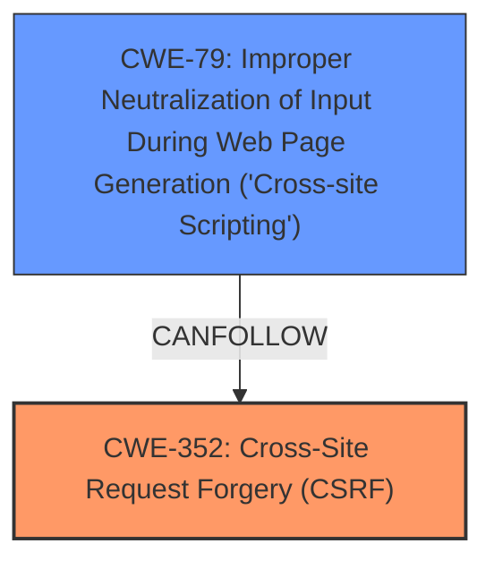

# Analysis Report for CVE-2024-54351

# Vulnerability Analysis Report: CVE-2024-54351

## Description

**Cross-Site Request Forgery (CSRF)** vulnerability in Tom Landis Fancy Roller Scroller allows Stored **XSS**.This issue affects Fancy Roller Scroller from n/a through 1.4.0.

## Vulnerability Description Key Phrases

- **Rootcause:** Cross-Site Request Forgery (CSRF)
- **Weakness:** XSS
- **Impact:** Stored XSS
- **Product:** Tom Landis Fancy Roller Scroller
- **Version:** n/a through 1.4.0

## Analysis (with Relationship Data)

# Summary
| CWE ID | CWE Name | Confidence | CWE Abstraction Level | CWE Vulnerability Mapping Label | CWE-Vulnerability Mapping Notes |
|---|---|---|---|---|---|
| **CWE-352** | **Cross-Site Request Forgery (CSRF)** | 0.9 | Compound | Primary | Allowed |
| CWE-79 | Improper Neutralization of Input During Web Page Generation ('Cross-site Scripting') | 0.7 | Base | Secondary | Allowed |

## Evidence and Confidence

*   **Confidence Score:** 0.8
*   **Evidence Strength:** HIGH

## Relationship Analysis
The primary weakness is identified as CWE-352, **Cross-Site Request Forgery (CSRF)**, which allows for Stored **XSS** (CWE-79). CWE-352 is a compound weakness, suggesting it's a combination of multiple underlying issues. CWE-79 is a base weakness, representing the specific **XSS** vulnerability that results from the CSRF.



## Vulnerability Chain
The vulnerability chain starts with the **Cross-Site Request Forgery (CSRF)** vulnerability (CWE-352). A successful CSRF attack can then lead to Stored **XSS** (CWE-79), where malicious scripts are injected and stored on the server, affecting other users. The root cause is the **CSRF** vulnerability, which allows attackers to perform actions on behalf of legitimate users, ultimately leading to the **XSS** vulnerability.

## Summary of Analysis
The analysis indicates a **Cross-Site Request Forgery (CSRF)** vulnerability that leads to Stored **XSS**. The "CVE Reference Links Content Summary" states that the root cause is **Cross-Site Request Forgery (CSRF)**.
The description clearly states that a **Cross-Site Request Forgery (CSRF)** vulnerability allows Stored **XSS**.
Based on the retriever results, CWE-79 has a high score. However, the vulnerability description states the root cause is **CSRF**, so it's more appropriate to assign CWE-352 as the primary weakness.

Relevant CWE Information:

# Enhanced Context (25 CWEs)
The following CWEs were identified as potentially relevant to this vulnerability:

## CWE-352: Cross-Site Request Forgery (CSRF)
**Abstraction Level**: Compound
**Similarity Score**: 0.75
**Source**: dense

**Description**:
The web application does not, or can not, sufficiently verify whether a well-formed, valid, consistent request was intentionally provided by the user who submitted the request.

**Mapping Guidance**:
- Usage: Allowed
- Rationale: This is a well-known Composite of multiple weaknesses that must all occur simultaneously, although it is attack-oriented in nature.

## CWE-79: Improper Neutralization of Input During Web Page Generation ('Cross-site Scripting')
**Abstraction Level**: Base
**Similarity Score**: 0.70
**Source**: dense

**Description**:
The product does not neutralize or incorrectly neutralizes user-controllable input before it is placed in output that is used as a web page that is served to other users.

**Mapping Guidance**:
- Usage: Allowed
- Rationale: This CWE entry is at the Base level of abstraction, which is a preferred level of abstraction for mapping to the root causes of vulnerabilities.

## CWE-80: Improper Neutralization of Script-Related HTML Tags in a Web Page (Basic XSS)
**Abstraction Level**: Variant
**Similarity Score**: 0.72
**Source**: dense

**Description**:
The product receives input from an upstream component, but it does not neutralize or incorrectly neutralizes special characters such as "<", ">", and "&" that could be interpreted as web-scripting elements when they are sent to a downstream component that processes web pages.

**Mapping Guidance**:
- Usage: Allowed
- Rationale: This CWE entry is at the Variant level of abstraction, which is a preferred level of abstraction for mapping to the root causes of vulnerabilities.

### Detailed Analysis of Considered CWEs:

*   **CWE-352: Cross-Site Request Forgery (CSRF)**
    *   The vulnerability description clearly indicates a **Cross-Site Request Forgery (CSRF)** vulnerability as the root cause. The "CVE Reference Links Content Summary" also confirms this.
    *   The description of CWE-352 matches the vulnerability, as the application does not sufficiently verify the request's origin.
    *   **Rationale:** The evidence strongly supports CWE-352 as the primary weakness.
*   **CWE-79: Improper Neutralization of Input During Web Page Generation ('Cross-site Scripting')**
    *   The vulnerability description mentions that the **CSRF** leads to Stored **XSS**.
    *   The description of CWE-79 matches the resulting **XSS** vulnerability.
    *   **Rationale:** CWE-79 accurately describes the resulting **XSS** vulnerability, making it a secondary weakness.
*   **CWE-80: Improper Neutralization of Script-Related HTML Tags in a Web Page (Basic XSS)**
    *   CWE-80 is a variant of **XSS**, but CWE-79 is more general and appropriate since the specific type of **XSS** (basic or not) isn't explicitly defined.
    *   **Rationale:** While related, CWE-79 provides a more comprehensive representation of the **XSS** vulnerability.
*   **CWE-89: Improper Neutralization of Special Elements used in an SQL Command ('SQL Injection')**
    *   This CWE is not relevant as there is no mention of SQL injection in the vulnerability description.
    *   **Rationale:** No evidence supports this CWE.
*   **CWE-601: URL Redirection to Untrusted Site ('Open Redirect')**
    *   This CWE is not relevant as there is no mention of URL redirection in the vulnerability description.
    *   **Rationale:** No evidence supports this CWE.
*   **CWE-918: Server-Side Request Forgery (SSRF)**
    *   This CWE is not relevant as there is no mention of Server-Side Request Forgery in the vulnerability description.
    *   **Rationale:** No evidence supports this CWE.
*   **CWE-1275: Sensitive Cookie with Improper SameSite Attribute**
    *   This CWE is not directly mentioned in the description, although improper cookie handling could be related to **CSRF**.
    *   **Rationale:** Insufficient direct evidence to support this CWE.
*   **CWE-116: Improper Encoding or Escaping of Output**
    *   This CWE could be related to the **XSS** part of the vulnerability, but CWE-79 is a more direct fit.
    *   **Rationale:** CWE-79 is more appropriate as it directly addresses the **XSS** issue.
*   **CWE-494: Download of Code Without Integrity Check**
    *   This CWE is not relevant as there is no mention of downloading code in the vulnerability description.
    *   **Rationale:** No evidence supports this CWE.
*   **CWE-425: Direct Request ('Forced Browsing')**
    *   This CWE is not directly related to **CSRF** or **XSS**.
    *   **Rationale:** No evidence to support this CWE.
*   **CWE-472: External Control of Assumed-Immutable Web Parameter**
    *   This CWE could be related to how the **CSRF** is exploited, but CWE-352 captures the essence of the **CSRF** vulnerability.
    *   **Rationale:** CWE-352 is a more direct and comprehensive representation of the **CSRF** vulnerability.
*   **CWE-613: Insufficient Session Expiration**
    *   This CWE could be a contributing factor to the **CSRF** vulnerability, but it is not the primary issue.
    *   **Rationale:** Insufficient evidence to assign this CWE.


## CWE Relationship Analysis

Current CWEs represent these abstraction levels: .


### Vulnerability Chain Analysis

**Chain starting from CWE-89:**
- 89 (Improper Neutralization of Special Elements used in an SQL Command ('SQL Injection')) - ROOT


**Chain starting from CWE-116:**
- 116 (Improper Encoding or Escaping of Output) - ROOT


### CWE Relationship Diagram

```mermaid
graph TD
    classDef primary fill:#f96,stroke:#333,stroke-width:2px
    classDef secondary fill:#69f,stroke:#333
    classDef tertiary fill:#9e9,stroke:#333
```


*Report generated on 2025-07-13 22:37:33*
