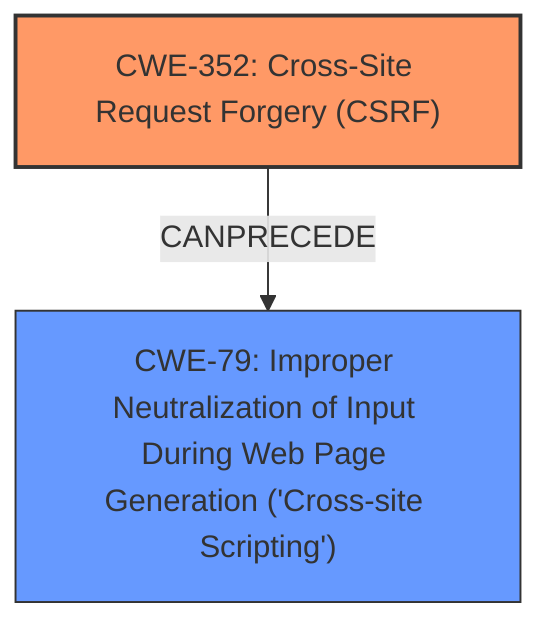

# Enhanced Analysis for CVE-2024-54398

# Summary
| CWE ID | CWE Name | Confidence | CWE Abstraction Level | CWE Vulnerability Mapping Label | CWE-Vulnerability Mapping Notes |
|---|---|---|---|---|---|
| CWE-352 | Cross-Site Request Forgery (CSRF) | 0.9 | Compound | ROOTCAUSE | Allowed |
| CWE-79 | Improper Neutralization of Input During Web Page Generation ('Cross-site Scripting') | 0.9 | Base | WEAKNESS | Allowed |

## Evidence and Confidence

*   **Confidence Score:** 0.9
*   **Evidence Strength:** HIGH

## Relationship Analysis
The analysis indicates that the primary root cause is **CWE-352**, Cross-Site Request Forgery (CSRF). This is due to the **lack of CSRF protection**. The resulting weakness is **CWE-79**, Improper Neutralization of Input During Web Page Generation ('Cross-site Scripting'), leading to Stored **XSS**. **CWE-352** can lead to **CWE-79** because a successful CSRF attack can allow an attacker to inject malicious scripts into the application.
The relationship is a chain where **CWE-352** can precede **CWE-79**.



## Vulnerability Chain
The vulnerability chain starts with the **lack of CSRF protection** (**CWE-352**), which allows an attacker to forge requests on behalf of a user. If the application does not properly neutralize user-controllable input, this can lead to Stored **XSS** (**CWE-79**). Thus, the chain is: **CWE-352** -> **CWE-79**.
  - **CWE-352**: Root cause, **lack of CSRF protection**
  - **CWE-79**: Improper neutralization leading to Stored **XSS** (Impact)

## Summary of Analysis
The primary weakness is the **lack of CSRF protection**, leading to **CWE-352**. This allows for the injection of malicious scripts due to the **improper neutralization of input**, resulting in **CWE-79**. The evidence provided clearly states the vulnerability as a Cross-Site Request Forgery (CSRF) vulnerability leading to Stored **XSS**.

The keyphrases 'lack of CSRF protection' and 'XSS' helped identify these two key CWEs.

The graph relationships influenced the selection by highlighting how **CWE-352** can precede **CWE-79** in a vulnerability chain.

The selected CWEs are at the optimal level of specificity because they directly represent the root cause (**CWE-352**) and the resulting weakness (**CWE-79**).

Several other CWEs were considered but not chosen:

*   **CWE-434**: Unrestricted Upload of File with Dangerous Type was considered due to its presence in the retriever results, but it's not relevant to the vulnerability description. The vulnerability is about CSRF leading to XSS, not about file uploads.
*   **CWE-116**: Improper Encoding or Escaping of Output was also considered, but **CWE-79** is a more specific and accurate representation of the **XSS** vulnerability.
*   **CWE-862**: Missing Authorization was considered but the **lack of CSRF protection** is a more exact root cause.
*   **CWE-80**: Improper Neutralization of Script-Related HTML Tags in a Web Page (Basic XSS) was considered, but **CWE-79** is a broader and more encompassing description of the **XSS** issue.


## CWE Relationship Analysis

Current CWEs represent these abstraction levels: .


### Vulnerability Chain Analysis

**Chain starting from CWE-116:**
- 116 (Improper Encoding or Escaping of Output) - ROOT


**Chain starting from CWE-862:**
- 862 (Missing Authorization) - ROOT


### CWE Relationship Diagram

```mermaid
graph TD
    classDef primary fill:#f96,stroke:#333,stroke-width:2px
    classDef secondary fill:#69f,stroke:#333
    classDef tertiary fill:#9e9,stroke:#333
```