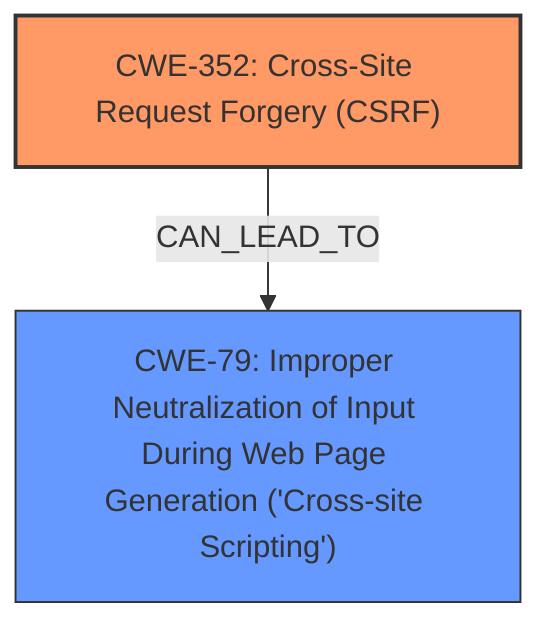

# Enhanced Analysis for CVE-2024-54400

# Summary
| CWE ID | CWE Name | Confidence | CWE Abstraction Level | CWE Vulnerability Mapping Label | CWE-Vulnerability Mapping Notes |
|---|---|---|---|---|---|
| CWE-352 | Cross-Site Request Forgery (CSRF) | 1.0 | Compound | Primary | Allowed |
| CWE-79 | Improper Neutralization of Input During Web Page Generation ('Cross-site Scripting') | 1.0 | Base | Secondary | Allowed |

## Evidence and Confidence

*   **Confidence Score:** 1.0
*   **Evidence Strength:** HIGH

## Relationship Analysis
The primary weakness is CWE-352 [Cross-Site Request Forgery (CSRF)], which is a compound weakness involving the web application's inability to verify the legitimacy of a request. The secondary weakness is CWE-79 [Improper Neutralization of Input During Web Page Generation ('Cross-site Scripting')], caused by the application not neutralizing user-controllable input, allowing for the possibility of **Stored XSS**.



## Vulnerability Chain
The vulnerability chain starts with **CWE-352 [Cross-Site Request Forgery (CSRF)]**, where the web application fails to verify the origin of a request. This leads to the injection of malicious code via a CSRF attack. Subsequently, **CWE-79 [Improper Neutralization of Input During Web Page Generation ('Cross-site Scripting')]** comes into play as the application fails to neutralize the injected malicious code, leading to **Stored XSS**.

## Summary of Analysis
The analysis indicates a **Cross-Site Request Forgery (CSRF)** vulnerability that enables **Stored XSS**. The primary **weakness** is the **lack of CSRF protection**, which allows an attacker to inject malicious scripts. The secondary **weakness** is the **improper neutralization of input**, which allows the injected script to be stored and executed.

The initial assessment strongly aligns with the provided evidence, particularly the keyphrases related to "**Cross-Site Request Forgery**" and "**XSS**". The retriever results and complete CWE specifications support the selection of **CWE-352 [Cross-Site Request Forgery (CSRF)]** as the primary CWE, with **CWE-79 [Improper Neutralization of Input During Web Page Generation ('Cross-site Scripting')]** as the secondary CWE.

**CWE-352 [Cross-Site Request Forgery (CSRF)]** is chosen as the primary CWE because the application **does not sufficiently verify whether a well-formed, valid, consistent request was intentionally provided by the user who submitted the request**. The evidence for this is "Cross-Site Request Forgery (CSRF) vulnerability in MELONIQ.NET AppMaps allows Stored XSS."

**CWE-79 [Improper Neutralization of Input During Web Page Generation ('Cross-site Scripting')]** is chosen as the secondary CWE because the **product does not neutralize user-controllable input before it is placed in output that is used as a web page that is served to other users**, leading to **Stored XSS**. The evidence for this is "Cross-Site Request Forgery (CSRF) vulnerability in MELONIQ.NET AppMaps allows Stored XSS."

Other CWEs Considered:

*   CWE-89 [Improper Neutralization of Special Elements used in an SQL Command ('SQL Injection')] was considered but deemed less relevant as the vulnerability's primary impact is related to XSS, not SQL injection.
*   CWE-918 [Server-Side Request Forgery (SSRF)] was also considered, but it's less applicable as the vulnerability involves CSRF leading to XSS, rather than the server making requests on behalf of the attacker.


## CWE Relationship Analysis

Current CWEs represent these abstraction levels: .


### Vulnerability Chain Analysis

**Chain starting from CWE-352:**
- 352 (Cross-Site Request Forgery (CSRF)) - ROOT


**Chain starting from CWE-79:**
- 79 (Improper Neutralization of Input During Web Page Generation ('Cross-site Scripting')) - ROOT


### CWE Relationship Diagram

```mermaid
graph TD
    classDef primary fill:#f96,stroke:#333,stroke-width:2px
    classDef secondary fill:#69f,stroke:#333
    classDef tertiary fill:#9e9,stroke:#333
```