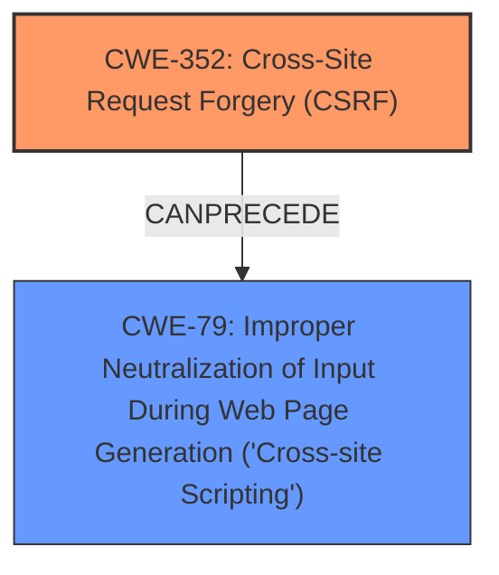

# Enhanced Analysis for CVE-2024-54411

# Summary
| CWE ID | CWE Name | Confidence | CWE Abstraction Level | CWE Vulnerability Mapping Label | CWE-Vulnerability Mapping Notes |
|---|---|---|---|---|---|
| CWE-352 | Cross-Site Request Forgery (CSRF) | 0.9 | Compound | Primary | Allowed |
| CWE-79 | Improper Neutralization of Input During Web Page Generation ('Cross-site Scripting') | 0.8 | Base | Secondary | Allowed |

## Evidence and Confidence

*   **Confidence Score:** 0.85
*   **Evidence Strength:** HIGH

## Relationship Analysis
The primary weakness is identified as CWE-352 [Cross-Site Request Forgery (CSRF)], which leads to the secondary weakness of CWE-79 [Improper Neutralization of Input During Web Page Generation ('Cross-site Scripting')]. CWE-352 allows an attacker to trick a user into performing actions they didn't intend. If the application lacks proper input validation and output encoding, this can lead to Stored XSS (CWE-79). Thus, CSRF can precede XSS in a vulnerability chain. The abstraction levels are appropriate, with CWE-352 being a compound weakness and CWE-79 being a base weakness.



## Vulnerability Chain
The vulnerability chain starts with the **lack of CSRF protection** (CWE-352). This allows an attacker to inject malicious input. The injected input is then improperly handled by the application, leading to Stored **XSS** (CWE-79). The chain is: CWE-352 -> CWE-79.

## Summary of Analysis
The initial analysis focused on identifying the root cause and the resulting weakness. The vulnerability description clearly states that the root cause is the **lack of CSRF protection**, leading to a Stored **XSS** vulnerability. The evidence from the "Vulnerability Description Key Phrases" section supports this: "**rootcause:** **lack of CSRF protection**" and "**weakness:** **XSS**". The "CVE Reference Links Content Summary" section further confirms this by stating "**CSRF:** The plugin is vulnerable to CSRF attacks".

CWE-352 [Cross-Site Request Forgery (CSRF)] is the primary CWE because the **lack of CSRF protection** is what allows the attacker to inject the malicious input. CWE-79 [Improper Neutralization of Input During Web Page Generation ('Cross-site Scripting')] is a secondary CWE because it's the result of the injected input not being properly neutralized.

The retriever results also support these choices, with CWE-79 having the highest score and CWE-352 also being listed.

Other CWEs were considered but not selected. For instance, CWE-434 [Unrestricted Upload of File with Dangerous Type] was considered because it involves uploading files. However, this vulnerability doesn't specifically involve file uploads. Similarly, CWE-89 [Improper Neutralization of Special Elements used in an SQL Command ('SQL Injection')] was considered, but the description doesn't mention SQL injection.

The selected CWEs are at the optimal level of specificity, with CWE-352 being a Compound weakness and CWE-79 being a Base weakness.

Relevant CWE Information:

*   **CWE-352: Cross-Site Request Forgery (CSRF)**
    *   **Technical Explanation:** The application does not properly verify if a request was intentionally provided by the user who submitted it. An attacker can trick a user into performing actions without their consent.
    *   **Security Implications:** An attacker can perform actions on behalf of the user, leading to unauthorized data modification, privilege escalation, or other malicious activities.
    *   **Relationship:** This is the root cause that allows other vulnerabilities to be exploited.
    *   **Usage:** Allowed.
*   **CWE-79: Improper Neutralization of Input During Web Page Generation ('Cross-site Scripting')**
    *   **Technical Explanation:** The application does not properly neutralize user-controllable input before placing it in output used as a web page.
    *   **Security Implications:** An attacker can inject malicious scripts into web pages viewed by other users.
    *   **Relationship:** This is a consequence of the lack of CSRF protection, as the attacker can inject malicious code.
    *   **Usage:** Allowed.


## CWE Relationship Analysis

Current CWEs represent these abstraction levels: .


### Vulnerability Chain Analysis

**Chain starting from CWE-352:**
- 352 (Cross-Site Request Forgery (CSRF)) - ROOT


**Chain starting from CWE-79:**
- 79 (Improper Neutralization of Input During Web Page Generation ('Cross-site Scripting')) - ROOT


### CWE Relationship Diagram

```mermaid
graph TD
    classDef primary fill:#f96,stroke:#333,stroke-width:2px
    classDef secondary fill:#69f,stroke:#333
    classDef tertiary fill:#9e9,stroke:#333
```