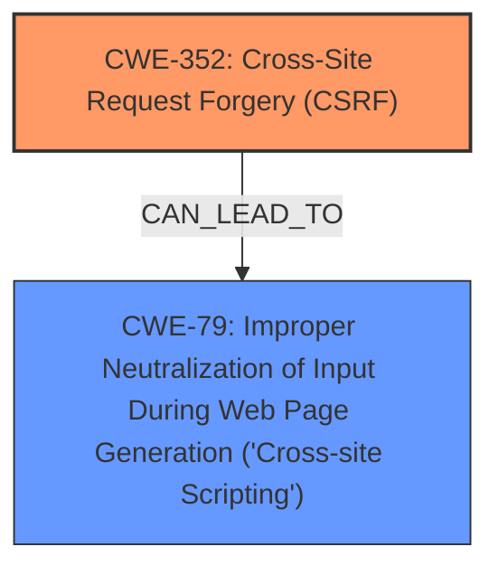

# Analysis for CVE-2024-54415

# Summary
| CWE ID | CWE Name | Confidence | CWE Abstraction Level | CWE Vulnerability Mapping Label | CWE-Vulnerability Mapping Notes |
|---|---|---|---|---|---|
| CWE-352 | Cross-Site Request Forgery (CSRF) | 1.0 | Compound | Primary | Allowed |
| CWE-79 | Improper Neutralization of Input During Web Page Generation ('Cross-site Scripting') | 1.0 | Base | Secondary | Allowed |

## Evidence and Confidence

*   **Confidence Score:** 1.0
*   **Evidence Strength:** HIGH

## Relationship Analysis
The primary weakness is identified as CWE-352 [Cross-Site Request Forgery (CSRF)], which is a compound weakness. The secondary weakness is CWE-79 [Improper Neutralization of Input During Web Page Generation ('Cross-site Scripting')], which can be a result of successful CSRF attacks if the application doesn't properly neutralize input. There isn't a direct hierarchical relationship between them, but CSRF can lead to XSS if the attacker can inject malicious scripts via CSRF. CWE-352 is a compound weakness that requires multiple conditions to be met.

## Vulnerability Chain
The vulnerability chain starts with the **lack of CSRF protection** (CWE-352), which allows an attacker to perform actions on behalf of a user. If the application also **fails to neutralize input** (CWE-79), the attacker can inject malicious scripts, leading to stored **XSS**.

## Summary of Analysis
The primary weakness is the **lack of CSRF protection**, which allows an attacker to perform actions on behalf of a user. The description states "Cross-Site Request Forgery (CSRF) vulnerability in Cyle Conoly WP-HideThat allows Stored **XSS**". This points to a scenario where a successful CSRF attack can lead to stored **XSS**.

The most appropriate CWE for the **lack of CSRF protection** is CWE-352 [Cross-Site Request Forgery (CSRF)]. This is supported by the vulnerability description, which explicitly mentions CSRF. The **XSS** part of the vulnerability is caused by the application's failure to neutralize user-controllable input. The most appropriate CWE for this is CWE-79 [Improper Neutralization of Input During Web Page Generation ('Cross-site Scripting')].

The evidence from the vulnerability description is: "Cross-Site Request Forgery (CSRF) vulnerability in Cyle Conoly WP-HideThat allows Stored **XSS**". This indicates that the **lack of CSRF protection** leads to stored **XSS**.

CWE-352 [Cross-Site Request Forgery (CSRF)] is a Compound level, but is the most accurate representation of the root cause **lack of CSRF protection**. CWE-79 [Improper Neutralization of Input During Web Page Generation ('Cross-site Scripting')] is at the Base level and accurately describes the **XSS** vulnerability.