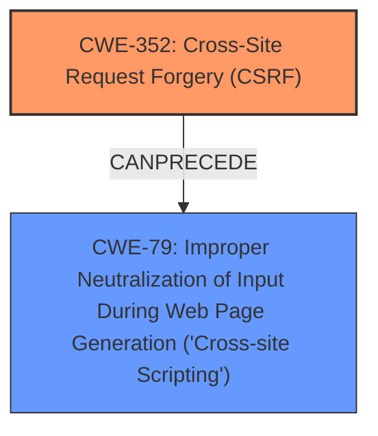

# Enhanced Analysis for CVE-2024-54421

# Summary
| CWE ID | CWE Name | Confidence | CWE Abstraction Level | CWE Vulnerability Mapping Label | CWE-Vulnerability Mapping Notes |
|---|---|---|---|---|---|
| CWE-352 | Cross-Site Request Forgery (CSRF) | 1.0 | Compound |  | Allowed |
| CWE-79 | Improper Neutralization of Input During Web Page Generation ('Cross-site Scripting') | 1.0 | Base |  | Allowed |

## Evidence and Confidence

*   **Confidence Score:** 1.0
*   **Evidence Strength:** HIGH

## Relationship Analysis
The primary relationship is the potential for CWE-352 [CWE-352: Cross-Site Request Forgery (CSRF)] to lead to other vulnerabilities, such as CWE-79 [CWE-79: Improper Neutralization of Input During Web Page Generation ('Cross-site Scripting')]. The lack of CSRF protection allows an attacker to inject malicious scripts, which are then not properly neutralized, leading to XSS. CWE-352 is a compound weakness, representing multiple underlying issues. CWE-79 is a base weakness.



## Vulnerability Chain
The vulnerability chain starts with the **lack of CSRF protection** (CWE-352 [CWE-352: Cross-Site Request Forgery (CSRF)]), which allows an attacker to forge requests. If the application then fails to properly neutralize input, it leads to Stored **XSS** (CWE-79 [CWE-79: Improper Neutralization of Input During Web Page Generation ('Cross-site Scripting')]).

## Summary of Analysis
The vulnerability description explicitly mentions a Cross-Site Request Forgery (CSRF) vulnerability leading to Stored **XSS**. The key phrases 'lack of CSRF protection' and 'XSS' are strong indicators. Both CWE-352 [CWE-352: Cross-Site Request Forgery (CSRF)] and CWE-79 [CWE-79: Improper Neutralization of Input During Web Page Generation ('Cross-site Scripting')] are present in the analysis of the key phrases. The absence of CSRF protection allows for malicious requests, and the improper neutralization of input leads to XSS.

The description states: "Cross-Site Request Forgery (CSRF) vulnerability in Sanjay Singh Negi Floating Video Player allows Stored **XSS**." This statement provides direct evidence for both CWE-352 [CWE-352: Cross-Site Request Forgery (CSRF)] and CWE-79 [CWE-79: Improper Neutralization of Input During Web Page Generation ('Cross-site Scripting')].

CWE-80 [CWE-80: Improper Neutralization of Script-Related HTML Tags in a Web Page (Basic XSS)] was considered as a potential alternative to CWE-79 [CWE-79: Improper Neutralization of Input During Web Page Generation ('Cross-site Scripting')], but CWE-79 is more general and accurately captures the essence of the **XSS** vulnerability, as it focuses on the broader issue of improper neutralization of input during web page generation, whereas CWE-80 is specific to script-related HTML tags.
CWE-434 [CWE-434: Unrestricted Upload of File with Dangerous Type] was considered because it appeared in the analysis, but it's not relevant to this vulnerability because there is no mention of file uploads.

Relevant CWE Information:
CWE-352: Cross-Site Request Forgery (CSRF)
CWE-79: Improper Neutralization of Input During Web Page Generation ('Cross-site Scripting')
CWE-80: Improper Neutralization of Script-Related HTML Tags in a Web Page (Basic XSS)
CWE-434: Unrestricted Upload of File with Dangerous Type


## CWE Relationship Analysis

Current CWEs represent these abstraction levels: .


### Vulnerability Chain Analysis

**Chain starting from CWE-352:**
- 352 (Cross-Site Request Forgery (CSRF)) - ROOT


**Chain starting from CWE-79:**
- 79 (Improper Neutralization of Input During Web Page Generation ('Cross-site Scripting')) - ROOT


### CWE Relationship Diagram

```mermaid
graph TD
    classDef primary fill:#f96,stroke:#333,stroke-width:2px
    classDef secondary fill:#69f,stroke:#333
    classDef tertiary fill:#9e9,stroke:#333
```