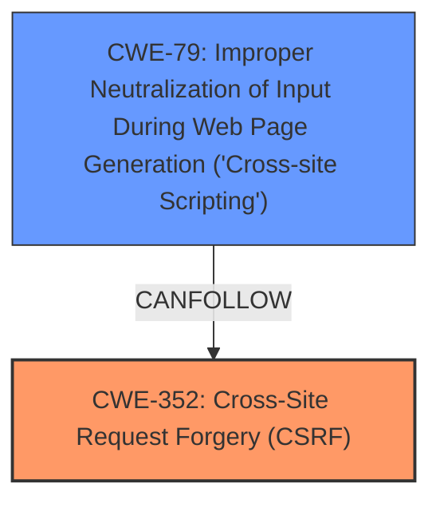

# Analysis for CVE-2024-54439

```markdown
# Summary
| CWE ID    | CWE Name                                                                         | Confidence | CWE Abstraction Level | CWE Vulnerability Mapping Label | CWE-Vulnerability Mapping Notes |
| --------- | -------------------------------------------------------------------------------- | ---------- | --------------------- | ------------------------------- | ----------------------------- |
| CWE-352   | Cross-Site Request Forgery (CSRF)                                                | 0.9        | Compound              | Primary                         | Allowed                       |
| CWE-79    | Improper Neutralization of Input During Web Page Generation ('Cross-site Scripting') | 0.8        | Base                  | Secondary                       | Allowed                       |

## Evidence and Confidence

*   **Confidence Score:** 0.85
*   **Evidence Strength:** MEDIUM

## Relationship Analysis
The primary relationship influencing the decision is the combination of **lack of CSRF protection** leading to a Stored **XSS** vulnerability. CWE-352 [Cross-Site Request Forgery (CSRF)] is selected as the primary root cause, and CWE-79 [Improper Neutralization of Input During Web Page Generation ('Cross-site Scripting')] is a secondary weakness resulting from the **lack of CSRF protection**. The Retriever results and keyphrase analysis both support this relationship.



## Vulnerability Chain
The vulnerability chain starts with the **lack of CSRF protection** (CWE-352) which allows an attacker to inject malicious scripts. The application then fails to properly neutralize the injected input, leading to Stored **XSS** (CWE-79).
  - **Root Cause:** **Lack of CSRF protection** (CWE-352)
  - **Weakness:** Improper neutralization of input (CWE-79)
  - **Impact:** Stored **XSS**

## Summary of Analysis
The analysis indicates that the primary issue is the **lack of CSRF protection**, which allows for the injection of malicious scripts that are then not properly neutralized, resulting in stored **XSS**.

The key supporting evidence is:
*   The explicit statement of "**lack of CSRF protection**" as a root cause.
*   The identification of Stored **XSS** as the vulnerability.

CWE-352 [Cross-Site Request Forgery (CSRF)] is chosen as the primary CWE because the **lack of CSRF protection** is the root cause that enables the **XSS** vulnerability. CWE-79 [Improper Neutralization of Input During Web Page Generation ('Cross-site Scripting')] is chosen as a secondary CWE because the application fails to neutralize the injected input, which leads to the **XSS** vulnerability.

CWE-434 [Unrestricted Upload of File with Dangerous Type] was considered but rejected because the vulnerability description does not indicate any file upload functionality.
CWE-116 [Improper Encoding or Escaping of Output] was considered but determined to be less specific than CWE-79 [Improper Neutralization of Input During Web Page Generation ('Cross-site Scripting')] for this specific **XSS** vulnerability.
CWE-862 [Missing Authorization] was considered but the root cause is lack of CSRF protection and not missing authorization.

The selected CWEs are at the optimal level of specificity, with CWE-352 [Cross-Site Request Forgery (CSRF)] representing the root cause and CWE-79 [Improper Neutralization of Input During Web Page Generation ('Cross-site Scripting')] representing the subsequent weakness.
```