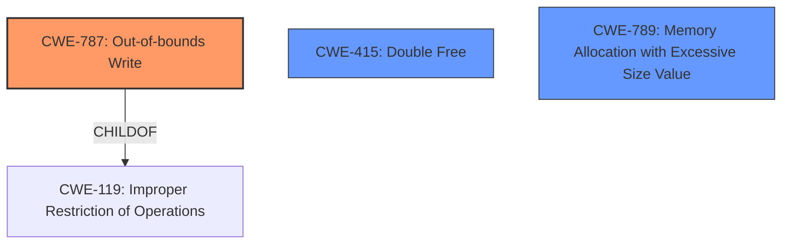

# Analysis Report for CVE-2024-54546

# Vulnerability Analysis Report: CVE-2024-54546

## Description

The issue was addressed with improved memory handling. This issue is fixed in macOS Sequoia 15. An app may be able to cause unexpected system termination or corrupt kernel memory.

## Vulnerability Description Key Phrases

- **Product:** macOS Sequoia
- **Impact:** unexpected system termination, corrupt kernel memory
- **Attacker:** app
- **Version:** 15

## Analysis (with Relationship Data)

# Summary
| CWE ID | CWE Name | Confidence | CWE Abstraction Level | CWE Vulnerability Mapping Label | CWE-Vulnerability Mapping Notes |
|---|---|---|---|---|---|
| CWE-787 | Out-of-bounds Write | 0.7 | Base | Primary CWE | Allowed |
| CWE-415 | Double Free | 0.5 | Variant | Secondary Candidate | Allowed |
| CWE-789 | Memory Allocation with Excessive Size Value | 0.4 | Variant | Secondary Candidate | Allowed |

## Evidence and Confidence

*   **Confidence Score:** 0.7
*   **Evidence Strength:** MEDIUM

## Relationship Analysis
The primary relationship considered was the parent-child relationship, particularly regarding CWE-787 **Out-of-bounds Write** [Base] and its parent CWE-119 **Improper Restriction of Operations within the Bounds of a Memory Buffer** [Class]. However, since the description explicitly mentions memory corruption, CWE-787 was deemed more specific and appropriate. The chain relationships weren't as influential here, as the focus was on identifying the direct cause of the memory corruption. The abstraction levels played a role in choosing CWE-787 over CWE-119, favoring the more detailed Base level.



## Vulnerability Chain
The vulnerability chain appears to start with some **improper memory handling** (root cause not fully specified), which leads to **memory corruption** and/or **unexpected system termination**.
- **Root Cause:** Some form of improper memory management (unspecified).
- **Weakness:** **CWE-787 Out-of-bounds Write** or **CWE-415 Double Free** or **CWE-789 Memory Allocation with Excessive Size Value**
- **Impact:** System termination or kernel memory corruption.

## Summary of Analysis
The initial analysis focused on the **memory corruption** and **unexpected system termination** impact. The retriever results suggested several CWEs, including **CWE-787 Out-of-bounds Write**, **CWE-415 Double Free**, and **CWE-789 Memory Allocation with Excessive Size Value**. Given the limited information, it's hard to pinpoint the exact root cause, but the fix involving improved memory handling suggests a memory safety issue. I've selected CWE-787 as the primary candidate because **out-of-bounds writes** directly cause **memory corruption**. CWE-415 and CWE-789 are considered as secondary candidates because they are also memory corruption issues. The evidence is based on the CVE summary stating "A vulnerability in the Wi-Fi component that could lead to unexpected system termination or kernel memory corruption." The relationships between the CWEs, especially the parent-child relation between CWE-787 and CWE-119, helped refine the selection to the more specific CWE-787.

Relevant CWE Information:

# Enhanced Context (25 CWEs)
The following CWEs were identified as potentially relevant to this vulnerability:

## CWE-667: Improper Locking
**Abstraction Level**: Class
**Similarity Score**: 0.71
**Source**: dense

**Description**:
The product does not properly acquire or release a lock on a resource, leading to unexpected resource state changes and behaviors.

**Mapping Guidance**:
- Usage: Allowed-with-Review
- Rationale: This CWE entry is a Class and might have Base-level children that would be more appropriate

*Not Selected:* Improper locking does not seem to be the rootcause, the issue is due to memory corruption.

## CWE-665: Improper Initialization
**Abstraction Level**: Class
**Similarity Score**: 0.71
**Source**: dense

**Description**:
The product does not initialize or incorrectly initializes a resource, which might leave the resource in an unexpected state when it is accessed or used.

**Mapping Guidance**:
- Usage: Discouraged
- Rationale: This CWE entry is a level-1 Class (i.e., a child of a Pillar). It might have lower-level children that would be more appropriate

*Not Selected:* Improper initialization does not seem to be the rootcause, the issue is due to memory corruption.

## CWE-755: Improper Handling of Exceptional Conditions
**Abstraction Level**: Class
**Similarity Score**: 0.70
**Source**: dense

**Description**:
The product does not handle or incorrectly handles an exceptional condition.

**Mapping Guidance**:
- Usage: Discouraged
- Rationale: This CWE entry is a level-1 Class (i.e., a child of a Pillar). It might have lower-level children that would be more appropriate

*Not Selected:* Improper handling of exceptional conditions does not seem to be the rootcause, the issue is due to memory corruption.

## CWE-203: Observable Discrepancy
**Abstraction Level**: Base
**Similarity Score**: 0.70
**Source**: dense

**Description**:
The product behaves differently or sends different responses under different circumstances in a way that is observable to an unauthorized actor, which exposes security-relevant information about the state of the product, such as whether a particular operation was successful or not.

**Mapping Guidance**:
- Usage: Allowed
- Rationale: This CWE entry is at the Base level of abstraction, which is a preferred level of abstraction for mapping to the root causes of vulnerabilities.

*Not Selected:* An observable discrepancy is not the rootcause. The issue is memory corruption.

## CWE-843: Access of Resource Using Incompatible Type ('Type Confusion')
**Abstraction Level**: Base
**Similarity Score**: 0.70
**Source**: dense

**Description**:
The product allocates or initializes a resource such as a pointer, object, or variable using one type, but it later accesses that resource using a type that is incompatible with the original type.

**Mapping Guidance**:
- Usage: Allowed
- Rationale: This CWE entry is at the Base level of abstraction, which is a preferred level of abstraction for mapping to the root causes of vulnerabilities.

*Not Selected:* Type confusion could be the reason, but not enough details for a solid assignment.

## CWE-252: Unchecked Return Value
**Abstraction Level**: Base
**Similarity Score**: 0.70
**Source**: dense

**Description**:
The product does not check the return value from a method or function, which can prevent it from detecting unexpected states and conditions.

**Mapping Guidance**:
- Usage: Allowed
- Rationale: This CWE entry is at the Base level of abstraction, which is a preferred level of abstraction for mapping to the root causes of vulnerabilities.

*Not Selected:* There is no mention of unchecked return values.

## CWE-824: Access of Uninitialized Pointer
**Abstraction Level**: Base
**Similarity Score**: 0.70
**Source**: dense

**Description**:
The product accesses or uses a pointer that has not been initialized.

**Mapping Guidance**:
- Usage: Allowed
- Rationale: This CWE entry is at the Base level of abstraction, which is a preferred level of abstraction for mapping to the root causes of vulnerabilities.

*Not Selected:* There is no mention of uninitialized pointers.

## CWE-789: Memory Allocation with Excessive Size Value
**Abstraction Level**: Variant
**Similarity Score**: 0.70
**Source**: dense

**Description**:
The product allocates memory based on an untrusted, large size value, but it does not ensure that the size is within expected limits, allowing arbitrary amounts of memory to be allocated.

**Mapping Guidance**:
- Usage: Allowed
- Rationale: This CWE entry is at the Variant level of abstraction, which is a preferred level of abstraction for mapping to the root causes of vulnerabilities.

*Selected as Secondary Candidate:* There is a possibility of memory corruption due to allocating too much memory.

## CWE-787: Out-of-bounds Write
**Abstraction Level**: Base
**Similarity Score**: 0.70
**Source**: dense

**Description**:
The product writes data past the end, or before the beginning, of the intended buffer.

**Mapping Guidance**:
- Usage: Allowed
- Rationale: This CWE entry is at the Base level of abstraction, which is a preferred level of abstraction for mapping to the root causes of vulnerabilities.

*Selected as Primary Candidate:* This can directly lead to memory corruption

## CWE-1285: Improper Validation of Specified Index, Position, or Offset in Input
**Abstraction Level**: Base
**Similarity Score**: 0.69
**Source**: dense

**Description**:
The product receives input that is expected to specify an index, position, or offset


## CWE Relationship Analysis

Current CWEs represent these abstraction levels: .


### Vulnerability Chain Analysis

**Chain starting from CWE-203:**
- 203 (Observable Discrepancy) - ROOT


**Chain starting from CWE-415:**
- 415 (Double Free) - ROOT


### CWE Relationship Diagram

```mermaid
graph TD
    classDef primary fill:#f96,stroke:#333,stroke-width:2px
    classDef secondary fill:#69f,stroke:#333
    classDef tertiary fill:#9e9,stroke:#333
```


*Report generated on 2025-07-13 22:54:03*
