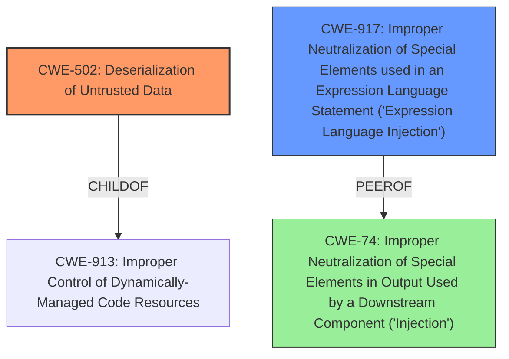

# Enhanced Analysis for CVE-2024-54660

# Summary
| CWE ID | CWE Name | Confidence | CWE Abstraction Level | CWE Vulnerability Mapping Label | CWE-Vulnerability Mapping Notes |
|---|---|---|---|---|---|
| CWE-502 | Deserialization of Untrusted Data | 0.9 | Base |  Primary | Allowed |
| CWE-917 | Improper Neutralization of Special Elements used in an Expression Language Statement ('Expression Language Injection') | 0.7 | Base | Secondary | Allowed |

## Evidence and Confidence

*   **Confidence Score:** 0.8
*   **Evidence Strength:** MEDIUM

## Relationship Analysis
The primary relationship that influenced the decision was the identification of **JNDI injection** leading to remote code execution. The selection of CWE-502 as the primary weakness stems from its direct relevance to **deserialization of untrusted data**, a key mechanism exploited in **JNDI injection**. The secondary consideration of CWE-917 arises from the injection aspect, where special elements in an expression language statement are improperly neutralized.



## Vulnerability Chain
The vulnerability chain starts with the **deserialization of untrusted data** (CWE-502) through **JNDI injection**. This leads to the execution of malicious code, resulting in remote code execution. The injection aspect can also be viewed as a secondary weakness, where special elements in an expression language statement are improperly neutralized (CWE-917).

## Summary of Analysis
The analysis is based on the provided vulnerability description and the retriever results. The primary weakness is identified as CWE-502 (**Deserialization of Untrusted Data**), as the **JNDI injection** leverages the deserialization of untrusted data to achieve remote code execution. The description states that "Attackers can inject malicious parameters into the JDBC URL, triggering **JNDI injection** during the process when the JDBC Driver uses this URL to connect to the database. This could lead to remote code execution."

CWE-917 (**Improper Neutralization of Special Elements used in an Expression Language Statement ('Expression Language Injection')**) is a secondary consideration, as the **injection** part of the vulnerability can be attributed to this CWE. "Using untrusted parameters in the krbJAASFile and/or remote host can trigger **JNDI injection** in the JDBC URL through the krbJAASFile."

The retriever results and graph relationships influenced the final selection. CWE-502 has relationships to CWE-913 (**Improper Control of Dynamically-Managed Code Resources**), which is a child, and CWE-915 (**Improperly Controlled Modification of Dynamically-Determined Object Attributes**), which is a peer.

The selected CWEs are at the optimal level of specificity, representing the core weaknesses exploited in this vulnerability.

Relevant CWE Information:

# Enhanced Context (25 CWEs)
The following CWEs were identified as potentially relevant to this vulnerability:

## CWE-917: Improper Neutralization of Special Elements used in an Expression Language Statement ('Expression Language Injection')
**Abstraction Level**: Base
**Similarity Score**: 0.78
**Source**: dense

**Description**:
The product constructs all or part of an expression language (EL) statement in a framework such as a Java Server Page (JSP) using externally-influenced input from an upstream component, but it does not neutralize or incorrectly neutralizes special elements that could modify the intended EL statement before it is executed.

**Mapping Guidance**:
- Usage: Allowed
- Rationale: This CWE entry is at the Base level of abstraction, which is a preferred level of abstraction for mapping to the root causes of vulnerabilities.

## CWE-502: Deserialization of Untrusted Data
**Abstraction Level**: base
**Similarity Score**: 2.12
**Source**: graph

**Description**:
CWE-502: Deserialization of Untrusted Data

**Mapping Guidance**:
- Usage: Allowed
- Rationale: This CWE entry is at the Base level of abstraction, which is a preferred level of abstraction for mapping to the root causes of vulnerabilities.

**Relationships**:
- PEEROF -> CWE-915
- CHILDOF -> CWE-913
- CHILDOF -> CWE-913
- PEEROF -> CWE-502
- PARENTOF -> CWE-502


## CWE Relationship Analysis

Current CWEs represent these abstraction levels: .


### Vulnerability Chain Analysis

**Chain starting from CWE-502:**
- 502 (Deserialization of Untrusted Data) - ROOT


**Chain starting from CWE-917:**
- 917 (Improper Neutralization of Special Elements used in an Expression Language Statement ('Expression Language Injection')) - ROOT


### CWE Relationship Diagram

```mermaid
graph TD
    classDef primary fill:#f96,stroke:#333,stroke-width:2px
    classDef secondary fill:#69f,stroke:#333
    classDef tertiary fill:#9e9,stroke:#333
```