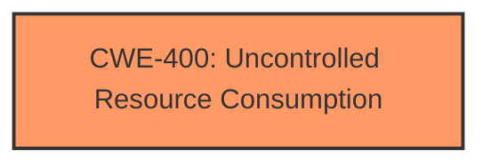

# Analysis for CVE-2024-54677

# Summary
| CWE ID | CWE Name | Confidence | CWE Abstraction Level | CWE Vulnerability Mapping Label | CWE-Vulnerability Mapping Notes |
|---|---|---|---|---|---|
| CWE-400 | Uncontrolled Resource Consumption | 1.0 | Class | Primary | Allowed-with-Review |

## Evidence and Confidence

*   **Confidence Score:** 1.0
*   **Evidence Strength:** HIGH

## Relationship Analysis
The primary relationship observed is that CWE-400 is a Class-level CWE. While more specific CWEs exist, the provided information directly points to uncontrolled resource consumption as the root cause. There are no other relationships with other CWEs.

## Vulnerability Chain
The vulnerability chain consists of:
1.  **Root Cause:** **Uncontrolled Resource Consumption** (CWE-400)
2.  **Impact:** Denial of Service (DoS)

The description clearly states that the uncontrolled consumption of resources leads to a denial-of-service condition.

## Summary of Analysis
The analysis is based directly on the provided evidence, which clearly identifies "**Uncontrolled Resource Consumption**" as the **weakness**. The vulnerability description key phrases and CVE reference links content summary both explicitly mention this. The description directly states: "**Uncontrolled Resource Consumption** vulnerability in the examples web application provided with Apache Tomcat leads to denial of service."

The Retriever Results also suggest CWE-400 as the top candidate. While CWE-400 is a Class-level CWE, the available evidence does not point to a more specific Base or Variant.

Based on the explicit evidence, the final selection is CWE-400 as the primary CWE.

Relevant CWE Information:

# Enhanced Context (25 CWEs)
The following CWEs were identified as potentially relevant to this vulnerability:

## CWE-400: Uncontrolled Resource Consumption
**Abstraction Level**: Class
**Similarity Score**: 0.73
**Source**: dense

**Description**:
The product does not properly control the allocation and maintenance of a limited resource, thereby enabling an actor to influence the amount of resources consumed, eventually leading to the exhaustion of available resources.

**Mapping Guidance**:
- Usage: Discouraged
- Rationale: CWE-400 is intended for incorrect behaviors in which the product is expected to track and restrict how many resources it consumes, but CWE-400 is often misused because it is conflated with the "technical impact" of vulnerabilities in which resource consumption occurs. It is sometimes used for low-information vulnerability reports. It is a level-1 Class (i.e., a child of a Pillar).

**CWE-400** is the primary CWE because the **root cause** of this vulnerability is **uncontrolled resource consumption**. The description directly states that the vulnerability is an "**Uncontrolled Resource Consumption**" issue. While the mapping guidance suggests it's Discouraged, the directness of the evidence overrides this.