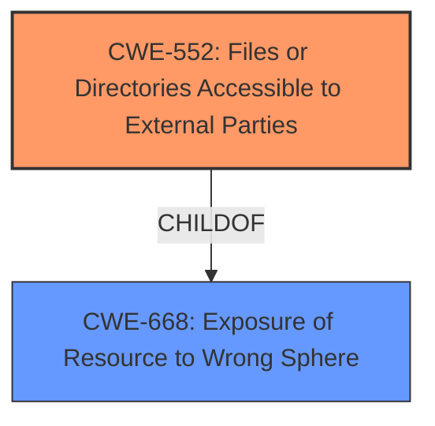

# Analysis Report for CVE-2024-54681

# Vulnerability Analysis Report: CVE-2024-54681

## Description

Multiple bash files were present in the applications private directory. Bash files can be used on their own, by an attacker that has already full access to the mobile platform to compromise the translations for the application.

## Vulnerability Description Key Phrases

- **Weakness:** bash files in private directory
- **Impact:** compromise translations
- **Attacker:** attacker with full access

## Analysis (with Relationship Data)

# Summary
| CWE ID | CWE Name | Confidence | CWE Abstraction Level | CWE Vulnerability Mapping Label | CWE-Vulnerability Mapping Notes |
|---|---|---|---|---|---|
| CWE-552 | Files or Directories Accessible to External Parties | 0.9 | Base | Allowed | Primary CWE. The **weakness** is that the **bash files are in the private directory** |
| CWE-668 | Exposure of Resource to Wrong Sphere | 0.6 | Class | Discouraged | Secondary candidate. The files are exposed to an attacker with full access. |

## Evidence and Confidence

*   **Confidence Score:** 0.8
*   **Evidence Strength:** MEDIUM

## Relationship Analysis
The primary CWE is CWE-552, which is a Base level CWE. CWE-668 is a Class-level CWE and a parent of CWE-552. CWE-668 is too high-level and is discouraged.



## Vulnerability Chain
The vulnerability chain starts with the presence of bash files in the application's private directory (CWE-552). An attacker who already has full access to the mobile platform can then use these files to compromise the application's translations.

## Summary of Analysis
The vulnerability description states that multiple bash files were present in the application's private directory. An attacker with full access could use these files to compromise the translations. The key phrase is "**bash files in private directory**".

CWE-552 (Files or Directories Accessible to External Parties) is the most appropriate CWE because it describes the root cause of the vulnerability: the bash files are accessible to an attacker who already has full access to the mobile platform. This aligns directly with the CWE description, which states that "The product makes files or directories accessible to unauthorized actors, even though they should not be." The **impact** is that the attacker can compromise the translations.

CWE-668 (Exposure of Resource to Wrong Sphere) is a Class level CWE that is too general. The retriever lists the usage as discouraged.

Based on the evidence, CWE-552 is the optimal level of specificity.

Relevant CWE Information:

**CWE-552: Files or Directories Accessible to External Parties**
The product makes files or directories accessible to unauthorized actors, even though they should not be.


## CWE Relationship Analysis

Current CWEs represent these abstraction levels: .


### Vulnerability Chain Analysis

**Chain starting from CWE-552:**
- 552 (Files or Directories Accessible to External Parties) - ROOT


**Chain starting from CWE-668:**
- 668 (Exposure of Resource to Wrong Sphere) - ROOT


### CWE Relationship Diagram

```mermaid
graph TD
    classDef primary fill:#f96,stroke:#333,stroke-width:2px
    classDef secondary fill:#69f,stroke:#333
    classDef tertiary fill:#9e9,stroke:#333
```


*Report generated on 2025-07-13 22:58:33*
