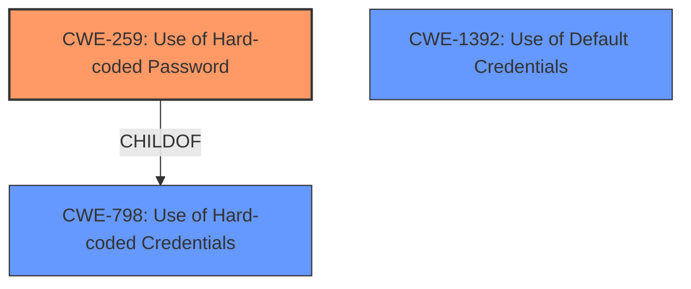

# Raw Analyzer Response for CVE-2024-54745

# Summary
| CWE ID | CWE Name | Confidence | CWE Abstraction Level | CWE Vulnerability Mapping Label | CWE-Vulnerability Mapping Notes |
|---|---|---|---|---|---|
| CWE-259 | Use of Hard-coded Password | 1.0 | Variant | Allowed | Primary CWE. The vulnerability description explicitly states the presence of a **hardcoded password**. |
| CWE-798 | Use of Hard-coded Credentials | 0.7 | Base | Allowed | Secondary Candidate. Could apply since a password is a type of credential. |
| CWE-1392 | Use of Default Credentials | 0.6 | Base | Allowed | Secondary Candidate. It is possible that the hardcoded password is also a default password. |

## Evidence and Confidence

*   **Confidence Score:** 0.9
*   **Evidence Strength:** HIGH

## Relationship Analysis
The primary relationship influencing the CWE selection is the child-parent relationship between CWE-259 (Use of Hard-coded Password) and CWE-798 (Use of Hard-coded Credentials). CWE-259 is a variant of CWE-798, making it a more specific classification when the **hardcoded credential** is explicitly a password. There are no chain relationships apparent from the provided information.

## Vulnerability Chain
The vulnerability chain is straightforward:
1.  **Root Cause:** **Hardcoded password** (CWE-259)
2.  **Impact:** Attackers can log in as root.

## Summary of Analysis
The vulnerability description clearly states the presence of a **hardcoded password** in `/etc/shadow`, allowing attackers to log in as root. This aligns directly with CWE-259 (Use of Hard-coded Password), which is a variant of CWE-798 (Use of Hard-coded Credentials).

The retriever results also support this, with CWE-259 being the top-ranked CWE. The graph relationships confirm that CWE-259 is a more specific child of CWE-798, making it the more appropriate choice. The usage recommendation for CWE-259 is "Allowed," further solidifying this decision. CWE-1392 (Use of Default Credentials) is considered as a secondary candidate.

The selection of CWE-259 is based on direct evidence from the vulnerability description and aligns with the MITRE mapping guidance. The level of specificity is optimal as it directly addresses the root cause (hardcoded password) rather than a more general category like "improper authentication."

Relevant CWE Information:
- Vulnerability Description Key Phrases:
  - **rootcause:** **hardcoded password**
  - **impact:** log in as root

CWEs considered but not used:

*   CWE-321 (Use of Hard-coded Cryptographic Key): This was considered but not selected because the vulnerability description specifically mentions a password, not a cryptographic key.
*   CWE-425 (Direct Request ('Forced Browsing')): This is not relevant as the vulnerability is not about unauthorized access to URLs.
*   CWE-912 (Hidden Functionality): This is not relevant as the vulnerability is not about hidden features.
*   CWE-1299 (Missing Protection Mechanism for Alternate Hardware Interface): This is not relevant as the vulnerability is not about hardware interfaces.
*   CWE-532 (Insertion of Sensitive Information into Log File): This is not relevant as the vulnerability is not about logging sensitive information.
*   CWE-256 (Plaintext Storage of a Password): The key issue isn't the password being in plaintext, but the fact that it is **hardcoded**.
*   CWE-471 (Modification of Assumed-Immutable Data (MAID)): This is not relevant as the vulnerability is not about modification of immutable data.