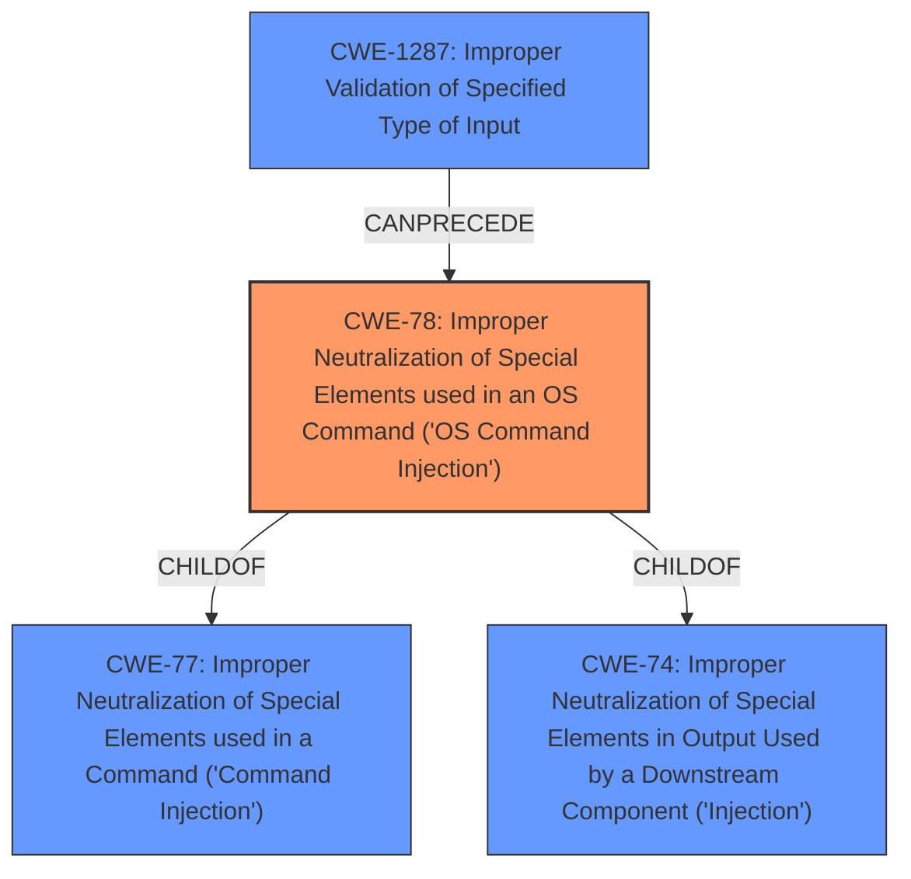

# Analysis Report for CVE-2024-54803

# Vulnerability Analysis Report: CVE-2024-54803

## Description

Netgear WNR854T 1.5.2 (North America) is vulnerable to Command Injection. An attacker can send a specially crafted request to post.cgi, updating the nvram parameter pppoe_peer_mac and forcing a reboot. This will result in **command injection**.

## Vulnerability Description Key Phrases

- **Weakness:** command injection
- **Vector:** specially crafted request
- **Attacker:** attacker
- **Product:** Netgear WNR854T
- **Version:** 1.5.2
- **Component:** post.cgi

## Analysis (with Relationship Data)

# Summary
| CWE ID | CWE Name | Confidence | CWE Abstraction Level | CWE Vulnerability Mapping Label | CWE-Vulnerability Mapping Notes |
|---|---|---|---|---|---|
| CWE-78 | Improper Neutralization of Special Elements used in an OS Command ('OS Command Injection') | 1.0 | Base | Primary | Allowed |
| CWE-1287 | Improper Validation of Specified Type of Input | 0.7 | Base | Secondary | Allowed |

## Evidence and Confidence

*   **Confidence Score:** 0.9
*   **Evidence Strength:** HIGH

## Relationship Analysis
The primary CWE is CWE-78, which is a base level CWE describing OS Command Injection. It falls under the class CWE-77 (Improper Neutralization of Special Elements used in a Command) and CWE-74 (Improper Neutralization of Special Elements in Output Used by a Downstream Component ('Injection')). CWE-1287 (Improper Validation of Specified Type of Input) is a related weakness that can precede CWE-78 by allowing the unsanitized input to reach the command execution.


## Vulnerability Chain
The vulnerability chain starts with **Improper Validation of Input (CWE-1287)**, leading to **Improper Neutralization of Special Elements used in an OS Command (CWE-78)**, which results in arbitrary command execution with root privileges. The injected commands are stored in NVRAM, making the compromise persistent.
  - Improper Validation of Input (CWE-1287) -> Improper Neutralization of Special Elements used in an OS Command (CWE-78) -> Arbitrary command execution with root privileges.

## Summary of Analysis
The analysis is based on the provided vulnerability description and CVE reference content summary. The key evidence is the **command injection** vulnerability in Netgear WNR854T, specifically in the `pppoe_peer_mac` parameter, which is processed without proper sanitization using the `sprintf` function. This aligns directly with CWE-78, which describes **improper neutralization of special elements used in an OS command**. The retriever results also strongly suggest CWE-78 and its class CWE-77 as primary candidates.

CWE-1287 is included as a secondary weakness because the root cause includes **insufficient input validation**.

The relationship graph shows the hierarchical relationship between CWE-78 and its parent classes, as well as the potential for CWE-1287 to precede CWE-78. The final selection of CWE-78 is at the optimal level of specificity as it accurately represents the type of injection occurring (OS command injection) and is a base-level CWE as recommended by MITRE.

Relevant CWE Information:

# Enhanced Context (25 CWEs)
The following CWEs were identified as potentially relevant to this vulnerability:

## CWE-77: Improper Neutralization of Special Elements used in a Command ('Command Injection')
**Abstraction Level**: Class
**Similarity Score**: 0.75
**Source**: dense

**Description**:
The product constructs all or part of a command using externally-influenced input from an upstream component, but it does not neutralize or incorrectly neutralizes special elements that could modify the intended command when it is sent to a downstream component.

**Mapping Guidance**:
- Usage: Allowed-with-Review
- Rationale: CWE-77 is often misused when OS command injection (CWE-78) was intended instead [REF-1287].

*NOT USED:* While CWE-77 is a parent class of CWE-78, the vulnerability description clearly indicates OS command injection, making the more specific CWE-78 a better fit.

## CWE-78: Improper Neutralization of Special Elements used in an OS Command ('OS Command Injection')
**Abstraction Level**: Base
**Similarity Score**: 0.75
**Source**: dense

**Description**:
The product constructs all or part of an OS command using externally-influenced input from an upstream component, but it does not neutralize or incorrectly neutralizes special elements that could modify the intended OS command when it is sent to a downstream component.

**Mapping Guidance**:
- Usage: Allowed
- Rationale: This CWE entry is at the Base level of abstraction, which is a preferred level of abstraction for mapping to the root causes of vulnerabilities.

*USED:* The vulnerability description clearly indicates that the vulnerability is an OS command injection, and this CWE perfectly describes this vulnerability.

## CWE-790: Improper Filtering of Special Elements
**Abstraction Level**: Class
**Similarity Score**: 0.75
**Source**: dense

**Description**:
The product receives data from an upstream component, but does not filter or incorrectly filters special elements before sending it to a downstream component.

**Mapping Guidance**:
- Usage: Allowed-with-Review
- Rationale: This CWE entry is a Class and might have Base-level children that would be more appropriate

*NOT USED:* This is a more general CWE and CWE-78 is a better fit.

## CWE-74: Improper Neutralization of Special Elements in Output Used by a Downstream Component ('Injection')
**Abstraction Level**: Class
**Similarity Score**: 0.74
**Source**: dense

**Description**:
The product constructs all or part of a command, data structure, or record using externally-influenced input from an upstream component, but it does not neutralize or incorrectly neutralizes special elements that could modify how it is parsed or interpreted when it is sent to a downstream component.

**Mapping Guidance**:
- Usage: Discouraged
- Rationale: CWE-74 is high-level and often misused when lower-level weaknesses are more appropriate.

*NOT USED:* This is a more general CWE and CWE-78 is a better fit.

## CWE-134: Use of Externally-Controlled Format String
**Abstraction Level**: Base
**Similarity Score**: 0.73
**Source**: dense

**Description**:
The product uses a function that accepts a format string as an argument, but the format string originates from an external source.

**Mapping Guidance**:
- Usage: Allowed
- Rationale: This CWE entry is at the Base level of abstraction, which is a preferred level of abstraction for mapping to the root causes of vulnerabilities.

*NOT USED:* The vulnerability summary mentions the `sprintf` function, but it is being used to construct a system call, not as a format string vulnerability.

## CWE-138: Improper Neutralization of Special Elements
**Abstraction Level**: Class
**Similarity Score**: 0.73
**Source**: dense

**Description**:
The product receives input from an upstream component, but it does not neutralize or incorrectly neutralizes special elements that could be interpreted as control elements or syntactic markers when they are sent to a downstream component.

**Mapping Guidance**:
- Usage: Discouraged
- Rationale: This CWE entry is a level-1 Class (i.e., a child of a Pillar). It might have lower-level children that would be more appropriate

*NOT USED:* This is a very general CWE, and CWE-78 is a better fit because it specifically addresses OS command injection.

## CWE-93: Improper Neutralization of CRLF Sequences ('CRLF Injection')
**Abstraction Level**: Base
**Similarity Score**: 0.72
**Source**: dense

**Description**:
The product uses CRLF (carriage return line feeds) as a special element, e.g. to separate lines or records, but it does not neutralize or incorrectly neutralizes CRLF sequences from inputs.

**Mapping Guidance**:
- Usage: Allowed
- Rationale: This CWE entry is at the Base level of abstraction, which is a preferred level of abstraction for mapping to the root causes of vulnerabilities.

*NOT USED:* This CWE is not relevant because the vulnerability does not involve CRLF injection.

## CWE-1391: Use of Weak Credentials
**Abstraction Level**: Class
**Similarity Score**: 0.72
**Source**: dense

**Description**:
The product uses weak credentials (such as a default key or hard-coded password) that can be calculated, derived, reused, or guessed by an attacker.

**Mapping Guidance**:
- Usage: Allowed-with-Review
- Rationale: This CWE entry is a Class and might have Base-level children that would be more appropriate

*NOT USED:* The vulnerability requires authentication to the administrative interface, but it is not directly related to the use of


## CWE Relationship Analysis

Current CWEs represent these abstraction levels: .


### Vulnerability Chain Analysis

**Chain starting from CWE-1391:**
- 1391 (Use of Weak Credentials) - ROOT


**Chain starting from CWE-93:**
- 93 (Improper Neutralization of CRLF Sequences ('CRLF Injection')) - ROOT


### CWE Relationship Diagram

```mermaid
graph TD
    classDef primary fill:#f96,stroke:#333,stroke-width:2px
    classDef secondary fill:#69f,stroke:#333
    classDef tertiary fill:#9e9,stroke:#333
```


*Report generated on 2025-07-13 23:03:26*
