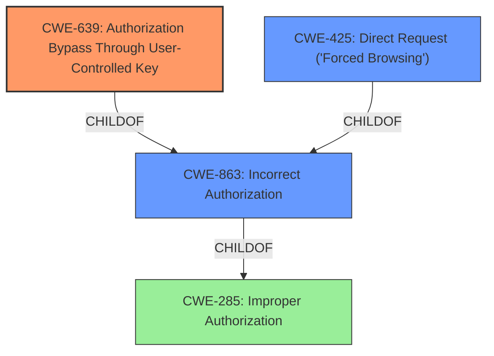

# Raw Analyzer Response for CVE-2024-55058

# Summary

| CWE ID  | CWE Name                                                                  | Confidence | CWE Abstraction Level | CWE Vulnerability Mapping Label | CWE-Vulnerability Mapping Notes |
| :-------- | :------------------------------------------------------------------------ | :--------- | :-------------------- | :------------------------------ | :------------------------------ |
| CWE-639 | Authorization Bypass Through User-Controlled Key                        | 0.95       | Base                  | Primary                         | Allowed                       |
| CWE-425 | Direct Request ('Forced Browsing')                                      | 0.75       | Base                  | Secondary                       | Allowed                       |
| CWE-863 | Incorrect Authorization                                                   | 0.65       | Class                 | Secondary                       | Allowed-with-Review           |

## Evidence and Confidence

*   **Confidence Score:** 0.85
*   **Evidence Strength:** HIGH

## Relationship Analysis

The primary CWE, CWE-639 Authorization Bypass Through User-Controlled Key, is a base-level CWE that directly addresses the vulnerability where users can access other users' data by manipulating a key value. It's related to higher-level categories like CWE-285 Improper Authorization and CWE-863 Incorrect Authorization, but provides a more specific description of the root cause. CWE-425 Direct Request ('Forced Browsing') is another related base-level CWE describing the lack of proper authorization on restricted URLs.

## Vulnerability Chain

The vulnerability chain starts with the **insecure direct object reference**, specifically the lack of authorization checks on the `viewid` parameter (CWE-639). This allows an attacker to directly request and access sensitive data, bypassing intended access controls (CWE-425). The underlying cause is likely an incorrect or missing authorization mechanism (CWE-863) that fails to properly validate the user's permission to access the requested data.

## Summary of Analysis

The analysis strongly supports CWE-639 as the primary CWE due to the clear evidence of an **insecure direct object reference** in the vulnerability description and the "CVE Reference Links Content Summary". The vulnerability allows authenticated users to access sensitive birth certificate details of other users by manipulating the `viewid` parameter in the URL, indicating a direct bypass of authorization through a user-controlled key.

CWE-425 is a relevant secondary CWE as the vulnerability also involves a direct request to a resource without adequate authorization enforcement. CWE-863 is included as a high-level classification indicating the presence of some authorization mechanism, albeit an **incorrect** one.

The selection is based on the evidence provided in the vulnerability description, which explicitly mentions the **insecure direct object reference** and the ability to access other users' data by manipulating the `viewid` parameter. The retriever results also support these findings, with CWE-639 being the top-ranked result.

The chosen CWEs are at the optimal level of specificity, with CWE-639 being a base-level CWE that directly addresses the root cause of the vulnerability.

Relevant CWE Information:

## CWE-639: Authorization Bypass Through User-Controlled Key
**Abstraction Level**: Base
**Similarity Score**: 0.78
**Source**: dense

**Description**:
The system's authorization functionality does not prevent one user from gaining access to another user's data or record by modifying the key value identifying the data.

**Mapping Guidance**:
- Usage: Allowed
- Rationale: This CWE entry is at the Base level of abstraction, which is a preferred level of abstraction for mapping to the root causes of vulnerabilities.

**Justification:** The vulnerability description states that authenticated users can access sensitive data of other users by manipulating the `viewid` parameter. This directly aligns with the description of CWE-639, where the authorization mechanism fails to prevent unauthorized access through a user-controlled key. Confidence: 0.95

## CWE-425: Direct Request ('Forced Browsing')
**Abstraction Level**: Base
**Similarity Score**: 0.76
**Source**: dense

**Description**:
The web application does not adequately enforce appropriate authorization on all restricted URLs, scripts, or files.

**Mapping Guidance**:
- Usage: Allowed
- Rationale: This CWE entry is at the Base level of abstraction, which is a preferred level of abstraction for mapping to the root causes of vulnerabilities.

**Justification:** The vulnerability allows authenticated users to directly request and access data associated with other users by manipulating the `viewid` parameter in the URL. The application does not adequately enforce authorization, allowing unauthorized access to sensitive information. Confidence: 0.75

## CWE-863: Incorrect Authorization
**Abstraction Level**: Class
**Similarity Score**: 1362.61
**Source**: sparse

**Description**:
The product performs an authorization check when an actor attempts to access a resource or perform an action, but it does not correctly perform the check.

**Mapping Guidance**:
- Usage: Allowed-with-Review
- Rationale: This CWE entry is a Class and might have Base-level children that would be more appropriate

**Justification:** This vulnerability implies that there might be some sort of authorization in place, but it's not correctly implemented, allowing the bypass. While CWE-639 is more specific, CWE-863 captures the high-level aspect of an authorization check existing but failing. Confidence: 0.65

## Other CWEs Considered

*   **CWE-285: Improper Authorization**: While relevant, it's a higher-level class CWE and less specific than CWE-639.
*   **CWE-306: Missing Authentication for Critical Function**: Not applicable, as the vulnerability requires an authenticated user.
*   **CWE-73: External Control of File Name or Path** and **CWE-89: Improper Neutralization of Special Elements used in an SQL Command ('SQL Injection')**: These are not relevant as the vulnerability doesn't involve file path manipulation or SQL injection.