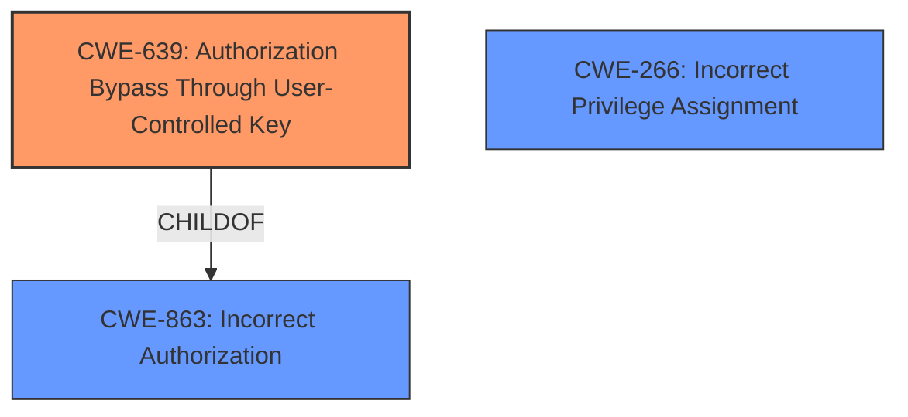

# Raw Analyzer Response for CVE-2024-55072

# Summary
| CWE ID | CWE Name | Confidence | CWE Abstraction Level | CWE Vulnerability Mapping Label | CWE-Vulnerability Mapping Notes |
|---|---|---|---|---|---|
| CWE-639 | Authorization Bypass Through User-Controlled Key | 0.9 | Base |  Primary CWE | Allowed |
| CWE-863 | Incorrect Authorization | 0.7 | Class | Secondary Candidate | Allowed-with-Review |
| CWE-266 | Incorrect Privilege Assignment | 0.5 | Base | Secondary Candidate | Allowed |

## Evidence and Confidence

*   **Confidence Score:** 0.8
*   **Evidence Strength:** HIGH

## Relationship Analysis
The primary relationship that impacted the decision was the hierarchical structure of CWEs related to Authorization and Access Control. CWE-639, as a Base CWE, offers a more specific description of the vulnerability than its parent Class CWEs like CWE-863. The chain relationships did not play a significant role here, as the focus is on the direct cause of the authorization bypass. Abstraction levels were critical in selecting the most precise CWE, favoring the Base level CWE-639 over the higher-level Class CWE-863.

## Vulnerability Chain
The vulnerability chain starts with the **incorrect authorization** mechanism that allows a user to manipulate keys, leading to an authorization bypass and ultimately resulting in privilege escalation.
  - **Root Cause:** **Authorization Bypass Through User-Controlled Key (CWE-639)**
  - **Weakness:** Incorrect Authorization (CWE-863) - Due to the ability to control the key, the authorization check fails.
  - **Impact:** Privilege Escalation - Users can grant themselves higher permissions.

## Summary of Analysis
The initial analysis focused on the **Broken Object Level Authorization** and the ability to manipulate API calls to change permissions. The Retriever Results highlighted CWE-639 as a strong candidate, supported by the vulnerability description's emphasis on user-controlled keys. The CWE guidance on Authentication vs. Authorization helped confirm that the issue was related to authorization, not authentication, as the users were already authenticated.

The graph relationships reinforced the decision to choose the most specific CWE (CWE-639) over more general ones (CWE-863). The selection of CWE-639 is at the optimal level of specificity because it directly addresses the root cause of the vulnerability. It is based on the following evidence from the "CVE Reference Links Content Summary" : "Group managers are not allowed to change their own permissions directly. However, by manipulating an API call intended for changing permissions of *other* group members, a group manager can successfully modify their own permissions." and "The ability to swap the `userId` in the API call to target the group manager's own account."

Relevant CWE Information:

# Enhanced Context (25 CWEs)
The following CWEs were identified as potentially relevant to this vulnerability:

## CWE-639: Authorization Bypass Through User-Controlled Key
**Abstraction Level**: Base
**Similarity Score**: 0.73
**Source**: dense

**Description**:
The system's authorization functionality does not prevent one user from gaining access to another user's data or record by modifying the key value identifying the data.

**Mapping Guidance**:
- Usage: Allowed
- Rationale: This CWE entry is at the Base level of abstraction, which is a preferred level of abstraction for mapping to the root causes of vulnerabilities.

## CWE-639: Authorization Bypass Through User-Controlled Key
**Abstraction Level**: Base
**Similarity Score**: 2454.48
**Source**: sparse

**Description**:
The system's authorization functionality does not prevent one user from gaining access to another user's data or record by modifying the key value identifying the data.

**Mapping Guidance**:
- Usage: Allowed
- Rationale: This CWE entry is at the Base level of abstraction, which is a preferred level of abstraction for mapping to the root causes of vulnerabilities.

## CWE-863: Incorrect Authorization
**Abstraction Level**: Class
**Similarity Score**: 2588.88
**Source**: sparse

**Description**:
The product performs an authorization check when an actor attempts to access a resource or perform an action, but it does not correctly perform the check.

**Mapping Guidance**:
- Usage: Allowed-with-Review
- Rationale: This CWE entry is a Class and might have Base-level children that would be more appropriate

## CWE-266: Incorrect Privilege Assignment
**Abstraction Level**: Base
**Similarity Score**: 0.74
**Source**: dense

**Description**:
A product incorrectly assigns a privilege to a particular actor, creating an unintended sphere of control for that actor.

**Mapping Guidance**:
- Usage: Allowed
- Rationale: This CWE entry is at the Base level of abstraction, which is a preferred level of abstraction for mapping to the root causes of vulnerabilities.

## CWE-266: Incorrect Privilege Assignment
**Abstraction Level**: Base
**Similarity Score**: 2.48
**Source**: graph

**Description**:
A product incorrectly assigns a privilege to a particular actor, creating an unintended sphere of control for that actor.

**Mapping Guidance**:
- Usage: Allowed
- Rationale: This CWE entry is at the Base level of abstraction, which is a preferred level of abstraction for mapping to the root causes of vulnerabilities.

### Detailed Analysis of Selected CWEs:

*   **CWE-639: Authorization Bypass Through User-Controlled Key**
    *   **Technical Explanation:** This CWE applies because the vulnerability allows users to bypass authorization checks by manipulating a user-controlled key (`userId` in the API call). The system's authorization mechanism fails to prevent a user from gaining access to another user's data or modifying their own permissions by altering this key value.
    *   **Security Implications:** This can lead to privilege escalation, where a user gains unauthorized access to sensitive data or functionality.
    *   **Relationship Analysis:** This is a Base CWE and a child of CWE-863 (Incorrect Authorization).
    *   **Mapping Guidance Influence:** The MITRE mapping guidance allows for this CWE, and its base level abstraction is preferred for root cause analysis.
*   **CWE-863: Incorrect Authorization**
    *   **Technical Explanation:** The product performs an authorization check, but it is flawed, allowing unauthorized access. In this case, the check is bypassed because the user ID can be manipulated.
    *   **Security Implications:** Unauthorized access to resources, privilege escalation.
    *   **Relationship Analysis:** Class CWE, parent of CWE-639.
    *   **Mapping Guidance Influence:** Allowed with review, but a more specific child is preferred.
*   **CWE-266: Incorrect Privilege Assignment**
    *   **Technical Explanation:** While the end result is a privilege escalation, the root cause isn't directly an incorrect assignment during initial setup, but rather the bypass of authorization that leads to it. This CWE is less precise than CWE-639.
    *   **Security Implications:** Privilege escalation, unauthorized actions.
    *   **Relationship Analysis:** This CWE is a base level CWE, but it's more related to initial setup issues rather than runtime authorization bypass.

### CWEs Considered but Not Used:

*   CWE-284: Improper Access Control - Too high-level, a more specific authorization bypass was identified.
*   CWE-285: Improper Authorization - Similar to CWE-863, but less specific than CWE-639.
*   CWE-269: Improper Privilege Management - Discouraged for privilege escalation, and the root cause is not directly related to privilege management but rather to authorization bypass.
*   CWE-306: Missing Authentication for Critical Function - The vulnerability is not due to missing authentication, but rather a flaw in authorization after authentication.