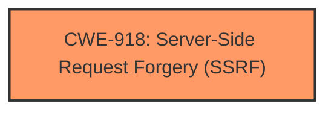

# Raw Analyzer Response for CVE-2024-55089

# Summary
| CWE ID | CWE Name | Confidence | CWE Abstraction Level | CWE Vulnerability Mapping Label | CWE-Vulnerability Mapping Notes |
|---|---|---|---|---|---|
| CWE-918 | Server-Side Request Forgery (SSRF) | 1.0 | Base | Primary | Allowed |

## Evidence and Confidence

*   **Confidence Score:** 1.0
*   **Evidence Strength:** HIGH

## Relationship Analysis
The primary relationship that influenced the decision was the direct match of the vulnerability description to the definition of CWE-918. All the keyphrases, WEAKNESS: 'SSRF', WEAKNESS: 'Server-Side Request Forgery', PRODUCT: 'Rhymix', VERSION: '2.1.19', and COMPONENT: 'background import data function' pointed to CWE-918 as the most relevant.

## Vulnerability Chain
The vulnerability chain consists of a single **root cause**:

1.  **Root Cause:** The **Server-Side Request Forgery (SSRF)** vulnerability (CWE-918) exists in the background import data function of Rhymix 2.1.19 because the web server does not sufficiently ensure that the request is being sent to the expected destination.

## Summary of Analysis
The initial analysis strongly indicated that the vulnerability is a **Server-Side Request Forgery (SSRF)**, as the description explicitly mentions this vulnerability. The keyphrases such as WEAKNESS: 'SSRF', WEAKNESS: 'Server-Side Request Forgery', PRODUCT: 'Rhymix', VERSION: '2.1.19', and COMPONENT: 'background import data function' point to CWE-918.

The evidence from the vulnerability description: "Rhymix 2.1.19 is vulnerable to **Server-Side Request Forgery (SSRF)** in the background import data function" directly supports the selection of CWE-918 as the primary CWE.

The retriever also ranked CWE-918 with the highest score which gave more confidence in the decision.

The selection of CWE-918 is at the optimal level of specificity because it directly describes the vulnerability (**Server-Side Request Forgery**). Other CWEs considered, such as CWE-611, CWE-352, CWE-89 and CWE-601, were less specific and did not directly address the **root cause** of the vulnerability.