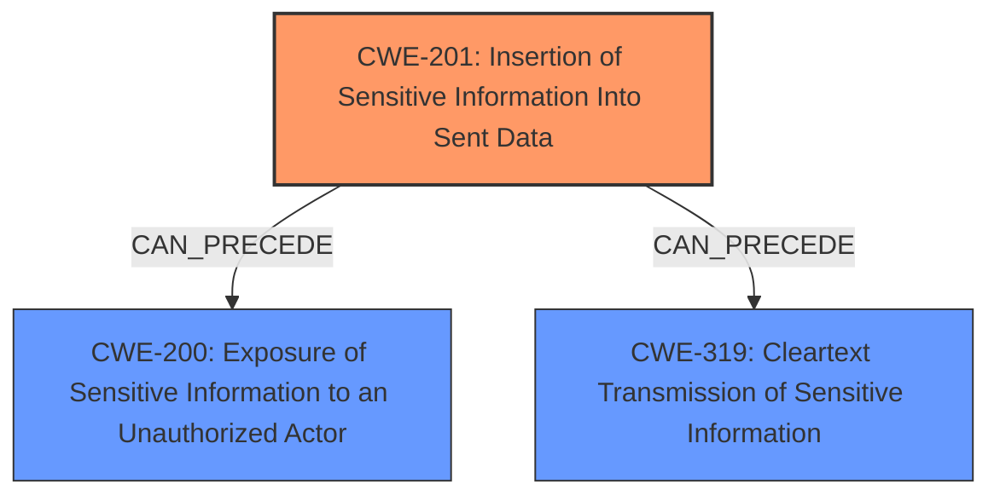

# Analysis Report for CVE-2024-55272

# Vulnerability Analysis Report: CVE-2024-55272

## Description

An issue in Brainasoft Braina v2.8 allows a remote attacker to obtain sensitive information via the chat window function.

## Vulnerability Description Key Phrases

- **Impact:** obtain sensitive information
- **Attacker:** remote attacker
- **Product:** Brainasoft Braina
- **Version:** v2.8
- **Component:** chat window function

## Analysis (with Relationship Data)

# Summary
| CWE ID | CWE Name | Confidence | CWE Abstraction Level | CWE Vulnerability Mapping Label | CWE-Vulnerability Mapping Notes |
|---|---|---|---|---|---|
| CWE-201 | Insertion of Sensitive Information Into Sent Data | 0.8 | Base | Allowed | Primary CWE. The application **inserts sensitive information** into data sent through the chat window function. |
| CWE-200 | Exposure of Sensitive Information to an Unauthorized Actor | 0.5 | Class | Discouraged | Secondary candidate. This is a potential impact of the primary weakness but is too high-level. |
| CWE-319 | Cleartext Transmission of Sensitive Information | 0.5 | Base | Allowed | Secondary candidate. It is possible the data is sent in cleartext, but this is not explicitly stated. |

## Evidence and Confidence

*   **Confidence Score:** 0.7
*   **Evidence Strength:** MEDIUM

## Relationship Analysis
The primary CWE is CWE-201, which is a Base level CWE. The retriever results also suggested CWE-200 and CWE-319. CWE-200 is a class-level CWE and is too generic. CWE-319 might be a valid weakness if the data is transmitted in cleartext.



## Vulnerability Chain
The vulnerability chain starts with the **insertion of sensitive information** into the data being sent (CWE-201). This can then lead to the exposure of sensitive information to an unauthorized actor (CWE-200) and potentially the cleartext transmission of the same information (CWE-319).

## Summary of Analysis
The vulnerability description states that a remote attacker can obtain sensitive information via the chat window function. This points towards **sensitive information** being included in the data that is being sent via the chat window.

The retriever results indicated a few candidate CWEs. The primary candidate is CWE-201 (Insertion of Sensitive Information Into Sent Data), with a score of 0.036, which aligns well with the description. The description states that the attacker obtains the information via the chat window function, implying that the sensitive information is being inserted into the data being sent.

CWE-200 (Exposure of Sensitive Information to an Unauthorized Actor) is a potential impact of the vulnerability but not the root cause.

CWE-319 (Cleartext Transmission of Sensitive Information) might be a valid secondary weakness if the data is being transmitted in cleartext, which is not explicitly stated in the description.

The best and most specific CWE is CWE-201.

Relevant CWE Information:
*   CWE-201: Insertion of Sensitive Information Into Sent Data - The code transmits data to another actor, but a portion of the data includes sensitive information that should not be accessible to that actor.


## CWE Relationship Analysis

Current CWEs represent these abstraction levels: .


### Vulnerability Chain Analysis

**Chain starting from CWE-319:**
- 319 (Cleartext Transmission of Sensitive Information) - ROOT


**Chain starting from CWE-200:**
- 200 (Exposure of Sensitive Information to an Unauthorized Actor) - ROOT


### CWE Relationship Diagram

```mermaid
graph TD
    classDef primary fill:#f96,stroke:#333,stroke-width:2px
    classDef secondary fill:#69f,stroke:#333
    classDef tertiary fill:#9e9,stroke:#333
```


*Report generated on 2025-07-13 23:12:06*
