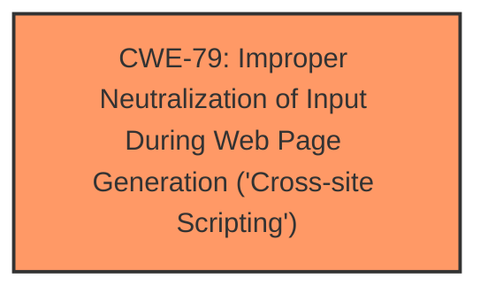

# Enhanced Analysis for CVE-2024-5531

# Summary

| CWE ID  | CWE Name                                                                        | Confidence | CWE Abstraction Level | CWE Vulnerability Mapping Label | CWE-Vulnerability Mapping Notes |
| ------- | ------------------------------------------------------------------------------- | ---------- | ----------------------- | ------------------------------- | --------------------------------- |
| CWE-79  | Improper Neutralization of Input During Web Page Generation ('Cross-site Scripting') | 1          | Base                    | Primary                         | Allowed                           |

## Evidence and Confidence

*   **Confidence Score:** 1
*   **Evidence Strength:** HIGH

## Relationship Analysis

The primary CWE is CWE-79 [Improper Neutralization of Input During Web Page Generation ('Cross-site Scripting')], which is a Base level CWE. There are several potential parent or child relationships, such as CWE-113 [Improper Neutralization of CRLF Sequences in HTTP Headers ('HTTP Request/Response Splitting')] or CWE-80 [Improper Neutralization of Script-Related HTML Tags in a Web Page (Basic XSS)], but the description does not provide enough information to select a more specific variant. The other Class level CWEs such as CWE-138 [Improper Neutralization of Special Elements] and CWE-116 [Improper Encoding or Escaping of Output] are less specific and are therefore not as good a fit.



## Vulnerability Chain

The vulnerability chain starts with **insufficient input sanitization and output escaping** of user-supplied attributes in the Flickr widget, leading to stored cross-site scripting (XSS). An attacker injects arbitrary web scripts via the `id` parameter of the Flickr widget, which are then executed when a user views the page, leading to potential malicious actions.

## Summary of Analysis

The primary weakness is clearly **cross-site scripting** due to **insufficient input sanitization and output escaping**. The evidence supports this with phrases like "**insufficient input sanitization and output escaping on user supplied attributes**". The vulnerability description and the CVE reference summary both explicitly mention stored XSS. The CVE summary further specifies that the vulnerable code is in `includes/widgets/flickr.php` and that `strip_tags` is used instead of `esc_attr` or similar escaping function.

CWE-79 [Improper Neutralization of Input During Web Page Generation ('Cross-site Scripting')] is the best fit because it directly addresses the root cause of the vulnerability, which is the **improper neutralization of user-controllable input** before it is placed in a web page. This aligns perfectly with the description of the vulnerability.

The other CWEs were considered but not selected because they are either too general (e.g., CWE-20 [Improper Input Validation]), address a different type of vulnerability (e.g., CWE-89 [Improper Neutralization of Special Elements used in an SQL Command ('SQL Injection')]), or are at a higher level of abstraction (e.g., CWE-138 [Improper Neutralization of Special Elements]).
CWE-116 [Improper Encoding or Escaping of Output] is a Class level CWE and is less specific than CWE-79 [Improper Neutralization of Input During Web Page Generation ('Cross-site Scripting')].
CWE-352 [Cross-Site Request Forgery (CSRF)] is not relevant because the vulnerability is not related to CSRF.

Relevant CWE Information:
*   CWE-79 [Improper Neutralization of Input During Web Page Generation ('Cross-site Scripting')]
    *   The product does not neutralize or incorrectly neutralizes user-controllable input before it is placed in output that is used as a web page that is served to other users.
    *   This aligns perfectly with the vulnerability description, which mentions **insufficient input sanitization and output escaping** on user-supplied attributes.


## CWE Relationship Analysis

Current CWEs represent these abstraction levels: .


### Vulnerability Chain Analysis

**Chain starting from CWE-89:**
- 89 (Improper Neutralization of Special Elements used in an SQL Command ('SQL Injection')) - ROOT


**Chain starting from CWE-116:**
- 116 (Improper Encoding or Escaping of Output) - ROOT


### CWE Relationship Diagram

```mermaid
graph TD
    classDef primary fill:#f96,stroke:#333,stroke-width:2px
    classDef secondary fill:#69f,stroke:#333
    classDef tertiary fill:#9e9,stroke:#333
```