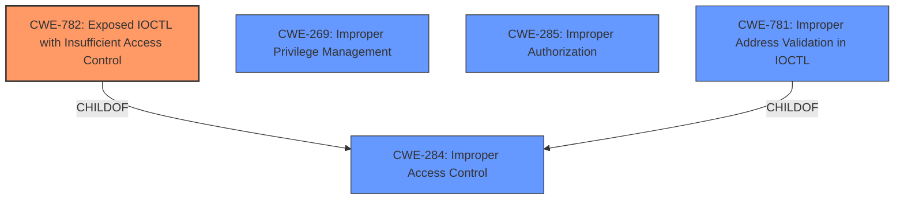

# Enhanced Analysis for CVE-2024-55414

# Summary
| CWE ID  | CWE Name                                                        | Confidence | CWE Abstraction Level | CWE Vulnerability Mapping Label | CWE-Vulnerability Mapping Notes |
| :-------- | :-------------------------------------------------------------- | :--------- | :-------------------- | :------------------------------ | :------------------------------ |
| CWE-782   | Exposed IOCTL with Insufficient Access Control                | 0.9        | Variant               | Primary                         | Allowed                         |
| CWE-269   | Improper Privilege Management                                 | 0.5        | Class                 | Secondary                       | Discouraged                     |
| CWE-285   | Improper Authorization                                        | 0.5        | Class                 | Secondary                       | Discouraged                     |

## Evidence and Confidence

*   **Confidence Score:** 0.7
*   **Evidence Strength:** MEDIUM

## Relationship Analysis
The primary CWE identified is CWE-782, which is a Variant of CWE-284 (Improper Access Control). CWE-781 is a sibling of CWE-782. The analysis also considered CWE-269 and CWE-285 which are related to Privilege Management and Authorization respectively. Given the specific mention of IOCTL and insufficient access control, CWE-782 was selected as the most specific and relevant option. CWE-269 and CWE-285 are broader and considered secondary due to the privilege escalation impact.



## Vulnerability Chain
The vulnerability chain starts with the **insufficient access control** on an exposed IOCTL (CWE-782), which allows low-privileged users to map physical memory. This leads to privilege escalation, code execution under high privileges, and information disclosure.

## Summary of Analysis
The primary classification is CWE-782 (Exposed IOCTL with Insufficient Access Control) because the vulnerability description specifically mentions "specially crafted IOCTL requests" and the **lack of proper access control**. This is supported by the vulnerability description stating, "allows low-privileged users to mapping physical memory via specially crafted IOCTL requests." This aligns directly with the CWE-782 description, which focuses on IOCTLs with functionality that should be restricted but lacks proper access control enforcement.

CWE-269 (Improper Privilege Management) and CWE-285 (Improper Authorization) were considered because the vulnerability leads to privilege escalation. However, these are more general and don't capture the specific issue of an exposed IOCTL. The guidance discourages using CWE-269 for privilege escalation without identifying the root cause. Since the root cause is the exposed IOCTL, CWE-782 is the more appropriate choice.

The chosen CWE is at the Variant level of abstraction, which provides a specific characterization of the weakness related to IOCTLs. This level of specificity is preferred over higher-level Class or Pillar CWEs like CWE-284 (Improper Access Control).

Relevant CWE Information:

# Enhanced Context (25 CWEs)
The following CWEs were identified as potentially relevant to this vulnerability:

## CWE-782: Exposed IOCTL with Insufficient Access Control
**Abstraction Level**: Variant
**Similarity Score**: 0.77
**Source**: dense

**Description**:
The product implements an IOCTL with functionality that should be restricted, but it does not properly enforce access control for the IOCTL.

**Mapping Guidance**:
- Usage: Allowed
- Rationale: This CWE entry is at the Variant level of abstraction, which is a preferred level of abstraction for mapping to the root causes of vulnerabilities.

## CWE-269: Improper Privilege Management
**Abstraction Level**: Class
**Similarity Score**: 1348.55
**Source**: sparse

**Description**:
The product does not properly assign, modify, track, or check privileges for an actor, creating an unintended sphere of control for that actor.

**Mapping Guidance**:
- Usage: Discouraged
- Rationale: CWE-269 is commonly misused. It can be conflated with "privilege escalation," which is a technical impact that is listed in many low-information vulnerability reports [REF-1287]. It is not useful for trend analysis.

## CWE-285: Improper Authorization
**Abstraction Level**: Class
**Similarity Score**: 1324.41
**Source**: sparse

**Description**:
The product does not perform or incorrectly performs an authorization check when an actor attempts to access a resource or perform an action.

**Mapping Guidance**:
- Usage: Discouraged
- Rationale: CWE-285 is high-level and lower-level CWEs can frequently be used instead. It is a level-1 Class (i.e., a child of a Pillar).


## CWE Relationship Analysis

Current CWEs represent these abstraction levels: .


### Vulnerability Chain Analysis

**Chain starting from CWE-782:**
- 782 (Exposed IOCTL with Insufficient Access Control) - ROOT


**Chain starting from CWE-269:**
- 269 (Improper Privilege Management) - ROOT


### CWE Relationship Diagram

```mermaid
graph TD
    classDef primary fill:#f96,stroke:#333,stroke-width:2px
    classDef secondary fill:#69f,stroke:#333
    classDef tertiary fill:#9e9,stroke:#333
```