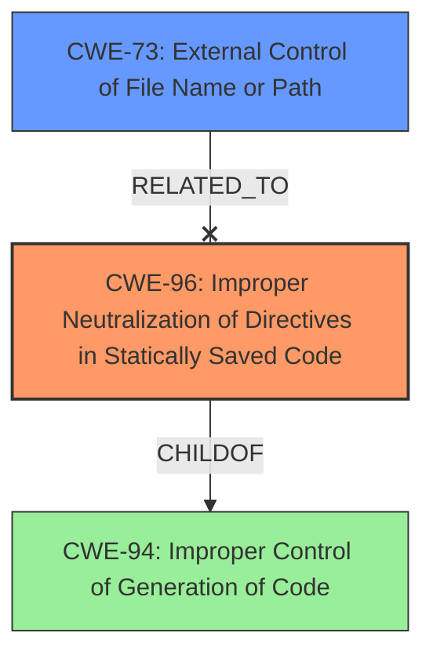

# Enhanced Analysis for CVE-2024-55461

# Summary
| CWE ID | CWE Name | Confidence | CWE Abstraction Level | CWE Vulnerability Mapping Label | CWE-Vulnerability Mapping Notes |
|---|---|---|---|---|---|
| CWE-96 | Improper Neutralization of Directives in Statically Saved Code ('Static Code Injection') | 0.9 | Base | Primary | Allowed |
| CWE-73 | External Control of File Name or Path | 0.7 | Base | Secondary | Allowed |

## Evidence and Confidence

*   **Confidence Score:** 0.8
*   **Evidence Strength:** MEDIUM

## Relationship Analysis
The primary relationship that influenced the selection was the parent-child relationship between CWE-94 (Improper Control of Generation of Code) and CWE-96 (Improper Neutralization of Directives in Statically Saved Code). Since the code being injected is statically saved (in a config file), CWE-96 is more specific and appropriate than CWE-94. CWE-73 is a contributing factor because the attacker can control part of the file path.



## Vulnerability Chain
The vulnerability chain starts with **insufficient sanitization** of input parameters (`mypath`, `oldword`, `newword`) passed to the `Ebak_RepPathFiletext` function. This leads to the ability to inject code into statically saved files (like configuration files), ultimately resulting in remote code execution. There's also a path traversal aspect, where the attacker has limited control over the file path.

## Summary of Analysis
The initial assessment identified several potential CWEs, including those related to injection and path traversal. After careful consideration of the vulnerability details, relationship analysis, and mapping guidance, the primary CWE was determined to be CWE-96 (Improper Neutralization of Directives in Statically Saved Code). This is because the vulnerability involves injecting code into statically saved files due to **insufficient sanitization**. The evidence supporting this decision comes directly from the "CVE Reference Links Content Summary," which states that the function "inadequately sanitizes user-provided input" and that an attacker can "inject malicious code into these files." The path traversal aspect (CWE-73) is a contributing factor, as the attacker has some control over the file path. However, the core issue is the ability to inject code, making CWE-96 the primary weakness.

Relevant CWE Information:

# Enhanced Context (25 CWEs)
The following CWEs were identified as potentially relevant to this vulnerability:

## CWE-425: Direct Request ('Forced Browsing')
**Abstraction Level**: Base
**Similarity Score**: 0.79
**Source**: dense

**Description**:
The web application does not adequately enforce appropriate authorization on all restricted URLs, scripts, or files.

**Mapping Guidance**:
- Usage: Allowed
- Rationale: This CWE entry is at the Base level of abstraction, which is a preferred level of abstraction for mapping to the root causes of vulnerabilities.


## CWE-96: Improper Neutralization of Directives in Statically Saved Code ('Static Code Injection')
**Abstraction Level**: Base
**Similarity Score**: 0.78
**Source**: dense

**Description**:
The product receives input from an upstream component, but it does not neutralize or incorrectly neutralizes code syntax before inserting the input into an executable resource, such as a library, configuration file, or template.

**Mapping Guidance**:
- Usage: Allowed
- Rationale: This CWE entry is at the Base level of abstraction, which is a preferred level of abstraction for mapping to the root causes of vulnerabilities.

**Vulnerability Description Key Phrases:**
- **impact:** command execution
- **product:** SeaCMS
- **version:** <=13.0
- **component:** phome.php

**CVE Reference Links Content Summary:**
-   **Root Cause:** The vulnerability lies in the `Ebak_RepPathFiletext` function within the `phome.php` file of the Seacms backend. This function is designed to replace text within files located in a backup directory. However, it **inadequately sanitizes** user-provided input, specifically the `mypath`, `oldword` and `newword` parameters.
-   **Unrestricted File Modification:** The core issue is that the function reads and replaces content in files within the user-controlled path (under `$bakpath`). The function `WriteFiletext_n` is used to write the modified content to the file, and the `$newvalue` that is written to the file is mostly controlled by the attacker with limited filtering.
-   **Insufficient Input Sanitization:** The `Ebak_ClearAddsData` function is applied to the `oldword` and `newword` parameters which appear to be **insufficient** to prevent the injection of malicious code.
-   **Impact of Exploitation:** An attacker can modify the contents of arbitrary files within the backup directory of the application. This can include configuration files such as `config.php`. By injecting malicious code into these files, an attacker can achieve Remote Code Execution (RCE) on the server.  The provided example shows that the attacker was able to inject `phpinfo()` into the config.php file.

## CWE-434: Unrestricted Upload of File with Dangerous Type
**Abstraction Level**: Base
**Similarity Score**: 0.78
**Source**: dense

**Description**:
The product allows the upload or transfer of dangerous file types that are automatically processed within its environment.

**Mapping Guidance**:
- Usage: Allowed
- Rationale: This CWE entry is at the Base level of abstraction, which is a preferred level of abstraction for mapping to the root causes of vulnerabilities.


## CWE-74: Improper Neutralization of Special Elements in Output Used by a Downstream Component ('Injection')
**Abstraction Level**: Class
**Similarity Score**: 0.77
**Source**: dense

**Description**:
The product constructs all or part of a command, data structure, or record using externally-influenced input from an upstream component, but it does not neutralize or incorrectly neutralizes special elements that could modify how it is parsed or interpreted when it is sent to a downstream component.

**Mapping Guidance**:
- Usage: Discouraged
- Rationale: CWE-74 is high-level and often misused when lower-level weaknesses are more appropriate.


## CWE-116: Improper Encoding or Escaping of Output
**Abstraction Level**: Class
**Similarity Score**: 0.77
**Source**: dense

**Description**:
The product prepares a structured message for communication with another component, but encoding or escaping of the data is either missing or done incorrectly. As a result, the intended structure of the message is not preserved.

**Mapping Guidance**:
- Usage: Allowed-with-Review
- Rationale: This CWE entry is a Class and might have Base-level children that would be more appropriate


## CWE-178: Improper Handling of Case Sensitivity
**Abstraction Level**: Base
**Similarity Score**: 0.77
**Source**: dense

**Description**:
The product does not properly account for differences in case sensitivity when accessing or determining the properties of a resource, leading to inconsistent results.

**Mapping Guidance**:
- Usage: Allowed
- Rationale: This CWE entry is at the Base level of abstraction, which is a preferred level of abstraction for mapping to the root causes of vulnerabilities.


## CWE-73: External Control of File Name or Path
**Abstraction Level**: Base
**Similarity Score**: 0.77
**Source**: dense

**Description**:
The product allows user input to control or influence paths or file names that are used in filesystem operations.

**Mapping Guidance**:
- Usage: Allowed
- Rationale: This CWE entry is at the Base level of abstraction, which is a preferred level of abstraction for mapping to the root causes of vulnerabilities.

**CVE Reference Links Content Summary:**
-   **Path Traversal (Limited):** Although there's a check for `..` in `$mypath`, the `$bakpath` is hardcoded and allows an attacker to control the `$path` variable by controlling the `mypath` parameter. This limits the path traversal to the subdirectories of `$bakpath`.

## CWE-472: External Control of Assumed-Immutable Web Parameter
**Abstraction Level**: Base
**Similarity Score**: 0.76
**Source**: dense

**Description**:
The web application does not sufficiently verify inputs that are assumed to be immutable but are actually externally controllable, such as hidden form fields.

**Mapping Guidance**:
- Usage: Allowed
- Rationale: This CWE entry is at the Base level of abstraction, which is a preferred level of abstraction for mapping to the root causes of vulnerabilities.


## CWE-8


## CWE Relationship Analysis

Current CWEs represent these abstraction levels: .


### Vulnerability Chain Analysis

**Chain starting from CWE-94:**
- 94 (Improper Control of Generation of Code ('Code Injection')) - ROOT


**Chain starting from CWE-116:**
- 116 (Improper Encoding or Escaping of Output) - ROOT


### CWE Relationship Diagram

```mermaid
graph TD
    classDef primary fill:#f96,stroke:#333,stroke-width:2px
    classDef secondary fill:#69f,stroke:#333
    classDef tertiary fill:#9e9,stroke:#333
```