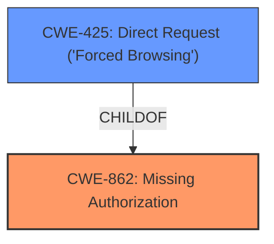

# Analysis Report for CVE-2024-5570

# Vulnerability Analysis Report: CVE-2024-5570

## Description

The Simple Photoswipe WordPress plugin through 0.1 **does not have authorisation check** when updating its settings, which could allow any authenticated users, such as subscriber to update them

## Vulnerability Description Key Phrases

- **Rootcause:** does not have authorisation check
- **Attacker:** any authenticated users
- **Product:** Simple Photoswipe WordPress plugin
- **Version:** through 0.1
- **Component:** settings

## Analysis (with Relationship Data)

# Summary
| CWE ID | CWE Name | Confidence | CWE Abstraction Level | CWE Vulnerability Mapping Label | CWE-Vulnerability Mapping Notes |
|---|---|---|---|---|---|
| CWE-862 | Missing Authorization | 1.0 | Class | Allowed-with-Review | Primary CWE. The plugin lacks any authorization checks when updating settings, allowing unauthorized access. |
| CWE-425 | Direct Request ('Forced Browsing') | 0.7 | Base | Allowed | Secondary CWE. The vulnerability can be exploited by directly accessing the options-general.php page without proper authorization checks. |

## Evidence and Confidence

*   **Confidence Score:** 1.0
*   **Evidence Strength:** HIGH

## Relationship Analysis
The primary relationship is the child-of relationship where CWE-862 is a class-level weakness. While more specific base-level CWEs might exist, the evidence directly points to a general lack of authorization. CWE-425, a base-level CWE, is included as a secondary weakness, representing the specific attack vector.



## Vulnerability Chain
The vulnerability chain starts with the **missing authorization check** (**CWE-862**), which allows any authenticated user to directly access and modify the plugin settings via a direct request (**CWE-425**). The final impact is the unauthorized modification of plugin settings.

## Summary of Analysis
The primary CWE is CWE-862 because the **root cause** of the vulnerability is the **lack of an authorization check**. The vulnerability description explicitly states that the plugin "**does not have authorisation check** when updating its settings". This aligns perfectly with the definition of CWE-862, which states, "The product does not perform an authorization check when an actor attempts to access a resource or perform an action."

The selection of CWE-862 is further supported by the "CVE Reference Links Content Summary," which highlights the root cause as the "plugin lacks authorization checks when updating its settings."

CWE-425 is added as a secondary CWE because the vulnerability is exploited by sending a direct request to `wp-admin/options-general.php` without proper authorization. This aligns with CWE-425's description: "The web application does not adequately enforce appropriate authorization on all restricted URLs, scripts, or files."

The evidence provided is strong and directly supports the selection of CWE-862 as the primary CWE. The relationship analysis further clarifies the connection between the missing authorization check and the direct request attack vector. The selected CWEs are at the optimal level of specificity, with CWE-862 representing the general lack of authorization and CWE-425 representing the specific attack vector.

Relevant CWE Information:

# Enhanced Context (25 CWEs)
The following CWEs were identified as potentially relevant to this vulnerability:

## CWE-352: Cross-Site Request Forgery (CSRF)
**Abstraction Level**: Compound
**Similarity Score**: 0.74
**Source**: dense

**Description**:
The web application does not, or can not, sufficiently verify whether a well-formed, valid, consistent request was intentionally provided by the user who submitted the request.

**Mapping Guidance**:
- Usage: Allowed
- Rationale: This is a well-known Composite of multiple weaknesses that must all occur simultaneously, although it is attack-oriented in nature.

*Not Selected*: While CSRF could be a concern, the description focuses on the **missing authorization**, not the inability to verify the request's origin.

## CWE-472: External Control of Assumed-Immutable Web Parameter
**Abstraction Level**: Base
**Similarity Score**: 0.69
**Source**: dense

**Description**:
The web application does not sufficiently verify inputs that are assumed to be immutable but are actually externally controllable, such as hidden form fields.

**Mapping Guidance**:
- Usage: Allowed
- Rationale: This CWE entry is at the Base level of abstraction, which is a preferred level of abstraction for mapping to the root causes of vulnerabilities.

*Not Selected*: The vulnerability is not about the verification of assumed-immutable parameters, but rather about the **lack of authorization** to modify the settings in the first place.

## CWE-425: Direct Request ('Forced Browsing')
**Abstraction Level**: Base
**Similarity Score**: 0.69
**Source**: dense

**Description**:
The web application does not adequately enforce appropriate authorization on all restricted URLs, scripts, or files.

**Mapping Guidance**:
- Usage: Allowed
- Rationale: This CWE entry is at the Base level of abstraction, which is a preferred level of abstraction for mapping to the root causes of vulnerabilities.

*Selected as Secondary*: As discussed above it is added as a secondary weakness, representing the specific attack vector.

## CWE-434: Unrestricted Upload of File with Dangerous Type
**Abstraction Level**: Base
**Similarity Score**: 0.68
**Source**: dense

**Description**:
The product allows the upload or transfer of dangerous file types that are automatically processed within its environment.

**Mapping Guidance**:
- Usage: Allowed
- Rationale: This CWE entry is at the Base level of abstraction, which is a preferred level of abstraction for mapping to the root causes of vulnerabilities.

*Not Selected*: This CWE is irrelevant to the vulnerability description, as it pertains to file uploads, not authorization checks for settings modification.

## CWE-639: Authorization Bypass Through User-Controlled Key
**Abstraction Level**: Base
**Similarity Score**: 0.67
**Source**: dense

**Description**:
The system's authorization functionality does not prevent one user from gaining access to another user's data or record by modifying the key value identifying the data.

**Mapping Guidance**:
- Usage: Allowed
- Rationale: This CWE entry is at the Base level of abstraction, which is a preferred level of abstraction for mapping to the root causes of vulnerabilities.

*Not Selected*: This is not about bypassing authorization through user-controlled keys but about a **complete lack of authorization checks**.

## CWE-862: Missing Authorization
**Abstraction Level**: Class
**Similarity Score**: 0.67
**Source**: dense

**Description**:
The product does not perform an authorization check when an actor attempts to access a resource or perform an action.

**Mapping Guidance**:
- Usage: Allowed-with-Review
- Rationale: This CWE entry is a Class and might have Base-level children that would be more appropriate

*Selected as Primary*: As discussed above it is added as a Primary weakness because the **root cause** of the vulnerability is the **lack of an authorization check**.

## CWE-116: Improper Encoding or Escaping of Output
**Abstraction Level**: Class
**Similarity Score**: 0.65
**Source**: dense

**Description**:
The product prepares a structured message for communication with another component, but encoding or escaping of the data is either missing or done incorrectly. As a result, the intended structure of the message is not preserved.

**Mapping Guidance**:
- Usage: Allowed-with-Review
- Rationale: This CWE entry is a Class and might have Base-level children that would be more appropriate

*Not Selected*: This CWE is related to encoding and escaping of output, which is not relevant to the **missing authorization** issue described in the vulnerability.

## CWE-306: Missing Authentication for Critical Function
**Abstraction Level**: Base
**Similarity Score**: 0.64
**Source**: dense

**Description**:
The product does not perform any authentication for functionality that requires a provable user identity or consumes a significant amount of resources.

**Mapping Guidance**:
- Usage: Allowed
- Rationale: This CWE entry is at the Base level of abstraction, which is a preferred level of abstraction for mapping to the root causes of vulnerabilities.

*Not Selected*: The description mentions that any authenticated user can exploit the vulnerability. Thus, authentication exists but authorization is **missing**.

## CWE-184: Incomplete List of Disallowed Inputs
**Abstraction Level**: Base
**Similarity Score**: 0.64
**Source**: dense

**Description**:
The product implements a protection mechanism that relies on a list of inputs (or properties of inputs) that are not allowed by policy or otherwise require other action to neutralize before additional processing takes place, but the list is incomplete.

**Mapping Guidance**:
- Usage: Allowed
- Rationale: This CWE entry is at the Base level of abstraction, which is a preferred level of abstraction for mapping to the root causes of vulnerabilities.

*Not Selected*: The issue is not related to an incomplete list of disallowed inputs, but rather the **complete absence of an authorization check**.

## CWE-863: Incorrect Authorization
**Abstraction Level**: Class
**Similarity Score**: 0.64
**Source**: dense

**Description**:
The product performs an authorization check when an actor attempts to access a resource or perform an action, but it does not correctly perform the check.

**


## CWE Relationship Analysis

Current CWEs represent these abstraction levels: .


### Vulnerability Chain Analysis

**Chain starting from CWE-863:**
- 863 (Incorrect Authorization) - ROOT


**Chain starting from CWE-116:**
- 116 (Improper Encoding or Escaping of Output) - ROOT


### CWE Relationship Diagram

```mermaid
graph TD
    classDef primary fill:#f96,stroke:#333,stroke-width:2px
    classDef secondary fill:#69f,stroke:#333
    classDef tertiary fill:#9e9,stroke:#333
```


*Report generated on 2025-07-13 23:21:23*
