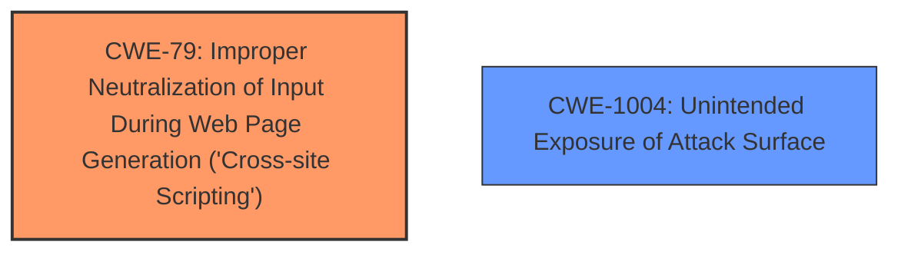

# Analysis Report for CVE-2024-55888

# Vulnerability Analysis Report: CVE-2024-55888

## Description

Hush Line is an open-source whistleblower management system. Starting in version 0.1.0 and prior to version 0.3.5, the productions server appeared to have been misconfigured and missed providing any content security policy or security headers. This could result in bypassing of **cross-site scripting** filters. Version 0.3.5 fixed the issue.

## Vulnerability Description Key Phrases

- **Rootcause:** misconfiguration
- **Weakness:** ['cross-site scripting', 'missing security headers']
- **Impact:** cross-site scripting bypass
- **Product:** Hush Line
- **Version:** 0.1.0 to 0.3.5
- **Component:** productions server

## Analysis (with Relationship Data)

# Summary
| CWE ID  | CWE Name | Confidence | CWE Abstraction Level | CWE Vulnerability Mapping Label | CWE-Vulnerability Mapping Notes |
|----------------|------------------------------------------------------------------------------------------------|----------------|---------------------------|------------------------------------|------------------------------------|
| **CWE-79** | Improper Neutralization of Input During Web Page Generation ('Cross-site Scripting') | 0.9  | Base  | Primary | Allowed |
| CWE-1004 |  Unintended Exposure of Attack Surface          | 0.7  | Base  | Secondary | Allowed |

## Evidence and Confidence

*   **Confidence Score:** 0.8
*   **Evidence Strength:** MEDIUM

## Relationship Analysis
The primary relationship is that **missing** security headers (**misconfiguration**) can lead to **CWE-79** Improper Neutralization of Input During Web Page Generation ('Cross-site Scripting'). There isn't a direct parent-child relationship that is more appropriate than the selected CWEs. The abstraction levels are appropriate for the identified weaknesses. CWE-79 is a base level CWE and directly addresses the cross-site scripting issue. CWE-1004 is a Base level CWE and addresses the exposure of the attack surface.



## Vulnerability Chain
The vulnerability chain starts with a **misconfiguration** (missing security headers) which leads to the bypassing of cross-site scripting filters and ultimately to a **cross-site scripting** vulnerability.

**Misconfiguration** (Missing Security Headers) -> **CWE-79** (Improper Neutralization of Input During Web Page Generation) -> **Cross-Site Scripting Vulnerability**

## Summary of Analysis
The analysis identified the primary weakness as **CWE-79** because the **misconfiguration** resulted in the bypassing of cross-site scripting filters. The evidence supporting this is the statement "productions server appeared to have been misconfigured and missed providing any content security policy or security headers. This could result in bypassing of **cross-site scripting** filters."

The retriever results consistently highlighted **CWE-79** as the most relevant CWE, especially considering the "WEAKNESS: 'cross-site scripting'" and "ROOTCAUSE: 'misconfiguration'" sections. The fact that security headers were **missing** points to a configuration issue that directly enables XSS.

CWE-1004 addresses the misconfiguration of the production server that lead to the **missing** security headers.

Other CWEs were considered, such as **CWE-113** (Improper Neutralization of CRLF Sequences in HTTP Headers), **CWE-918** (Server-Side Request Forgery), and **CWE-138** (Improper Neutralization of Special Elements), but these were deemed less relevant because they don't directly address the **misconfiguration** leading to the XSS bypass.

The selected CWEs are at the optimal level of specificity because they directly address the root cause and the immediate consequence of the vulnerability.


## CWE Relationship Analysis

Current CWEs represent these abstraction levels: .


### Vulnerability Chain Analysis

**Chain starting from CWE-79:**
- 79 (Improper Neutralization of Input During Web Page Generation ('Cross-site Scripting')) - ROOT


**Chain starting from CWE-113:**
- 113 (Improper Neutralization of CRLF Sequences in HTTP Headers ('HTTP Request/Response Splitting')) - ROOT


### CWE Relationship Diagram

```mermaid
graph TD
    classDef primary fill:#f96,stroke:#333,stroke-width:2px
    classDef secondary fill:#69f,stroke:#333
    classDef tertiary fill:#9e9,stroke:#333
```


*Report generated on 2025-07-13 23:22:24*
