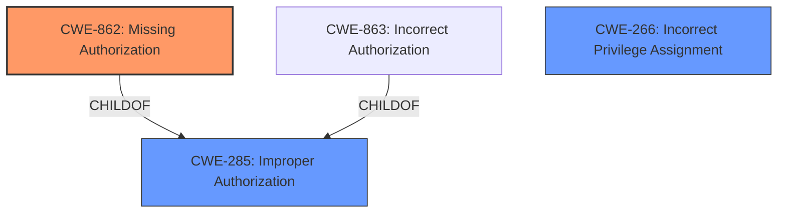

# Analysis Report for CVE-2024-55949

# Vulnerability Analysis Report: CVE-2024-55949

## Description

MinIO is a high-performance, S3 compatible object store, open sourced under GNU AGPLv3 license. Minio is subject to a privilege escalation in IAM import API, all users are impacted since MinIO commit `580d9db85e04f1b63cc2909af50f0ed08afa965f`. This issue has been addressed in commit `f246c9053f9603e610d98439799bdd2a6b293427` which is included in RELEASE.2024-12-13T22-19-12Z. There are no workarounds possible, all users are advised to upgrade immediately.

## Vulnerability Description Key Phrases

- **Impact:** privilege escalation
- **Product:** MinIO
- **Component:** IAM import API

## Analysis (with Relationship Data)

# Summary
| CWE ID | CWE Name | Confidence | CWE Abstraction Level | CWE Vulnerability Mapping Label | CWE-Vulnerability Mapping Notes |
|---|---|---|---|---|---|
| CWE-862 | Missing Authorization | 1 | Base |  Primary CWE | Allowed |
| CWE-266 | Incorrect Privilege Assignment | 0.7 | Base | Secondary Candidate | Allowed |
| CWE-285 | Improper Authorization | 0.6 | Class | Secondary Candidate | Discouraged |

## Evidence and Confidence

*   **Confidence Score:** 0.8
*   **Evidence Strength:** HIGH

## Relationship Analysis
The primary relationship that influenced the decision was the parent-child relationship between CWE-285 (Improper Authorization) and CWE-862 (Missing Authorization). Since the vulnerability stems from a complete lack of authorization, CWE-862 is a more precise fit. CWE-266 (Incorrect Privilege Assignment) was also considered due to the privilege escalation impact, but the root cause is the missing authorization, making it a secondary concern.



## Vulnerability Chain
The vulnerability chain starts with **missing authorization** in the IAM import API (CWE-862). This leads to a user being able to upload a malicious `iam-info.zip` file. The user then escalates their privileges (CWE-266 is a secondary candidate because it describes the consequence). The final impact is potential data breach or system compromise.

## Summary of Analysis
The analysis is based on the provided vulnerability description and CVE reference. The key piece of evidence is the statement that the vulnerability stems from a **missing permissions check** in the IAM import API. This directly points to CWE-862 (Missing Authorization). The retriever results also included CWE-863 (Incorrect Authorization) and CWE-285 (Improper Authorization), but these imply that an authorization check exists but is flawed, which is not the case here.

The graph relationships influenced the decision by highlighting the parent-child relationship between CWE-862 and CWE-285. Choosing CWE-862 provides a more specific description of the vulnerability.

The selected CWEs are at the optimal level of specificity because CWE-862 accurately describes the **root cause** (missing authorization), while CWE-266 describes the **impact** (privilege escalation).

Relevant CWE Information:

# Enhanced Context (25 CWEs)
The following CWEs were identified as potentially relevant to this vulnerability:

## CWE-266: Incorrect Privilege Assignment
**Abstraction Level**: Base
**Similarity Score**: 0.79
**Source**: dense

**Description**:
A product incorrectly assigns a privilege to a particular actor, creating an unintended sphere of control for that actor.

**Mapping Guidance**:
- Usage: Allowed
- Rationale: This CWE entry is at the Base level of abstraction, which is a preferred level of abstraction for mapping to the root causes of vulnerabilities.

## CWE-285: Improper Authorization
**Abstraction Level**: Class
**Similarity Score**: 2023.86
**Source**: sparse

**Description**:
The product does not perform or incorrectly performs an authorization check when an actor attempts to access a resource or perform an action.

**Mapping Guidance**:
- Usage: Discouraged
- Rationale: CWE-285 is high-level and lower-level CWEs can frequently be used instead. It is a level-1 Class (i.e., a child of a Pillar).

## CWE-862: Missing Authorization
CWE-862 (Missing Authorization) is the primary CWE because the vulnerability is caused by the **complete absence of an authorization check**, allowing users to perform actions they should not be able to.
CWE-266 (Incorrect Privilege Assignment) is a secondary candidate because it relates to the **impact** of the vulnerability, which is privilege escalation.
CWE-285 (Improper Authorization) was considered, but it's a less precise fit as it describes scenarios where an authorization check exists but is flawed.


## CWE Relationship Analysis

Current CWEs represent these abstraction levels: .


### Vulnerability Chain Analysis

**Chain starting from CWE-266:**
- 266 (Incorrect Privilege Assignment) - ROOT


**Chain starting from CWE-863:**
- 863 (Incorrect Authorization) - ROOT


### CWE Relationship Diagram

```mermaid
graph TD
    classDef primary fill:#f96,stroke:#333,stroke-width:2px
    classDef secondary fill:#69f,stroke:#333
    classDef tertiary fill:#9e9,stroke:#333
```


*Report generated on 2025-07-13 23:24:52*
