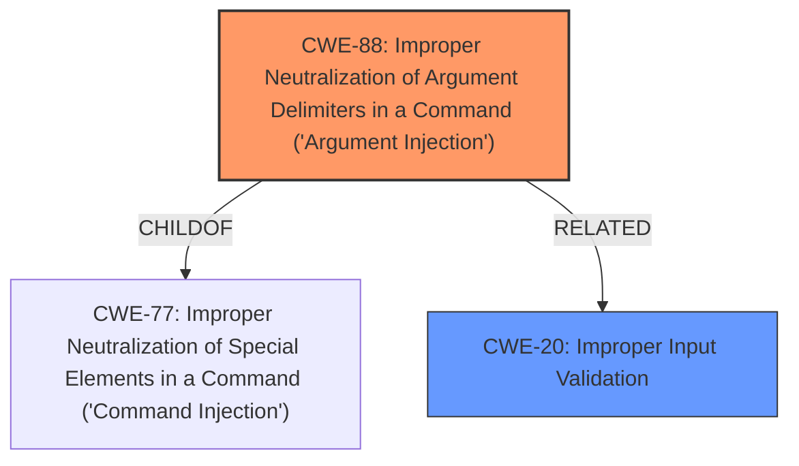

# Enhanced Analysis for CVE-2024-55953

# Summary
| CWE ID | CWE Name | Confidence | CWE Abstraction Level | CWE Vulnerability Mapping Label | CWE-Vulnerability Mapping Notes |
|---|---|---|---|---|---|
| CWE-88 | Improper Neutralization of Argument Delimiters in a Command ('Argument Injection') | 0.9 | Base | Primary | Allowed |
| CWE-20 | Improper Input Validation | 0.7 | Class | Secondary | Allowed |

## Evidence and Confidence

*   **Confidence Score:** 0.8
*   **Evidence Strength:** HIGH

## Relationship Analysis
The primary weakness is identified as CWE-88, which is a Base level CWE and a child of CWE-77 (Improper Neutralization of Special Elements in Command). CWE-20 is a class-level CWE. The analysis prioritizes CWE-88 because it is a more specific, base-level representation of the vulnerability, aligning with the principle of selecting the most granular CWE.



## Vulnerability Chain
The vulnerability chain starts with **improper filtering** (CWE-88), leading to the ability to inject parameters into the JDBC connection string. This enables arbitrary file reading and potentially remote code execution. The chain highlights the progression from the initial input validation failure to the final impact.

## Summary of Analysis
The analysis is primarily based on the provided vulnerability description and CVE reference summary, which highlight the **lack of input filtering** and the ability to inject parameters into the JDBC connection string. The selection of CWE-88 is strongly supported by the evidence and is more specific than alternatives like CWE-74 or CWE-138. The confidence is high due to the clear connection between the vulnerability details and the chosen CWE.

Relevant CWE Information:

# Enhanced Context (25 CWEs)
The following CWEs were identified as potentially relevant to this vulnerability:

## Vulnerability Description
DataEase is an open source business analytics tool. Authenticated users can read and deserialize arbitrary files through the background JDBC connection. When constructing the jdbc connection string, the **parameters are not filtered**. This vulnerability has been fixed in v1.18.27. Users are advised to upgrade. There are no known workarounds for this vulnerability.

### Vulnerability Description Key Phrases
- **rootcause:** **parameters are not filtered**
- **impact:** arbitrary file access
- **attacker:** authenticated users
- **product:** DataEase
- **version:** before 1.18.27
- **component:** background JDBC connection

## CVE Reference Links Content Summary
Based on the provided content, here's an analysis of CVE-2024-55953:

**Root Cause of Vulnerability:**

The vulnerability stems from insufficient filtering of parameters when constructing JDBC connection strings in DataEase. Specifically, the application fails to properly sanitize the `host` parameter, allowing an attacker to inject malicious parameters. This enables them to bypass intended restrictions and execute arbitrary actions.

**Weaknesses/Vulnerabilities Present:**

*   **Inadequate Input Validation:** The primary weakness is the lack of robust input validation for the `host` parameter in the JDBC connection string. The application attempts to filter "illegal parameters" but does not apply this filtering correctly to the complete JDBC URL, leaving it vulnerable to parameter injection.

### Explanation of Selected CWEs:

*   **CWE-88: Improper Neutralization of Argument Delimiters in a Command ('Argument Injection')**
    *   **Technical Explanation:** The vulnerability description explicitly mentions that the **parameters are not filtered** when constructing the JDBC connection string. This allows an attacker to inject arbitrary arguments or delimiters, leading to unintended command execution. The CVE reference summary supports this, stating the application fails to properly sanitize the `host` parameter, allowing an attacker to inject malicious parameters.
    *   **Security Implications:** Attackers can manipulate the JDBC connection string to perform actions such as reading arbitrary files or potentially executing arbitrary code.
    *   **Relationships:** CWE-88 is a base-level CWE, providing a specific description of the vulnerability. It is a child of CWE-77, which is a more general form of command injection.
    *   **Primary Weakness:** This is the primary weakness, as it directly leads to the ability to inject malicious parameters.
    *   **MITRE Mapping Guidance:** Usage: Allowed. This CWE entry is at the Base level of abstraction, which is a preferred level of abstraction for mapping to the root causes of vulnerabilities.
*   **CWE-20: Improper Input Validation**
    *   **Technical Explanation:** This is a general class of weakness where the software does not validate input sufficiently. The CVE summary mentions "Inadequate Input Validation".
    *   **Security Implications:** This can lead to a wide range of vulnerabilities, including command injection, denial of service, and information disclosure.
    *   **Relationships:** CWE-20 is a high-level class, and more specific CWEs like CWE-88 are often more appropriate when the exact nature of the input validation failure is known.
    *   **Secondary Weakness:** This is a contributing factor as the rootcause is the lack of parameter filtering.

### Explanation of Other CWEs Considered:

*   **CWE-74: Improper Neutralization of Special Elements in Output Used by a Downstream Component ('Injection')** - While injection is a factor, CWE-88 is more specific to the argument injection within a command.
*   **CWE-138: Improper Neutralization of Special Elements** - This is a class-level CWE, and CWE-88 is a more specific base CWE.
*   **CWE-790: Improper Filtering of Special Elements** - While filtering is mentioned, CWE-88 is more specific to the argument injection.
*   **CWE-1336: Improper Neutralization of Special Elements Used in a Template Engine** - This is not related to the vulnerability description.
*   **CWE-532: Insertion of Sensitive Information into Log File, CWE-497: Exposure of Sensitive System Information to an Unauthorized Control Sphere, CWE-209: Generation of Error Message Containing Sensitive Information, CWE-538: Insertion of Sensitive Information into Externally-Accessible File or Directory, CWE-212: Improper Removal of Sensitive Information Before Storage or Transfer, CWE-668: Exposure of Resource to Wrong Sphere, CWE-252: Unchecked Return Value, CWE-204: Observable Response Discrepancy, CWE-303: Incorrect Implementation of Authentication Algorithm, CWE-116: Improper Encoding or Escaping of Output, CWE-789: Memory Allocation with Excessive Size Value, CWE-1333: Inefficient Regular Expression Complexity, CWE-770: Allocation of Resources Without Limits or Throttling, CWE-69: Improper Handling of Windows ::DATA Alternate Data Stream, CWE-1325: Improperly Controlled Sequential Memory Allocation, CWE-201: Insertion of Sensitive Information Into Sent Data, CWE-226: Sensitive Information in Resource Not Removed Before Reuse, CWE-756: Missing Custom Error Page, CWE-1284: Improper Validation of Specified Quantity in Input** - These are less relevant because they do not directly address the **lack of filtering** in the construction of the JDBC connection string.


## CWE Relationship Analysis

Current CWEs represent these abstraction levels: .


### Vulnerability Chain Analysis

**Chain starting from CWE-226:**
- 226 (Sensitive Information in Resource Not Removed Before Reuse) - ROOT


**Chain starting from CWE-770:**
- 770 (Allocation of Resources Without Limits or Throttling) - ROOT


### CWE Relationship Diagram

```mermaid
graph TD
    classDef primary fill:#f96,stroke:#333,stroke-width:2px
    classDef secondary fill:#69f,stroke:#333
    classDef tertiary fill:#9e9,stroke:#333
```