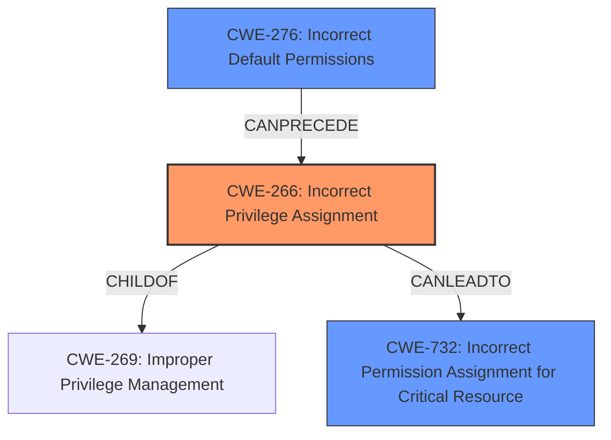

# Analysis for CVE-2024-55955

# Summary
| CWE ID | CWE Name | Confidence | CWE Abstraction Level | CWE Vulnerability Mapping Label | CWE-Vulnerability Mapping Notes |
|---|---|---|---|---|---|
| CWE-266 | Incorrect Privilege Assignment | 1.0 | Base | Allowed | Primary CWE. This is the root cause of the vulnerability as stated in the vulnerability description. |
| CWE-276 | Incorrect Default Permissions | 0.7 | Base | Allowed | Secondary candidate. The incorrect privilege assignment could be the result of incorrect default permissions. |
| CWE-732 | Incorrect Permission Assignment for Critical Resource | 0.6 | Class | Allowed-with-Review | Secondary candidate. The vulnerability description mentions incorrect permission assignment and this CWE covers that aspect. |

## Evidence and Confidence

*   **Confidence Score:** 0.9
*   **Evidence Strength:** HIGH

## Relationship Analysis
The primary CWE is CWE-266, which is a Base level CWE. It is related to other CWEs such as CWE-269 (Improper Privilege Management), which is a Class level CWE. CWE-276 (Incorrect Default Permissions) could be a cause of the **incorrect privilege assignment**. CWE-732 (Incorrect Permission Assignment for Critical Resource) is related because the **incorrect privilege assignment** leads to incorrect permissions for resources.

## Vulnerability Chain
The vulnerability chain starts with an **incorrect permissions assignment** (CWE-266). This allows a local attacker to escalate privileges on affected installations, leading to privilege escalation. The attacker must first obtain the ability to execute low-privileged code on the target system in order to exploit this vulnerability.

## Summary of Analysis
The analysis is based on the provided evidence, which includes the vulnerability description and the CVE reference links content summary. The vulnerability description clearly states that there is an **incorrect permissions assignment** vulnerability. The CVE reference links content summary also mentions that the root cause of the vulnerability is an **incorrect permissions assignment**.

The graph relationships influenced the final selection by showing how the different CWEs are related to each other. For example, CWE-266 is a child of CWE-269, which means that CWE-266 is a more specific type of CWE-269.

The selected CWEs are at the optimal level of specificity because they accurately represent the weakness described in the vulnerability description. CWE-266 is the most specific CWE that matches the vulnerability description.

Relevant CWE Information:

# Enhanced Context (25 CWEs)
The following CWEs were identified as potentially relevant to this vulnerability:

## CWE-266: Incorrect Privilege Assignment
**Abstraction Level**: Base
**Similarity Score**: 0.80
**Source**: dense

**Description**:
A product incorrectly assigns a privilege to a particular actor, creating an unintended sphere of control for that actor.

**Mapping Guidance**:
- Usage: Allowed
- Rationale: This CWE entry is at the Base level of abstraction, which is a preferred level of abstraction for mapping to the root causes of vulnerabilities.

**Rationale:** This CWE is selected as the primary CWE because the vulnerability description clearly states that there is an **incorrect permissions assignment** vulnerability. The "Vulnerability Description Key Phrases" also has "**incorrect permissions assignment**" listed as the rootcause.

## CWE-276: Incorrect Default Permissions
**Abstraction Level**: Base
**Similarity Score**: 0.76
**Source**: dense

**Description**:
During installation, installed file permissions are set to allow anyone to modify those files.

**Mapping Guidance**:
- Usage: Allowed
- Rationale: This CWE entry is at the Base level of abstraction, which is a preferred level of abstraction for mapping to the root causes of vulnerabilities.

**Rationale:** This CWE is a secondary candidate because the **incorrect privilege assignment** could be the result of incorrect default permissions.

## CWE-732: Incorrect Permission Assignment for Critical Resource
**Abstraction Level**: Class
**Similarity Score**: 1559.94
**Source**: sparse

**Description**:
The product specifies permissions for a security-critical resource in a way that allows that resource to be read or modified by unintended actors.

**Mapping Guidance**:
- Usage: Allowed-with-Review
- Rationale: While the name itself indicates an assignment of permissions for resources, this is often misused for vulnerabilities in which "permissions" are not checked, which is an "authorization" weakness (CWE-285 or descendants) within CWE's model [REF-1287].

**Rationale:** This CWE is a secondary candidate because the vulnerability description mentions **incorrect permission assignment** and this CWE covers that aspect.

## CWE-427: Uncontrolled Search Path Element
This CWE was mentioned in the "CVE Reference Links Content Summary" but not the provided "Vulnerability Description". Therefore, it can not be used for this analysis.