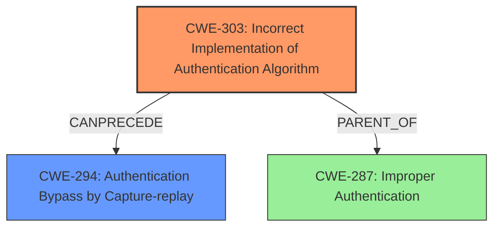

# Enhanced Analysis for CVE-2024-56128

# Summary
| CWE ID    | CWE Name                                                        | Confidence | CWE Abstraction Level | CWE Vulnerability Mapping Label | CWE-Vulnerability Mapping Notes |
| --------- | --------------------------------------------------------------- | ---------- | --------------------- | ------------------------------- | ------------------------------- |
| CWE-303   | Incorrect Implementation of Authentication Algorithm          | 0.9        | Base                  | Primary                         | Allowed                       |
| CWE-294   | Authentication Bypass by Capture-replay                       | 0.7        | Base                  | Secondary                       | Allowed                       |

## Evidence and Confidence

*   **Confidence Score:** 0.8
*   **Evidence Strength:** HIGH

## Relationship Analysis
The primary relationship influencing the decision is that CWE-303 is a base CWE that directly addresses the root cause of the vulnerability, namely, the **incorrect implementation of the authentication algorithm**. While other CWEs like CWE-287 (Improper Authentication) are related, they are more general. CWE-294 (Authentication Bypass by Capture-replay) is a potential consequence of the root cause.



## Vulnerability Chain
The vulnerability chain starts with the **incorrect implementation of the SCRAM authentication algorithm** (CWE-303). This leads to a **missing nonce verification**, which in turn allows for **authentication bypass by capture-replay** (CWE-294).

## Summary of Analysis
The primary CWE is CWE-303 because the **root cause** of this vulnerability is the **incorrect implementation of the SCRAM authentication algorithm**. The evidence is very strong, due to the "Vulnerability Description Key Phrases" section stating the **rootcause** is "**Incorrect Implementation of Authentication Algorithm**" and the "**weakness**" is "**did not fully adhere to the requirements of RFC 5802**". The "CVE Reference Links Content Summary" states "**Missing Nonce Verification:** The primary weakness is the absence of proper nonce validation in the SCRAM authentication exchange".

The selection of CWE-303 is at the optimal level of specificity, as it directly addresses the **incorrect implementation**. While CWE-287 (Improper Authentication) could be considered, it is a more general class and doesn't capture the specific flaw in the implementation. CWE-294 is a consequence, not the root cause.

Relevant CWE Information:

# Enhanced Context (25 CWEs)
The following CWEs were identified as potentially relevant to this vulnerability:

## CWE-303: Incorrect Implementation of Authentication Algorithm
**Abstraction Level**: Base
**Similarity Score**: 0.75
**Source**: dense

**Description**:
The requirements for the product dictate the use of an established authentication algorithm, but the implementation of the algorithm is incorrect.

**Mapping Guidance**:
- Usage: Allowed
- Rationale: This CWE entry is at the Base level of abstraction, which is a preferred level of abstraction for mapping to the root causes of vulnerabilities.

## CWE-294: Authentication Bypass by Capture-replay
**Abstraction Level**: Base
**Similarity Score**: 0.75
**Source**: dense

**Description**:
A capture-replay flaw exists when the design of the product makes it possible for a malicious user to sniff network traffic and bypass authentication by replaying it to the server in question to the same effect as the original message (or with minor changes).

**Mapping Guidance**:
- Usage: Allowed
- Rationale: This CWE entry is at the Base level of abstraction, which is a preferred level of abstraction for mapping to the root causes of vulnerabilities.

## CWE-287: Improper Authentication
**Abstraction Level**: Class
**Similarity Score**: 2312.71
**Source**: sparse

**Description**:
When an actor claims to have a given identity, the product does not prove or insufficiently proves that the claim is correct.

**Mapping Guidance**:
- Usage: Discouraged
- Rationale: This CWE entry might be misused when lower-level CWE entries are likely to be applicable. It is a level-1 Class (i.e., a child of a Pillar).

## Considered but not used CWEs:
*   CWE-327 (Use of a Broken or Risky Cryptographic Algorithm): While cryptography is involved, the issue is not about using a broken algorithm but about **incorrectly implementing a standard one**.
*   CWE-347 (Improper Verification of Cryptographic Signature): This CWE is related to signature verification, which is not the core issue here. The problem is with **nonce verification within the SCRAM protocol**, not with signature validation.
*   CWE-1204 (Generation of Weak Initialization Vector (IV)): This is specific to weak IVs, which is not relevant to this vulnerability.
*   CWE-319 (Cleartext Transmission of Sensitive Information): The vulnerability is exploitable over plaintext, but the core issue is not the transmission itself, but the **lack of proper verification** that leads to replay attacks.
*   CWE-863 (Incorrect Authorization): This is about authorization, while the issue is primarily about authentication.
*   CWE-201 (Insertion of Sensitive Information Into Sent Data): Not relevant, as the issue is not about leaking sensitive data.
*   CWE-306 (Missing Authentication for Critical Function): There is authentication, but it's **incorrectly implemented**.
*   CWE-304 (Missing Critical Step in Authentication): It is very close, but CWE-303 describes it more accurately because the **rootcause** is in the **incorrect implementation of the authentication algorithm**.
*   CWE-613 (Insufficient Session Expiration): Not relevant, as the vulnerability is not related to session management.


## CWE Relationship Analysis

Current CWEs represent these abstraction levels: .


### Vulnerability Chain Analysis

**Chain starting from CWE-863:**
- 863 (Incorrect Authorization) - ROOT


**Chain starting from CWE-327:**
- 327 (Use of a Broken or Risky Cryptographic Algorithm) - ROOT


### CWE Relationship Diagram

```mermaid
graph TD
    classDef primary fill:#f96,stroke:#333,stroke-width:2px
    classDef secondary fill:#69f,stroke:#333
    classDef tertiary fill:#9e9,stroke:#333
```