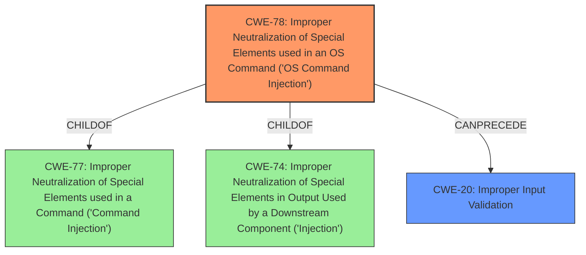

# Analysis Report for CVE-2024-56131

# Vulnerability Analysis Report: CVE-2024-56131

## Description

Improper **Input Validation vulnerability** of Authenticated User in Progress LoadMaster allows **OS Command Injection**. This issue affects Product Affected Versions LoadMaster From 7.2.55.0 to 7.2.60.1 (inclusive) From 7.2.49.0 to 7.2.54.12 (inclusive) 7.2.48.12 and all prior versions Multi-Tenant Hypervisor 7.1.35.12 and all prior versions ECS All prior versions to 7.2.60.1 (inclusive)

## Vulnerability Description Key Phrases

- **Rootcause:** ['Input Validation vulnerability', 'Improper Input Validation']
- **Weakness:** OS Command Injection
- **Attacker:** Authenticated User
- **Product:** Progress LoadMaster
- **Version:** ["'Multi-Tenant Hypervisor 7.1.35.12 and all prior versions'", "'ECS All prior versions to 7.2.60.1 (inclusive)']", "'From 7.2.49.0 to 7.2.54.12 (inclusive)'", "['From 7.2.55.0 to 7.2.60.1 (inclusive)'", "'7.2.48.12 and all prior versions'"]

## Analysis (with Relationship Data)

# Summary
| CWE ID  | CWE Name                                                                       | Confidence | CWE Abstraction Level | CWE Vulnerability Mapping Label | CWE-Vulnerability Mapping Notes |
| :-------- | :----------------------------------------------------------------------------- | :---------- | :---------------------- | :------------------------------ | :------------------------------ |
| CWE-78  | Improper Neutralization of Special Elements used in an OS Command ('**OS Command Injection**') | 1          | Base                    | Primary                         | Allowed                         |
| CWE-20  | Improper **Input Validation**                                                                 | 0.7        | Class                   | Secondary                       | Discouraged                     |

## Evidence and Confidence

*   **Confidence Score:** 0.85
*   **Evidence Strength:** HIGH

## Relationship Analysis
The primary weakness is **CWE-78** because the vulnerability results in **OS Command Injection**. **CWE-78** is a child of **CWE-77** (Improper Neutralization of Special Elements used in a Command ('Command Injection')) and **CWE-74** (Improper Neutralization of Special Elements in Output Used by a Downstream Component ('Injection')). The vulnerability stems from **improper input validation**, which can be represented by **CWE-20**, but **CWE-78** is the more specific and appropriate choice as it directly describes the **OS Command Injection**.



## Vulnerability Chain
The vulnerability chain starts with **improper input validation**, which allows an authenticated user to inject **OS commands**. The lack of proper neutralization of special elements in the input leads to the **OS Command Injection**.

Improper Input Validation -> **OS Command Injection**

## Summary of Analysis
The primary CWE is **CWE-78** because the vulnerability is an **OS Command Injection**. The root cause is **improper input validation**, but **CWE-78** is more specific. The vulnerability allows an authenticated user to inject **OS commands** due to **improper input validation**.

The description states: "Improper **Input Validation vulnerability** of Authenticated User in Progress LoadMaster allows **OS Command Injection**."

**CWE-78** best captures the specific vulnerability, while **CWE-20** represents the more general class of **improper input validation**. The relationship analysis supports this, showing that **CWE-78** is a more specific type of command injection, making it a better fit than the broader **CWE-20**.

Other CWEs Considered:

*   **CWE-77**: While related, **CWE-78** is more specific as it explicitly mentions **OS Command Injection**.
*   **CWE-74**: This is a more general injection weakness.
*   **CWE-20**: This is a high-level class and less specific than **CWE-78**. The mapping guidance discourages its use when more specific CWEs are available.
Relevant CWE Information:

# Enhanced Context (25 CWEs)
The following CWEs were identified as potentially relevant to this vulnerability:

## CWE-74: Improper Neutralization of Special Elements in Output Used by a Downstream Component ('Injection')
**Abstraction Level**: Class
**Similarity Score**: 0.75
**Source**: dense

**Description**:
The product constructs all or part of a command, data structure, or record using externally-influenced input from an upstream component, but it does not neutralize or incorrectly neutralizes special elements that could modify how it is parsed or interpreted when it is sent to a downstream component.

**Mapping Guidance**:
- Usage: Discouraged
- Rationale: CWE-74 is high-level and often misused when lower-level weaknesses are more appropriate.


## CWE-345: Insufficient Verification of Data Authenticity
**Abstraction Level**: Class
**Similarity Score**: 0.75
**Source**: dense

**Description**:
The product does not sufficiently verify the origin or authenticity of data, in a way that causes it to accept invalid data.

**Mapping Guidance**:
- Usage: Discouraged
- Rationale: This CWE entry is a level-1 Class (i.e., a child of a Pillar). It might have lower-level children that would be more appropriate


## CWE-668: Exposure of Resource to Wrong Sphere
**Abstraction Level**: Class
**Similarity Score**: 0.74
**Source**: dense

**Description**:
The product exposes a resource to the wrong control sphere, providing unintended actors with inappropriate access to the resource.

**Mapping Guidance**:
- Usage: Discouraged
- Rationale: CWE-668 is high-level and is often misused as a catch-all when lower-level CWE IDs might be applicable. It is sometimes used for low-information vulnerability reports [REF-1287]. It is a level-1 Class (i.e., a child of a Pillar). It is not useful for trend analysis.


## CWE-1391: Use of Weak Credentials
**Abstraction Level**: Class
**Similarity Score**: 0.74
**Source**: dense

**Description**:
The product uses weak credentials (such as a default key or hard-coded password) that can be calculated, derived, reused, or guessed by an attacker.

**Mapping Guidance**:
- Usage: Allowed-with-Review
- Rationale: This CWE entry is a Class and might have Base-level children that would be more appropriate


## CWE-303: Incorrect Implementation of Authentication Algorithm
**Abstraction Level**: Base
**Similarity Score**: 0.74
**Source**: dense

**Description**:
The requirements for the product dictate the use of an established authentication algorithm, but the implementation of the algorithm is incorrect.

**Mapping Guidance**:
- Usage: Allowed
- Rationale: This CWE entry is at the Base level of abstraction, which is a preferred level of abstraction for mapping to the root causes of vulnerabilities.


## CWE-138: Improper Neutralization of Special Elements
**Abstraction Level**: Class
**Similarity Score**: 0.73
**Source**: dense

**Description**:
The product receives input from an upstream component, but it does not neutralize or incorrectly neutralizes special elements that could be interpreted as control elements or syntactic markers when they are sent to a downstream component.

**Mapping Guidance**:
- Usage: Discouraged
- Rationale: This CWE entry is a level-1 Class (i.e., a child of a Pillar). It might have lower-level children that would be more appropriate


## CWE-41: Improper Resolution of Path Equivalence
**Abstraction Level**: Base
**Similarity Score**: 0.73
**Source**: dense

**Description**:
The product is vulnerable to file system contents disclosure through path equivalence. Path equivalence involves the use of special characters in file and directory names. The associated manipulations are intended to generate multiple names for the same object.

**Mapping Guidance**:
- Usage: Allowed
- Rationale: This CWE entry is at the Base level of abstraction, which is a preferred level of abstraction for mapping to the root causes of vulnerabilities.


## CWE-497: Exposure of Sensitive System Information to an Unauthorized Control Sphere
**Abstraction Level**: Base
**Similarity Score**: 0.73
**Source**: dense

**Description**:
The product does not properly prevent sensitive system-level information from being accessed by unauthorized actors who do not have the same level of access to the underlying system as the product does.

**Mapping Guidance**:
- Usage: Allowed
- Rationale: This CWE entry is at the Base level of abstraction, which is a preferred level of abstraction for mapping to the root causes of vulnerabilities.


## CWE-696: Incorrect Behavior Order
**Abstraction Level**: Class
**Similarity Score**: 0.73
**Source**: dense

**Description**:
The product performs multiple related behaviors, but the behaviors are performed in the wrong order in ways which may produce resultant weaknesses.

**Mapping Guidance**:
- Usage: Allowed-with-Review
- Rationale: This CWE entry is a Class and might have Base-level children that would be more appropriate


## CWE-703: Improper Check or Handling of Exceptional Conditions
**Abstraction Level**: Pillar
**Similarity Score**: 0.73
**Source**: dense

**Description**:
The product does not properly anticipate or handle exceptional conditions that rarely occur during normal operation of the product.

**Mapping Guidance**:


## CWE Relationship Analysis

Current CWEs represent these abstraction levels: .


### Vulnerability Chain Analysis

**Chain starting from CWE-1391:**
- 1391 (Use of Weak Credentials) - ROOT


**Chain starting from CWE-345:**
- 345 (Insufficient Verification of Data Authenticity) - ROOT


### CWE Relationship Diagram

```mermaid
graph TD
    classDef primary fill:#f96,stroke:#333,stroke-width:2px
    classDef secondary fill:#69f,stroke:#333
    classDef tertiary fill:#9e9,stroke:#333
```


*Report generated on 2025-07-13 23:31:08*
