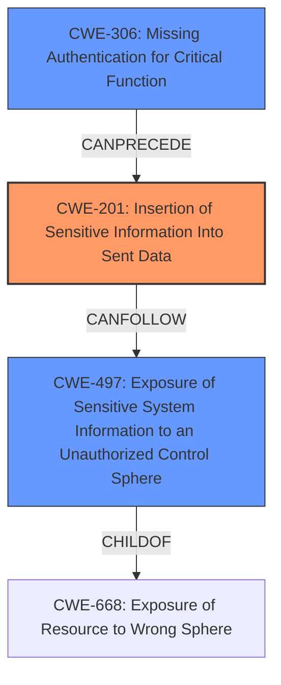

# Raw Analyzer Response for CVE-2024-56159

# Summary

| CWE ID | CWE Name | Confidence | CWE Abstraction Level | CWE Vulnerability Mapping Label | CWE-Vulnerability Mapping Notes |
|---|---|---|---|---|---|
| CWE-201 | Insertion of Sensitive Information Into Sent Data | 0.8 | Base | Allowed | Primary CWE. The sourcemap files, which contain sensitive source code information, are being sent to a publicly accessible folder. |
| CWE-497 | Exposure of Sensitive System Information to an Unauthorized Control Sphere | 0.6 | Base | Allowed | Secondary candidate. The vulnerability results in the exposure of system information (server-side source code) to an unauthorized control sphere. |
| CWE-306 | Missing Authentication for Critical Function | 0.5 | Base | Allowed | Secondary candidate. The affected folder containing the sourcemaps is publicly accessible without any authentication. |

## Evidence and Confidence

*   **Confidence Score:** 0.7
*   **Evidence Strength:** HIGH

## Relationship Analysis
The primary CWE is CWE-201, which focuses on the insertion of sensitive information into sent data. The sourcemaps, containing server source code, are moved to a publicly accessible directory, effectively sending sensitive information to unauthorized users. CWE-497, Exposure of Sensitive System Information to an Unauthorized Control Sphere, is considered because the exposed sourcemaps reveal system internals. CWE-306, Missing Authentication for Critical Function, is related because the directory containing the sourcemaps lacks authentication, allowing unauthenticated access.

## Vulnerability Chain
The vulnerability chain starts with the **incorrect** placement of server-side sourcemaps into a publicly accessible directory. This leads to the exposure of sensitive source code (CWE-201). Because the directory is publicly available, there is a **missing authentication** for critical function (CWE-306) in accessing the sourcemaps. This combination allows any unauthenticated user to read parts of the server source code which can be classified as exposure of sensitive system information (CWE-497). The chain is as follows: Missing Authentication (CWE-306) -> Insertion of Sensitive Information (CWE-201) -> Exposure of Sensitive System Information (CWE-497).

## Summary of Analysis
The primary focus is on the **exposure** of source code due to its **insertion** into a publicly accessible location. The decision to prioritize CWE-201 is based on the vulnerability's description highlighting that sourcemap files containing sensitive source code are moved to a publicly accessible directory. The evidence for this is found in the "Vulnerability Description" and "CVE Reference Links Content Summary" sections. This is a direct **insertion** of sensitive information into a location where it can be sent to unauthorized parties.

CWE-497 is a valid secondary consideration because the exposure of sourcemaps leads to exposure of sensitive system information. However, CWE-201 more precisely captures the root cause: the act of placing sensitive information (source code) in a location accessible to unauthorized parties.

CWE-306 is also considered as a secondary factor because the public directory holding sourcemaps lacks any form of authentication, exacerbating the risk associated with the placement of source code.

The selection of CWE-201 as the primary weakness is at the optimal level of specificity because it precisely describes the **root cause** of the vulnerability: the **insertion** of sensitive data into a location where it can be sent to unauthorized parties. The related CWEs, CWE-497 and CWE-306, help paint a complete picture of the vulnerability's context and contributing factors, but CWE-201 remains the core issue.