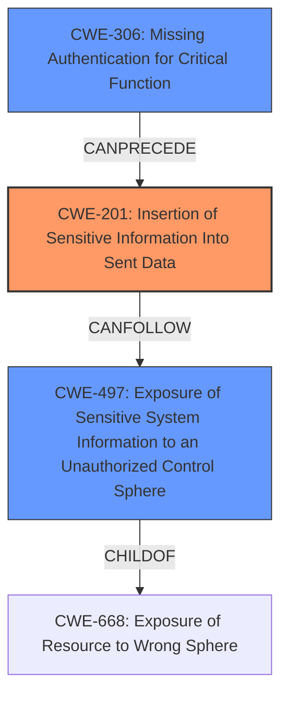

# Analysis Report for CVE-2024-56159

# Vulnerability Analysis Report: CVE-2024-56159

## Description

Astro is a web framework for content-driven websites. A bug in the build process allows any unauthenticated user to read parts of the server source code. During build, along with client assets such as css and font files, the sourcemap files **for the server code** are moved to a publicly-accessible folder. Any outside party can read them with an unauthorized HTTP GET request to the same server hosting the rest of the website. While some server files are hashed, making their access obscure, the files corresponding to the file system router (those in `src/pages`) are predictably named. For example. the sourcemap file for `src/pages/index.astro` gets named `dist/client/pages/index.astro.mjs.map`. This vulnerability is the root cause of issue #12703, which links to a simple stackblitz project demonstrating the vulnerability. Upon build, notice the contents of the `dist/client` (referred to as `config.build.client` in astro code) folder. All astro servers make the folder in question accessible to the public internet without any authentication. It contains `.map` files corresponding to the code that runs on the server. All **server-output** projects on Astro 5 versions **v5.0.3** through **v5.0.7**, that have **sourcemaps enabled**, either directly or through an add-on such as `sentry`, are affected. The fix for **server-output** projects was released in **astro@5.0.8**. Additionally, all **static-output** projects built using Astro 4 versions **4.16.17 or older**, or Astro 5 versions **5.0.8 or older**, that have **sourcemaps enabled** are also affected. The fix for **static-output** projects was released in **astro@5.0.9**, and backported to Astro v4 in **astro@4.16.18**. The immediate impact is limited to source code. Any secrets or environment variables are not exposed unless they are present verbatim in the source code. There is no immediate loss of integrity within the the vulnerable server. However, it is possible to subsequently discover another vulnerability via the revealed source code . There is no immediate impact to availability of the vulnerable server. However, the presence of an unsafe regular expression, for example, can quickly be exploited to subsequently compromise the availability. The fix for **server-output** projects was released in **astro@5.0.8**, and the fix for **static-output** projects was released in **astro@5.0.9** and backported to Astro v4 in **astro@4.16.18**. Users are advised to update immediately if they are using sourcemaps or an integration that enables sourcemaps.

## Vulnerability Description Key Phrases

- **Impact:** ['read parts of the server source code', 'read sourcemap files', 'loss of integrity', 'availability']
- **Attacker:** any unauthenticated user
- **Product:** ["'Astro static-output']", "['Astro server-output'"]
- **Version:** ["['5.0.3 through 5.0.7'", "'4.16.17 or older'", "'5.0.8 or older']"]

## Analysis (with Relationship Data)

# Summary

| CWE ID | CWE Name | Confidence | CWE Abstraction Level | CWE Vulnerability Mapping Label | CWE-Vulnerability Mapping Notes |
|---|---|---|---|---|---|
| CWE-201 | Insertion of Sensitive Information Into Sent Data | 0.8 | Base | Allowed | Primary CWE. The sourcemap files, which contain sensitive source code information, are being sent to a publicly accessible folder. |
| CWE-497 | Exposure of Sensitive System Information to an Unauthorized Control Sphere | 0.6 | Base | Allowed | Secondary candidate. The vulnerability results in the exposure of system information (server-side source code) to an unauthorized control sphere. |
| CWE-306 | Missing Authentication for Critical Function | 0.5 | Base | Allowed | Secondary candidate. The affected folder containing the sourcemaps is publicly accessible without any authentication. |

## Evidence and Confidence

*   **Confidence Score:** 0.7
*   **Evidence Strength:** HIGH

## Relationship Analysis
The primary CWE is CWE-201, which focuses on the insertion of sensitive information into sent data. The sourcemaps, containing server source code, are moved to a publicly accessible directory, effectively sending sensitive information to unauthorized users. CWE-497, Exposure of Sensitive System Information to an Unauthorized Control Sphere, is considered because the exposed sourcemaps reveal system internals. CWE-306, Missing Authentication for Critical Function, is related because the directory containing the sourcemaps lacks authentication, allowing unauthenticated access.



## Vulnerability Chain
The vulnerability chain starts with the **incorrect** placement of server-side sourcemaps into a publicly accessible directory. This leads to the exposure of sensitive source code (CWE-201). Because the directory is publicly available, there is a **missing authentication** for critical function (CWE-306) in accessing the sourcemaps. This combination allows any unauthenticated user to read parts of the server source code which can be classified as exposure of sensitive system information (CWE-497). The chain is as follows: Missing Authentication (CWE-306) -> Insertion of Sensitive Information (CWE-201) -> Exposure of Sensitive System Information (CWE-497).

## Summary of Analysis
The primary focus is on the **exposure** of source code due to its **insertion** into a publicly accessible location. The decision to prioritize CWE-201 is based on the vulnerability's description highlighting that sourcemap files containing sensitive source code are moved to a publicly accessible directory. The evidence for this is found in the "Vulnerability Description" and "CVE Reference Links Content Summary" sections. This is a direct **insertion** of sensitive information into a location where it can be sent to unauthorized parties.

CWE-497 is a valid secondary consideration because the exposure of sourcemaps leads to exposure of sensitive system information. However, CWE-201 more precisely captures the root cause: the act of placing sensitive information (source code) in a location accessible to unauthorized parties.

CWE-306 is also considered as a secondary factor because the public directory holding sourcemaps lacks any form of authentication, exacerbating the risk associated with the placement of source code.

The selection of CWE-201 as the primary weakness is at the optimal level of specificity because it precisely describes the **root cause** of the vulnerability: the **insertion** of sensitive data into a location where it can be sent to unauthorized parties. The related CWEs, CWE-497 and CWE-306, help paint a complete picture of the vulnerability's context and contributing factors, but CWE-201 remains the core issue.


## CWE Relationship Analysis

Current CWEs represent these abstraction levels: .


### Vulnerability Chain Analysis

**Chain starting from CWE-306:**
- 306 (Missing Authentication for Critical Function) - ROOT


**Chain starting from CWE-201:**
- 201 (Insertion of Sensitive Information Into Sent Data) - ROOT


### CWE Relationship Diagram

```mermaid
graph TD
    classDef primary fill:#f96,stroke:#333,stroke-width:2px
    classDef secondary fill:#69f,stroke:#333
    classDef tertiary fill:#9e9,stroke:#333
```


*Report generated on 2025-07-13 23:33:24*
