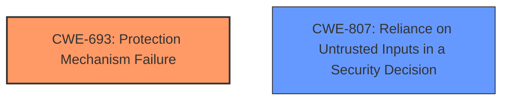

# Analysis Report for CVE-2024-56182

# Vulnerability Analysis Report: CVE-2024-56182

## Description

A vulnerability has been identified in SIMATIC Field PG M5 (All versions), SIMATIC Field PG M6 (All versions < V26.01.12), SIMATIC IPC BX-21A (All versions < V31.01.07), SIMATIC IPC BX-32A (All versions < V29.01.07), SIMATIC IPC BX-39A (All versions < V29.01.07), SIMATIC IPC BX-59A (All versions < V32.01.04), SIMATIC IPC PX-32A (All versions < V29.01.07), SIMATIC IPC PX-39A (All versions < V29.01.07), SIMATIC IPC PX-39A PRO (All versions < V29.01.07), SIMATIC IPC RC-543A (All versions), SIMATIC IPC RC-543B (All versions), SIMATIC IPC RW-543A (All versions), SIMATIC IPC RW-543B (All versions), SIMATIC IPC127E (All versions), SIMATIC IPC227E (All versions), SIMATIC IPC227G (All versions), SIMATIC IPC277E (All versions), SIMATIC IPC277G (All versions), SIMATIC IPC277G PRO (All versions), SIMATIC IPC3000 SMART V3 (All versions), SIMATIC IPC327G (All versions), SIMATIC IPC347G (All versions), SIMATIC IPC377G (All versions), SIMATIC IPC427E (All versions), SIMATIC IPC477E (All versions), SIMATIC IPC477E PRO (All versions), SIMATIC IPC527G (All versions), SIMATIC IPC627E (All versions < V25.02.15), SIMATIC IPC647E (All versions < V25.02.15), SIMATIC IPC677E (All versions < V25.02.15), SIMATIC IPC847E (All versions < V25.02.15), SIMATIC ITP1000 (All versions). The affected devices have insufficient protection mechanism for the EFI(Extensible Firmware Interface) variables stored on the device. This could allow an authenticated attacker to disable the BIOS password without proper authorization by directly communicate with the flash controller.

## Vulnerability Description Key Phrases

- **Rootcause:** insufficient protection mechanism for EFI variables
- **Vector:** directly communicate with flash controller
- **Product:** SIMATIC Field PG M5, SIMATIC Field PG M6, SIMATIC IPC BX-21A, SIMATIC IPC BX-32A, SIMATIC IPC BX-39A, SIMATIC IPC BX-59A, SIMATIC IPC PX-32A, SIMATIC IPC PX-39A, SIMATIC IPC PX-39A PRO, SIMATIC IPC RC-543A, SIMATIC IPC RC-543B, SIMATIC IPC RW-543A, SIMATIC IPC RW-543B, SIMATIC IPC127E, SIMATIC IPC227E, SIMATIC IPC227G, SIMATIC IPC277E, SIMATIC IPC277G, SIMATIC IPC277G PRO, SIMATIC IPC3000 SMART V3, SIMATIC IPC327G, SIMATIC IPC347G, SIMATIC IPC377G, SIMATIC IPC427E, SIMATIC IPC477E, SIMATIC IPC477E PRO, SIMATIC IPC527G, SIMATIC IPC627E, SIMATIC IPC647E, SIMATIC IPC677E, SIMATIC IPC847E, SIMATIC ITP1000
- **Impact:** disable BIOS password
- **Attacker:** authenticated attacker

## Analysis (with Relationship Data)

# Summary
| CWE ID | CWE Name | Confidence | CWE Abstraction Level | CWE Vulnerability Mapping Label | CWE-Vulnerability Mapping Notes |
|---|---|---|---|---|---|
| CWE-693 | Protection Mechanism Failure | 0.9 | Class | Primary CWE | Allowed |
| CWE-807 | Reliance on Untrusted Inputs in a Security Decision | 0.7 | Base | Secondary Candidate | Allowed |

## Evidence and Confidence

*   **Confidence Score:** 0.8
*   **Evidence Strength:** HIGH

## Relationship Analysis
The primary CWE is CWE-693, which is a Class-level CWE. CWE-807 is a Base-level CWE and can be a more specific description of the **insufficient protection mechanism**. There are no direct parent-child relationships relevant in this case, but the retriever suggests CWE-693 as the appropriate selection for the **protection mechanism failure**.



## Vulnerability Chain
The vulnerability chain begins with an **insufficient protection mechanism for EFI variables**, which allows an authenticated attacker to bypass the BIOS password by directly communicating with the flash controller. This leads to the impact of disabling the BIOS password.

## Summary of Analysis
The initial assessment focused on identifying the root cause of the vulnerability, which is the **insufficient protection mechanism for EFI variables**. The evidence provided in the vulnerability description and the CVE Reference Links Content Summary clearly supports this.

The primary CWE identified is CWE-693 (Protection Mechanism Failure), which aligns with the **lack of adequate protection for the EFI variables**. The vulnerability allows an authenticated attacker to disable the BIOS password without proper authorization by communicating with the flash controller. This directly reflects a failure in the protection mechanism.

CWE-807 (Reliance on Untrusted Inputs in a Security Decision) was also considered, as the vulnerability involves bypassing the expected authorization checks by directly manipulating the flash controller. However, CWE-693 is more directly related to the **failure of the protection mechanism itself**.

The chosen CWEs are at the optimal level of specificity, with CWE-693 capturing the general protection failure and CWE-807 potentially adding more context about the **reliance on exploitable inputs**. The selection is based on the evidence provided and the relationships between the CWEs.

Relevant CWE Information:

# Enhanced Context (25 CWEs)
The following CWEs were identified as potentially relevant to this vulnerability:

## CWE-345: Insufficient Verification of Data Authenticity
**Abstraction Level**: Class
**Similarity Score**: 0.79
**Source**: dense

**Description**:
The product does not sufficiently verify the origin or authenticity of data, in a way that causes it to accept invalid data.

**Mapping Guidance**:
- Usage: Discouraged
- Rationale: This CWE entry is a level-1 Class (i.e., a child of a Pillar). It might have lower-level children that would be more appropriate

## CWE-668: Exposure of Resource to Wrong Sphere
**Abstraction Level**: Class
**Similarity Score**: 0.78
**Source**: dense

**Description**:
The product exposes a resource to the wrong control sphere, providing unintended actors with inappropriate access to the resource.

**Mapping Guidance**:
- Usage: Discouraged
- Rationale: CWE-668 is high-level and is often misused as a catch-all when lower-level CWE IDs might be applicable. It is sometimes used for low-information vulnerability reports [REF-1287]. It is a level-1 Class (i.e., a child of a Pillar). It is not useful for trend analysis.

## CWE-497: Exposure of Sensitive System Information to an Unauthorized Control Sphere
**Abstraction Level**: Base
**Similarity Score**: 0.78
**Source**: dense

**Description**:
The product does not properly prevent sensitive system-level information from being accessed by unauthorized actors who do not have the same level of access to the underlying system as the product does.

**Mapping Guidance**:
- Usage: Allowed
- Rationale: This CWE entry is at the Base level of abstraction, which is a preferred level of abstraction for mapping to the root causes of vulnerabilities.

## CWE-41: Improper Resolution of Path Equivalence
**Abstraction Level**: Base
**Similarity Score**: 0.77
**Source**: dense

**Description**:
The product is vulnerable to file system contents disclosure through path equivalence. Path equivalence involves the use of special characters in file and directory names. The associated manipulations are intended to generate multiple names for the same object.

**Mapping Guidance**:
- Usage: Allowed
- Rationale: This CWE entry is at the Base level of abstraction, which is a preferred level of abstraction for mapping to the root causes of vulnerabilities.

## CWE-807: Reliance on Untrusted Inputs in a Security Decision
**Abstraction Level**: Base
**Similarity Score**: 0.77
**Source**: dense

**Description**:
The product uses a protection mechanism that relies on the existence or values of an input, but the input can be modified by an untrusted actor in a way that bypasses the protection mechanism.

**Mapping Guidance**:
- Usage: Allowed
- Rationale: This CWE entry is at the Base level of abstraction, which is a preferred level of abstraction for mapping to the root causes of vulnerabilities.

## CWE-755: Improper Handling of Exceptional Conditions
**Abstraction Level**: Class
**Similarity Score**: 0.77
**Source**: dense

**Description**:
The product does not handle or incorrectly handles an exceptional condition.

**Mapping Guidance**:
- Usage: Discouraged
- Rationale: This CWE entry is a level-1 Class (i.e., a child of a Pillar). It might have lower-level children that would be more appropriate

## CWE-538: Insertion of Sensitive Information into Externally-Accessible File or Directory
**Abstraction Level**: Base
**Similarity Score**: 0.77
**Source**: dense

**Description**:
The product places sensitive information into files or directories that are accessible to actors who are allowed to have access to the files, but not to the sensitive information.

**Mapping Guidance**:
- Usage: Allowed
- Rationale: This CWE entry is at the Base level of abstraction, which is a preferred level of abstraction for mapping to the root causes of vulnerabilities.

## CWE-1391: Use of Weak Credentials
**Abstraction Level**: Class
**Similarity Score**: 0.77
**Source**: dense

**Description**:
The product uses weak credentials (such as a default key or hard-coded password) that can be calculated, derived, reused, or guessed by an attacker.

**Mapping Guidance**:
- Usage: Allowed-with-Review
- Rationale: This CWE entry is a Class and might have Base-level children that would be more appropriate

## CWE-303: Incorrect Implementation of Authentication Algorithm
**Abstraction Level**: Base
**Similarity Score**: 0.77
**Source**: dense

**Description**:
The requirements for the product dictate the use of an established authentication algorithm, but the implementation of the algorithm is incorrect.

**Mapping Guidance**:
- Usage: Allowed
- Rationale: This CWE entry is at the Base level of abstraction, which is a preferred level of abstraction for mapping to the root causes of vulnerabilities.

## CWE-203: Observable Discrepancy
**Abstraction Level**: Base
**Similarity Score**: 0.77
**Source**: dense

**Description**:
The product behaves differently or sends different responses under different circumstances in a way that is observable to an unauthorized actor, which exposes security-relevant information about the state of the product, such as whether a particular operation was successful or not.

**Mapping Guidance**:
- Usage: Allowed
- Rationale: This CWE entry is at the Base level of abstraction, which is a preferred level of abstraction for mapping to the root causes of vulnerabilities.

## CWE-119: Improper Restriction of Operations within the Bounds of a Memory Buffer
**Abstraction Level**: Class
**Similarity Score**: 2038.58
**Source**: sparse

**Description**:
The product performs operations on a memory buffer, but it reads from or writes to a memory location outside the buffer's intended boundary. This may result in read or write operations on unexpected memory locations that could be linked to other variables, data structures, or internal program data.

**Mapping Guidance**:
- Usage: Discouraged
- Rationale: CWE-119 is commonly misused in low-information vulnerability reports when lower-level CWEs could be used instead, or when more details about the vulnerability are available.

## CWE-116: Improper Encoding or Escaping of Output
**Abstraction Level**: Class
**Similarity Score**: 1978.20
**Source**: sparse

**Description**:
The product prepares a structured message for communication with another component, but encoding or escaping of the data is either missing or done incorrectly. As a result, the intended structure of the message is not preserved.

**Mapping


## CWE Relationship Analysis

Current CWEs represent these abstraction levels: .


### Vulnerability Chain Analysis

**Chain starting from CWE-203:**
- 203 (Observable Discrepancy) - ROOT


**Chain starting from CWE-345:**
- 345 (Insufficient Verification of Data Authenticity) - ROOT


### CWE Relationship Diagram

```mermaid
graph TD
    classDef primary fill:#f96,stroke:#333,stroke-width:2px
    classDef secondary fill:#69f,stroke:#333
    classDef tertiary fill:#9e9,stroke:#333
```


*Report generated on 2025-07-13 23:34:06*
