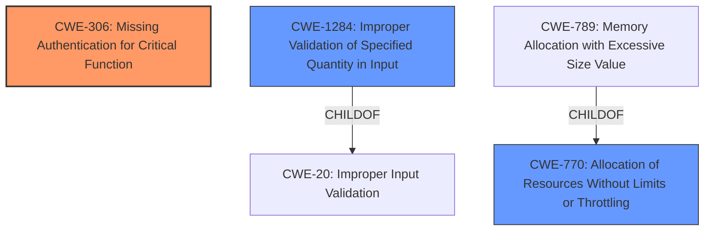

# Raw Analyzer Response for CVE-2024-56200

# Summary
| CWE ID | CWE Name | Confidence | CWE Abstraction Level | CWE Vulnerability Mapping Label | CWE-Vulnerability Mapping Notes |
|---|---|---|---|---|---|
| CWE-306 | Missing Authentication for Critical Function | 0.9 | Base | Primary | Allowed |
| CWE-770 | Allocation of Resources Without Limits or Throttling | 0.8 | Base | Secondary | Allowed |
| CWE-1284 | Improper Validation of Specified Quantity in Input | 0.7 | Base | Secondary | Allowed |

## Evidence and Confidence

*   **Confidence Score:** 0.8
*   **Evidence Strength:** HIGH

## Relationship Analysis
The primary CWE is CWE-306, which addresses the missing authentication. CWE-770 and CWE-1284 are related as potential consequences of the missing authentication, leading to resource exhaustion. CWE-770 is a parent of CWE-789 (Memory Allocation with Excessive Size Value), reflecting the possibility of uncontrolled resource allocation. CWE-1284 is related to CWE-20 (Improper Input Validation), indicating a broader issue of inadequate input handling.

## Vulnerability Chain
The vulnerability chain starts with the **lack of authentication (CWE-306)**, which allows attackers to send arbitrary requests to the image proxy. This, coupled with the **lack of request validation (CWE-1284)**, can lead to **uncontrolled resource allocation (CWE-770)**, and ultimately result in a denial-of-service by abnormally increasing CPU usage and network load.

## Summary of Analysis
The primary cause of the vulnerability is the **lack of authentication** in the image proxy, allowing unauthenticated access to its functionalities. This is evidenced by the "Vulnerability Description Key Phrases" which states "**lack of request validation and lack of authentication in the image proxy**". This aligns directly with CWE-306. The impact, such as increased CPU usage and heavy network load, are consequences of this primary weakness. The retriever results also suggest CWE-306 as a potential match.

CWE-770 and CWE-1284 are secondary weaknesses. The **lack of request validation** can lead to **uncontrolled resource allocation**, making CWE-770 and CWE-1284 relevant. These are at the Base level of abstraction, which is preferred.

CWEs considered but not selected:
*   CWE-789: Although related to resource consumption, it's a variant of CWE-770, and the description doesn't explicitly mention memory allocation with excessive size, so it's less directly applicable.
*   CWE-863: Incorrect Authorization is not applicable because the vulnerability arises from a complete **lack of authentication**, not an incorrect authorization mechanism.
*   CWE-285: Improper Authorization is not applicable because the vulnerability arises from a complete **lack of authentication**, not an incorrect authorization mechanism.
*   CWE-287: Improper Authentication is not applicable because the vulnerability arises from a complete **lack of authentication**, there is no authentication.

Relevant CWE Information:

*   **CWE-306: Missing Authentication for Critical Function**
    *   **Technical Explanation:** The image proxy lacks any form of authentication, allowing anyone to send requests to it.
    *   **Security Implications:** This allows unauthenticated users to access functionality that should be protected, leading to potential misuse and resource exhaustion.
    *   **Relationship:** This is the primary weakness.
    *   **Mapping Guidance:** The guidance confirms that CWE-306 is suitable when no identity validation is enforced.
*   **CWE-770: Allocation of Resources Without Limits or Throttling**
    *   **Technical Explanation:** The image proxy doesn't limit the amount of resources it allocates when processing requests.
    *   **Security Implications:** An attacker can cause a denial-of-service by sending requests that consume excessive resources.
    *   **Relationship:** This is a consequence of the missing authentication and request validation.
    *   **Mapping Guidance:** The guidance confirms that CWE-770 applies when resources are allocated without limits, leading to potential resource exhaustion.
*   **CWE-1284: Improper Validation of Specified Quantity in Input**
    *   **Technical Explanation:** There is insufficient validation of the requests made to the media/file proxy.
    *   **Security Implications:** An attacker can cause a denial-of-service by sending requests with crafted quantity values.
    *   **Relationship:** This is a consequence of the missing authentication.
    *   **Mapping Guidance:** The guidance confirms that CWE-1284 applies when there is improper validation of quantity.