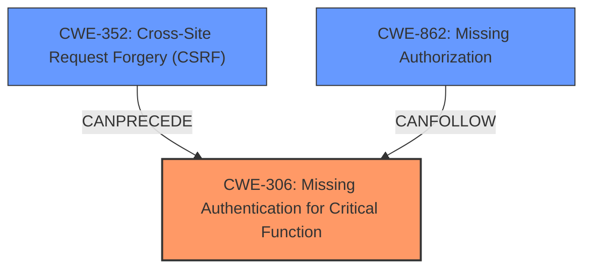

# Analysis Report for CVE-2024-56329

# Vulnerability Analysis Report: CVE-2024-56329

## Description

Socialstream is a third-party package for Laravel Jetstream. It replaces the published authentication and profile scaffolding provided by Laravel Jetstream, with scaffolding that has support for Laravel Socialite. When linking a social account to an already authenticated user, the lack of a confirmation step introduces a security risk. This is exacerbated if ->stateless() is used in the Socialite configuration, bypassing state verification and making the exploit easier. Developers should ensure that users explicitly confirm account linking and avoid configurations that skip critical security checks. Socialstream v6.2 introduces a new custom route that requires a user to Confirm or Deny a request to link a social account. Users are advised to upgrade. There are no known workarounds for this vulnerability.

## Vulnerability Description Key Phrases

- **Rootcause:** lack of confirmation step when linking social account
- **Weakness:** bypass state verification
- **Impact:** security risk
- **Product:** Socialstream

## Analysis (with Relationship Data)

# Summary
| CWE ID  | CWE Name                                                                 | Confidence | CWE Abstraction Level | CWE Vulnerability Mapping Label | CWE-Vulnerability Mapping Notes |
| :-------- | :----------------------------------------------------------------------- | :--------- | :---------------------- | :------------------------------ | :-------------------------------- |
| CWE-306 | Missing Authentication for Critical Function                         | 0.9        | Base                    | Primary                         | Allowed                           |
| CWE-862 | Missing Authorization                                                    | 0.7        | Base                    | Secondary                       | Allowed                           |
| CWE-352 | Cross-Site Request Forgery (CSRF)                                         | 0.6        | Compound                | Secondary                       | Allowed                           |

## Evidence and Confidence

*   **Confidence Score:** 0.8
*   **Evidence Strength:** HIGH

## Relationship Analysis
The primary relationship that influenced the CWE selection was the distinction between authentication and authorization. The **lack of confirmation** step during social account linking points to a failure to properly authenticate the user's intent to link accounts, leading to CWE-306. However, since the user is already authenticated to the main application, the **lack of authorization** to link the social account is also relevant, suggesting CWE-862 as a secondary concern. The bypass of state verification through `->stateless()` exacerbates the issue. CWE-352 is considered as a further potential consequence due to the bypass of state verification which is normally present to prevent CSRF.



## Vulnerability Chain
The vulnerability chain starts with the **lack of a confirmation step** (CWE-306), progresses to potential **unauthorized account linking** due to **missing authorization** (CWE-862), and can be further exploited due to the **bypassed state verification** which can lead to Cross-Site Request Forgery (CSRF) (CWE-352).
  - Root Cause: **Lack of Confirmation Step** for account linking (CWE-306)
  - Weakness: **Missing Authorization** to verify the user's intent to link accounts (CWE-862)
  - Exploitation Easier: Bypass state verification
  - Impact: Unauthorized account linking, potential account hijacking, actions performed as the victim.

## Summary of Analysis
The initial analysis identified the **lack of confirmation** during social account linking as the primary issue. The retriever results suggested CWE-863 (Incorrect Authorization) and CWE-1390 (Weak Authentication). However, after considering the guidance on Authentication vs. Authorization, CWE-306 (Missing Authentication for Critical Function) was deemed a more accurate representation of the root cause because there's no check to confirm the user's intention to link accounts. CWE-862 is also relevant since after the initial authentication to the application, there is no authorization check to link the social account. Finally, CWE-352 (CSRF) is also considered as the bypass of state verification makes exploitation easier.

The decision to prioritize CWE-306 was based on the evidence that the application **does not perform any authentication** for the critical function of linking social accounts. This aligns with the CWE's description and usage guidelines. The abstraction level of Base is also appropriate as it directly represents the **missing authentication** check.

Relevant CWE Information:

# Enhanced Context (25 CWEs)

## CWE-1390: Weak Authentication
**Abstraction Level**: Class
**Similarity Score**: 0.76
**Source**: dense

**Description**:
The product uses an authentication mechanism to restrict access to specific users or identities, but the mechanism does not sufficiently prove that the claimed identity is correct.

**Mapping Guidance**:
- Usage: Allowed-with-Review
- Rationale: This CWE entry is a Class and might have Base-level children that would be more appropriate

*Not Used:* While Weak Authentication (CWE-1390) was considered, the vulnerability isn't about a weakness in the existing authentication mechanism, but rather the **lack of authentication** for a specific function (linking social accounts).

## CWE-639: Authorization Bypass Through User-Controlled Key
**Abstraction Level**: Base
**Similarity Score**: 0.76
**Source**: dense

**Description**:
The system's authorization functionality does not prevent one user from gaining access to another user's data or record by modifying the key value identifying the data.

**Mapping Guidance**:
- Usage: Allowed
- Rationale: This CWE entry is at the Base level of abstraction, which is a preferred level of abstraction for mapping to the root causes of vulnerabilities.

*Not Used:* Authorization Bypass Through User-Controlled Key (CWE-639) is not a good fit because the vulnerability doesn't involve modifying a key value to bypass authorization.

## CWE-472: External Control of Assumed-Immutable Web Parameter
**Abstraction Level**: Base
**Similarity Score**: 0.76
**Source**: dense

**Description**:
The web application does not sufficiently verify inputs that are assumed to be immutable but are actually externally controllable, such as hidden form fields.

**Mapping Guidance**:
- Usage: Allowed
- Rationale: This CWE entry is at the Base level of abstraction, which is a preferred level of abstraction for mapping to the root causes of vulnerabilities.

*Not Used:* External Control of Assumed-Immutable Web Parameter (CWE-472) doesn't apply because the issue isn't about controlling parameters assumed to be immutable.

## CWE-74: Improper Neutralization of Special Elements in Output Used by a Downstream Component ('Injection')
**Abstraction Level**: Class
**Similarity Score**: 0.75
**Source**: dense

**Description**:
The product constructs all or part of a command, data structure, or record using externally-influenced input from an upstream component, but it does not neutralize or incorrectly neutralizes special elements that could modify how it is parsed or interpreted when it is sent to a downstream component.

**Mapping Guidance**:
- Usage: Discouraged
- Rationale: CWE-74 is high-level and often misused when lower-level weaknesses are more appropriate.

*Not Used:* Improper Neutralization of Special Elements in Output Used by a Downstream Component ('Injection') (CWE-74) is irrelevant as there's no indication of injection vulnerabilities.

## CWE-212: Improper Removal of Sensitive Information Before Storage or Transfer
**Abstraction Level**: Base
**Similarity Score**: 0.75
**Source**: dense

**Description**:
The product stores, transfers, or shares a resource that contains sensitive information, but it does not properly remove that information before the product makes the resource available to unauthorized actors.

**Mapping Guidance**:
- Usage: Allowed
- Rationale: This CWE entry is at the Base level of abstraction, which is a preferred level of abstraction for mapping to the root causes of vulnerabilities.

*Not Used:* Improper Removal of Sensitive Information Before Storage or Transfer (CWE-212) is not applicable as the vulnerability doesn't relate to sensitive information exposure.

## CWE-303: Incorrect Implementation of Authentication Algorithm
**Abstraction Level**: Base
**Similarity Score**: 0.75
**Source**: dense

**Description**:
The requirements for the product dictate the use of an established authentication algorithm, but the implementation of the algorithm is incorrect.

**Mapping Guidance**:
- Usage: Allowed
- Rationale: This CWE entry is at the Base level of abstraction, which is a preferred level of abstraction for mapping to the root causes of vulnerabilities.

*Not Used:* Incorrect Implementation of Authentication Algorithm (CWE-303) is not the correct CWE, as the problem isn't with the implementation of an authentication algorithm, but with the **lack of authentication** for a specific function.

## CWE-1391: Use of Weak Credentials
**Abstraction Level**: Class
**Similarity Score**: 0.75
**Source**: dense

**Description**:
The product uses weak credentials (such as a default key or hard-coded password) that can be calculated, derived, reused, or guessed by an attacker.

**Mapping Guidance**:
- Usage: Allowed-with-Review
- Rationale: This CWE entry is a Class and might have Base-level children that would be more appropriate

*Not Used:* Use of Weak Credentials (CWE-1391) is not applicable as there is no mention of weak credentials in the description.

## CWE-668: Exposure of Resource to Wrong Sphere
**Abstraction Level**: Class
**Similarity Score**: 0.75
**Source**: dense

**Description**:
The product exposes a resource to the wrong control sphere, providing unintended actors with inappropriate access to the resource.

**Mapping Guidance


## CWE Relationship Analysis

Current CWEs represent these abstraction levels: .


### Vulnerability Chain Analysis

**Chain starting from CWE-1390:**
- 1390 (Weak Authentication) - ROOT


**Chain starting from CWE-863:**
- 863 (Incorrect Authorization) - ROOT


### CWE Relationship Diagram

```mermaid
graph TD
    classDef primary fill:#f96,stroke:#333,stroke-width:2px
    classDef secondary fill:#69f,stroke:#333
    classDef tertiary fill:#9e9,stroke:#333
```


*Report generated on 2025-07-13 23:39:47*
