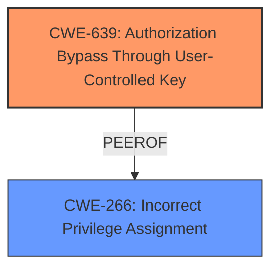

# Analysis Report for CVE-2024-56404

# Vulnerability Analysis Report: CVE-2024-56404

## Description

In One Identity Identity Manager 9.x before 9.3, an **insecure direct object reference** (IDOR) vulnerability allows privilege escalation. Only On-Premise installations are affected.

## Vulnerability Description Key Phrases

- **Rootcause:** insecure direct object reference
- **Product:** One Identity Identity Manager
- **Impact:** privilege escalation, privilege escalation
- **Version:** 9.x before 9.3

## Analysis (with Relationship Data)

# Summary
| CWE ID | CWE Name | Confidence | CWE Abstraction Level | CWE Vulnerability Mapping Label | CWE-Vulnerability Mapping Notes |
|---|---|---|---|---|---|
| CWE-639 | Authorization Bypass Through User-Controlled Key | 0.9 | Base | Allowed | Primary CWE. The vulnerability allows privilege escalation through an **insecure direct object reference** (IDOR). |
| CWE-266 | Incorrect Privilege Assignment | 0.6 | Base | Allowed | Secondary candidate.  The vulnerability leads to privilege escalation. |

## Evidence and Confidence

*   **Confidence Score:** 0.8
*   **Evidence Strength:** MEDIUM

## Relationship Analysis
The primary CWE, CWE-639, is a Base level CWE, which is the preferred level of abstraction. CWE-639 is related to authorization bypass. CWE-266 is also a Base level CWE and is related to privilege assignment. While CWE-266 could be related, it is not the primary issue. The primary issue is that the system's authorization functionality does not prevent one user from gaining access to another user's data.



## Vulnerability Chain
The vulnerability chain starts with an **insecure direct object reference** (IDOR), which leads to authorization bypass and ultimately privilege escalation. The root cause is the **insecure direct object reference**, which allows an attacker to manipulate keys and gain unauthorized access.

## Summary of Analysis
The vulnerability description clearly states that the vulnerability is an **insecure direct object reference** that leads to privilege escalation. The CVE Reference Links Content Summary confirms this.

The Retriever Results suggest CWE-639 (Authorization Bypass Through User-Controlled Key) as the top candidate. This aligns well with the vulnerability description, as the **insecure direct object reference** allows an attacker to bypass authorization and gain unauthorized access.

CWE-266 (Incorrect Privilege Assignment) is also considered as a secondary candidate, as the vulnerability ultimately leads to privilege escalation. However, the root cause is the **insecure direct object reference**, which makes CWE-639 the primary weakness.

The selected CWEs are at the optimal level of specificity, as they accurately represent the root cause and the resulting impact of the vulnerability.

Relevant CWE Information:
- Vulnerability Description Key Phrases:
  - **rootcause:** **insecure direct object reference**
  - **impact:** privilege escalation
- CVE Reference Links Content Summary:
  - "An Insecure Direct Object Reference (IDOR) vulnerability has been identified in Identity Manager which in certain configurations may allow an individual to gain unauthorised privilege escalation."

# Enhanced Context (25 CWEs)
The following CWEs were identified as potentially relevant to this vulnerability:

## CWE-639: Authorization Bypass Through User-Controlled Key
**Abstraction Level**: Base
**Similarity Score**: 1.000
**Source**: alternate_terms

**Description**:
The system's authorization functionality does not prevent one user from gaining access to another user's data or record by modifying the key value identifying the data.

**Mapping Guidance**:
- Usage: Allowed
- Rationale: This CWE entry is at the Base level of abstraction, which is a preferred level of abstraction for mapping to the root causes of vulnerabilities.

## CWE-266: Incorrect Privilege Assignment
**Abstraction Level**: Base
**Similarity Score**: 0.521
**Source**: dense

**Description**:
A product incorrectly assigns a privilege to a particular actor, creating an unintended sphere of control for that actor.

**Mapping Guidance**:
- Usage: Allowed
- Rationale: This CWE entry is at the Base level of abstraction, which is a preferred level of abstraction for mapping to the root causes of vulnerabilities.


## CWE Relationship Analysis

Current CWEs represent these abstraction levels: .


### Vulnerability Chain Analysis

**Chain starting from CWE-266:**
- 266 (Incorrect Privilege Assignment) - ROOT


**Chain starting from CWE-639:**
- 639 (Authorization Bypass Through User-Controlled Key) - ROOT


### CWE Relationship Diagram

```mermaid
graph TD
    classDef primary fill:#f96,stroke:#333,stroke-width:2px
    classDef secondary fill:#69f,stroke:#333
    classDef tertiary fill:#9e9,stroke:#333
```


*Report generated on 2025-07-13 23:41:22*
