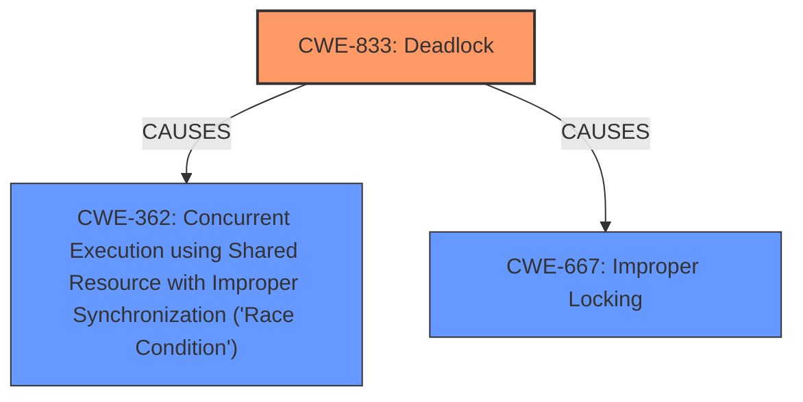

# Analysis Report for CVE-2024-56547

# Vulnerability Analysis Report: CVE-2024-56547

## Description

In the Linux kernel, the following vulnerability has been resolved rcu/nocb Fix **missed RCU barrier on deoffloading** Currently, running rcutorture test with torture_type=rcu fwd_progress=8 n_barrier_cbs=8 nocbs_nthreads=8 nocbs_toggle=100 onoff_interval=60 test_boost=2, will trigger the following warning WARNING CPU 19 PID 100 at kernel/rcu/tree_nocb.h1061 rcu_nocb_rdp_deoffload+0x292/0x2a0 RIP 0010rcu_nocb_rdp_deoffload+0x292/0x2a0 Call Trace ? __warn+0x7e/0x120 ? rcu_nocb_rdp_deoffload+0x292/0x2a0 ? report_bug+0x18e/0x1a0 ? handle_bug+0x3d/0x70 ? exc_invalid_op+0x18/0x70 ? asm_exc_invalid_op+0x1a/0x20 ? rcu_nocb_rdp_deoffload+0x292/0x2a0 rcu_nocb_cpu_deoffload+0x70/0xa0 rcu_nocb_toggle+0x136/0x1c0 ? __pfx_rcu_nocb_toggle+0x10/0x10 kthread+0xd1/0x100 ? __pfx_kthread+0x10/0x10 ret_from_fork+0x2f/0x50 ? __pfx_kthread+0x10/0x10 ret_from_fork_asm+0x1a/0x30 CPU0 CPU2 CPU3 //rcu_nocb_toggle //nocb_cb_wait //rcutorture // deoffload CPU1 // process CPU1s rdp rcu_barrier() rcu_segcblist_entrain() rcu_segcblist_add_len(1) // len == 2 // enqueue barrier // callback to CPU1s // rdp->cblist rcu_do_batch() // invoke CPU1s rdp->cblist // callback rcu_barrier_callback() rcu_barrier() mutex_lock(&rcu_state.barrier_mutex) // still see len == 2 // enqueue barrier callback // to CPU1s rdp->cblist rcu_segcblist_entrain() rcu_segcblist_add_len(1) // len == 3 // decrement len rcu_segcblist_add_len(-2) kthread_parkme() // CPU1s rdp->cblist len == 1 // Warn because there is // still a pending barrier // trigger warning WARN_ON_ONCE(rcu_segcblist_n_cbs(&rdp->cblist)) cpus_read_unlock() // wait CPU1 to comes online and // invoke barrier callback on // CPU1 rdps->cblist wait_for_completion(&rcu_state.barrier_completion) // deoffload CPU4 cpus_read_lock() rcu_barrier() mutex_lock(&rcu_state.barrier_mutex) // block on barrier_mutex // wait rcu_barrier() on // CPU3 to unlock barrier_mutex // but CPU3 unlock barrier_mutex // need to wait CPU1 comes online // when CPU1 going online will block on cpus_write_lock The above scenario will not only trigger a WARN_ON_ONCE(), but also trigger a deadlock. Thanks to nocb locking, a second racing rcu_barrier() on an offline CPU will either observe the decremented callback counter down to 0 and spare the callback enqueue, or rcuo will observe the new callback and keep rdp->nocb_cb_sleep to false. Therefore check rdp->nocb_cb_sleep before parking to make sure no further rcu_barrier() is waiting on the rdp.

## Vulnerability Description Key Phrases

- **Rootcause:** missed RCU barrier on deoffloading
- **Impact:** deadlock
- **Product:** Linux kernel

## Analysis (with Relationship Data)

# Summary
| CWE ID | CWE Name | Confidence | CWE Abstraction Level | CWE Vulnerability Mapping Label | CWE-Vulnerability Mapping Notes |
|---|---|---|---|---|---|
| CWE-833 | Deadlock | 0.9 | Base | Allowed | Primary CWE |
| CWE-362 | Concurrent Execution using Shared Resource with Improper Synchronization ('Race Condition') | 0.7 | Class | Allowed-with-Review | Secondary Candidate |
| CWE-667 | Improper Locking | 0.6 | Class | Allowed-with-Review | Secondary Candidate |

## Evidence and Confidence

*   **Confidence Score:** 0.8
*   **Evidence Strength:** MEDIUM

## Relationship Analysis
The primary relationship influencing the CWE selection is the hierarchical structure. CWE-833 (Deadlock) is selected as the primary CWE because the vulnerability description clearly states that a deadlock can occur. While CWE-362 (Race Condition) and CWE-667 (Improper Locking) are related and contribute to the deadlock, they are more general classifications. CWE-833, being a Base level CWE, is more specific and directly reflects the described outcome.



## Vulnerability Chain
The vulnerability chain starts with a **missed RCU barrier on deoffloading**. This **missed barrier** then causes a race condition due to concurrent execution and shared resource access with improper synchronization. Ultimately, this leads to a deadlock.

**Root Cause:** Missed RCU barrier on deoffloading
**Weakness:** Race condition due to concurrent execution and shared resource access with improper synchronization
**Impact:** Deadlock

## Summary of Analysis
The initial assessment considered various CWEs related to concurrency and resource management. The final conclusion emphasizes CWE-833 (Deadlock) as the primary CWE due to the explicit mention of a deadlock in the vulnerability description and the evidence from CVE reference links. The relationships between the CWEs highlight the progression from a race condition to a deadlock. The selection is at the optimal level of specificity, as CWE-833 is a Base level CWE that directly describes the vulnerability's outcome.

The key evidence supporting this decision comes from the **Vulnerability Description Key Phrases**, which state "**impact:** deadlock" and the "CVE Reference Links Content Summary" which states "A deadlock can occur due to the race condition".

Based on this evidence, CWE-833 is the most appropriate primary CWE. Other CWEs such as CWE-362 and CWE-667 are contributing factors but not the ultimate result, making them secondary considerations.

Relevant CWE Information:

# Enhanced Context (25 CWEs)
The following CWEs were identified as potentially relevant to this vulnerability:

## CWE-667: Improper Locking
**Abstraction Level**: Class
**Similarity Score**: 0.77
**Source**: dense

**Description**:
The product does not properly acquire or release a lock on a resource, leading to unexpected resource state changes and behaviors.

**Mapping Guidance**:
- Usage: Allowed-with-Review
- Rationale: This CWE entry is a Class and might have Base-level children that would be more appropriate


## CWE-833: Deadlock
**Abstraction Level**: Base
**Similarity Score**: 0.76
**Source**: dense

**Description**:
The product contains multiple threads or executable segments that are waiting for each other to release a necessary lock, resulting in deadlock.

**Mapping Guidance**:
- Usage: Allowed
- Rationale: This CWE entry is at the Base level of abstraction, which is a preferred level of abstraction for mapping to the root causes of vulnerabilities.


## CWE-362: Concurrent Execution using Shared Resource with Improper Synchronization ('Race Condition')
**Abstraction Level**: Class
**Similarity Score**: 0.74
**Source**: dense

**Description**:
The product contains a concurrent code sequence that requires temporary, exclusive access to a shared resource, but a timing window exists in which the shared resource can be modified by another code sequence operating concurrently.

**Mapping Guidance**:
- Usage: Allowed-with-Review
- Rationale: This CWE entry is a Class and might have Base-level children that would be more appropriate


## CWE-367: Time-of-check Time-of-use (TOCTOU) Race Condition
**Abstraction Level**: Base
**Similarity Score**: 0.73
**Source**: dense

**Description**:
The product checks the state of a resource before using that resource, but the resource's state can change between the check and the use in a way that invalidates the results of the check. This can cause the product to perform invalid actions when the resource is in an unexpected state.

**Mapping Guidance**:
- Usage: Allowed
- Rationale: This CWE entry is at the Base level of abstraction, which is a preferred level of abstraction for mapping to the root causes of vulnerabilities.


## CWE-407: Inefficient Algorithmic Complexity
**Abstraction Level**: Class
**Similarity Score**: 0.72
**Source**: dense

**Description**:
An algorithm in a product has an inefficient worst-case computational complexity that may be detrimental to system performance and can be triggered by an attacker, typically using crafted manipulations that ensure that the worst case is being reached.

**Mapping Guidance**:
- Usage: Allowed-with-Review
- Rationale: This CWE entry is a Class and might have Base-level children that would be more appropriate


## CWE-703: Improper Check or Handling of Exceptional Conditions
**Abstraction Level**: Pillar
**Similarity Score**: 0.71
**Source**: dense

**Description**:
The product does not properly anticipate or handle exceptional conditions that rarely occur during normal operation of the product.

**Mapping Guidance**:
- Usage: Discouraged
- Rationale: This CWE entry is extremely high-level, a Pillar.


## CWE-366: Race Condition within a Thread
**Abstraction Level**: Base
**Similarity Score**: 0.71
**Source**: dense

**Description**:
If two threads of execution use a resource simultaneously, there exists the possibility that resources may be used while invalid, in turn making the state of execution undefined.

**Mapping Guidance**:
- Usage: Allowed
- Rationale: This CWE entry is at the Base level of abstraction, which is a preferred level of abstraction for mapping to the root causes of vulnerabilities.


## CWE-755: Improper Handling of Exceptional Conditions
**Abstraction Level**: Class
**Similarity Score**: 0.71
**Source**: dense

**Description**:
The product does not handle or incorrectly handles an exceptional condition.

**Mapping Guidance**:
- Usage: Discouraged
- Rationale: This CWE entry is a level-1 Class (i.e., a child of a Pillar). It might have lower-level children that would be more appropriate


## CWE-476: NULL Pointer Dereference
**Abstraction Level**: Base
**Similarity Score**: 0.70
**Source**: dense

**Description**:
The product dereferences a pointer that it expects to be valid but is NULL.

**Mapping Guidance**:
- Usage: Allowed
- Rationale: This CWE entry is at the Base level of abstraction, which is a preferred level of abstraction for mapping to the root causes of vulnerabilities.


## CWE-252: Unchecked Return Value
**Abstraction Level**: Base
**Similarity Score**: 0.70
**Source**: dense

**Description**:
The product does not check the return value from a method or function, which can prevent it from detecting unexpected states and conditions.

**Mapping Guidance**:
- Usage: Allowed
- Rationale: This CWE entry is at the Base level of abstraction, which is a preferred level of abstraction for mapping to the root causes of vulnerabilities.


## CWE-667: Improper Locking
**Abstraction Level**: Class
**Similarity Score**: 1090.24
**Source**: sparse

**Description**:
The product does not properly acquire or release a lock on a resource, leading to unexpected resource state changes and behaviors.

**Mapping Guidance**:
- Usage: Allowed-with-Review
- Rationale: This CWE entry is a Class and might have Base-level children that would be more appropriate


## CWE-833: Deadlock
**Abstraction Level**: Base
**Similarity Score**: 1040.40
**Source**: sparse

**Description**:
The product contains multiple threads or executable segments that are waiting for each other to release a necessary lock, resulting in deadlock.

**Mapping Guidance**:
- Usage: Allowed
- Rationale: This CWE entry is at the Base level of abstraction, which is a preferred level of abstraction for mapping to the root causes of vulnerabilities.


## CWE-1284: Improper Validation of Specified Quantity in


## CWE Relationship Analysis

Current CWEs represent these abstraction levels: .


### Vulnerability Chain Analysis

**Chain starting from CWE-1284:**
- 1284 (Improper Validation of Specified Quantity in Input) - ROOT


**Chain starting from CWE-476:**
- 476 (NULL Pointer Dereference) - ROOT


### CWE Relationship Diagram

```mermaid
graph TD
    classDef primary fill:#f96,stroke:#333,stroke-width:2px
    classDef secondary fill:#69f,stroke:#333
    classDef tertiary fill:#9e9,stroke:#333
```


*Report generated on 2025-07-13 23:49:40*
