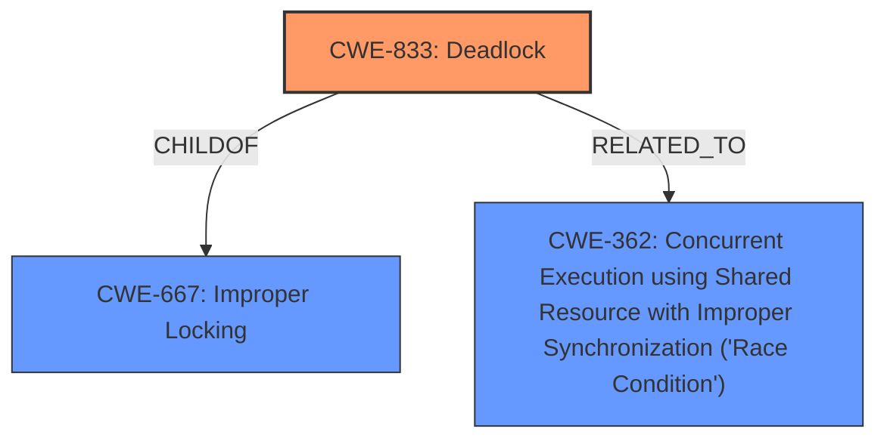

# Analysis Report for CVE-2024-56592

# Vulnerability Analysis Report: CVE-2024-56592

## Description

In the Linux kernel, the following vulnerability has been resolved bpf Call free_htab_elem() after htab_unlock_bucket() For htab of maps, when the map is removed from the htab, it may hold the last reference of the map. bpf_map_fd_put_ptr() will invoke bpf_map_free_id() to free the id of the removed map element. However, bpf_map_fd_put_ptr() is invoked while holding a bucket lock (raw_spin_lock_t), and bpf_map_free_id() attempts to acquire map_idr_lock (spinlock_t), triggering the following lockdep warning ============================= [ BUG **Invalid wait context** ] 6.11.0-rc4+ #49 Not tainted ----------------------------- test_maps/4881 is trying to lock ffffffff84884578 (map_idr_lock){+...}-{33}, at bpf_map_free_id.part.0+0x21/0x70 other info that might help us debug this context-{55} 2 locks held by test_maps/4881 #0 ffffffff846caf60 (rcu_read_lock){....}-{13}, at bpf_fd_htab_map_update_elem+0xf9/0x270 #1 ffff888149ced148 (&htab->lockdep_key#2){....}-{22}, at htab_map_update_elem+0x178/0xa80 stack backtrace CPU 0 UID 0 PID 4881 Comm test_maps Not tainted 6.11.0-rc4+ #49 Hardware name QEMU Standard PC (i440FX + PIIX, 1996), ... Call Trace dump_stack_lvl+0x6e/0xb0 dump_stack+0x10/0x20 __lock_acquire+0x73e/0x36c0 lock_acquire+0x182/0x450 _raw_spin_lock_irqsave+0x43/0x70 bpf_map_free_id.part.0+0x21/0x70 bpf_map_put+0xcf/0x110 bpf_map_fd_put_ptr+0x9a/0xb0 free_htab_elem+0x69/0xe0 htab_map_update_elem+0x50f/0xa80 bpf_fd_htab_map_update_elem+0x131/0x270 htab_map_update_elem+0x50f/0xa80 bpf_fd_htab_map_update_elem+0x131/0x270 bpf_map_update_value+0x266/0x380 __sys_bpf+0x21bb/0x36b0 __x64_sys_bpf+0x45/0x60 x64_sys_call+0x1b2a/0x20d0 do_syscall_64+0x5d/0x100 entry_SYSCALL_64_after_hwframe+0x76/0x7e One way to fix the lockdep warning is using raw_spinlock_t for map_idr_lock as well. However, bpf_map_alloc_id() invokes idr_alloc_cyclic() after acquiring map_idr_lock, it will trigger a similar lockdep warning because the slabs lock (s->cpu_slab->lock) is still a spinlock. Instead of changing map_idr_locks type, fix the issue by invoking htab_put_fd_value() after htab_unlock_bucket(). However, only deferring the invocation of htab_put_fd_value() is not enough, because the old map pointers in htab of maps can not be saved during batched deletion. Therefore, also defer the invocation of free_htab_elem(), so these to-be-freed elements could be linked together similar to lru map. There are four callers for ->map_fd_put_ptr (1) alloc_htab_elem() (through htab_put_fd_value()) It invokes ->map_fd_put_ptr() under a raw_spinlock_t. The invocation of htab_put_fd_value() can not simply move after htab_unlock_bucket(), because the old element has already been stashed in htab->extra_elems. It may be reused immediately after htab_unlock_bucket() and the invocation of htab_put_fd_value() after htab_unlock_bucket() may release the newly-added element incorrectly. Therefore, saving the map pointer of the old element for htab of maps before unlocking the bucket and releasing the map_ptr after unlock. Beside the map pointer in the old element, should do the same thing for the special fields in the old element as well. (2) free_htab_elem() (through htab_put_fd_value()) Its caller includes __htab_map_lookup_and_delete_elem(), htab_map_delete_elem() and __htab_map_lookup_and_delete_batch(). For htab_map_delete_elem(), simply invoke free_htab_elem() after htab_unlock_bucket(). For __htab_map_lookup_and_delete_batch(), just like lru map, linking the to-be-freed element into node_to_free list and invoking free_htab_elem() for these element after unlock. It is safe to reuse batch_flink as the link for node_to_free, because these elements have been removed from the hash llist. Because htab of maps doesnt support lookup_and_delete operation, __htab_map_lookup_and_delete_elem() doesnt have the problem, so kept it as ---truncated---

## Vulnerability Description Key Phrases

- **Rootcause:** Invalid wait context
- **Product:** Linux kernel
- **Version:** 6.11.0-rc4+
- **Component:** bpf

## Analysis (with Relationship Data)

# Summary
| CWE ID | CWE Name | Confidence | CWE Abstraction Level | CWE Vulnerability Mapping Label | CWE-Vulnerability Mapping Notes |
|---|---|---|---|---|---|
| CWE-833 | Deadlock | 0.9 | Base | Primary | Allowed |
| CWE-667 | Improper Locking | 0.7 | Class | Secondary Candidate | Allowed-with-Review |
| CWE-362 | Concurrent Execution using Shared Resource with Improper Synchronization ('Race Condition') | 0.6 | Class | Secondary Candidate | Allowed-with-Review |

## Evidence and Confidence

*   **Confidence Score:** 0.8
*   **Evidence Strength:** HIGH

## Relationship Analysis
The primary CWE, CWE-833 [Deadlock], is a Base level CWE, providing a specific description of the locking issue. CWE-667 [Improper Locking] and CWE-362 [Concurrent Execution using Shared Resource with Improper Synchronization ('Race Condition')] are Class level CWEs that are related to locking issues but are less specific than CWE-833 [Deadlock]. CWE-833 [Deadlock] is the most appropriate because the vulnerability description mentions a lockdep warning and the potential for a system hang, which are direct indicators of a deadlock situation.



## Vulnerability Chain
The vulnerability chain starts with an **Invalid wait context** due to a locking conflict when removing a map from a hash table. This leads to a lock ordering violation where a raw spinlock is held while attempting to acquire a regular spinlock, ultimately resulting in a kernel **deadlock**.

## Summary of Analysis
The analysis is based on the provided vulnerability description and the "CVE Reference Links Content Summary," which explicitly mentions a lock ordering violation leading to a deadlock. The **rootcause** is the **Invalid wait context**. The primary CWE is CWE-833 [Deadlock] due to the explicit mention of a deadlock situation and lockdep warning. The supporting evidence for this decision is the following excerpt: "triggering the following lockdep warning ============================= [ BUG **Invalid wait context** ]" and "This creates a lock ordering violation leading to a deadlock situation". CWE-667 [Improper Locking] and CWE-362 [Concurrent Execution using Shared Resource with Improper Synchronization ('Race Condition')] were considered as secondary candidates because they are related to locking issues but are less specific than the identified deadlock. The selection of CWE-833 [Deadlock] is at the optimal level of specificity because it directly addresses the described vulnerability.

Relevant CWE Information:

# Enhanced Context (25 CWEs)
The following CWEs were identified as potentially relevant to this vulnerability:

## CWE-667: Improper Locking
**Abstraction Level**: Class
**Similarity Score**: 0.80
**Source**: dense

**Description**:
The product does not properly acquire or release a lock on a resource, leading to unexpected resource state changes and behaviors.

**Mapping Guidance**:
- Usage: Allowed-with-Review
- Rationale: This CWE entry is a Class and might have Base-level children that would be more appropriate


## CWE-362: Concurrent Execution using Shared Resource with Improper Synchronization ('Race Condition')
**Abstraction Level**: Class
**Similarity Score**: 0.77
**Source**: dense

**Description**:
The product contains a concurrent code sequence that requires temporary, exclusive access to a shared resource, but a timing window exists in which the shared resource can be modified by another code sequence operating concurrently.

**Mapping Guidance**:
- Usage: Allowed-with-Review
- Rationale: This CWE entry is a Class and might have Base-level children that would be more appropriate


## CWE-367: Time-of-check Time-of-use (TOCTOU) Race Condition
**Abstraction Level**: Base
**Similarity Score**: 0.76
**Source**: dense

**Description**:
The product checks the state of a resource before using that resource, but the resource's state can change between the check and the use in a way that invalidates the results of the check. This can cause the product to perform invalid actions when the resource is in an unexpected state.

**Mapping Guidance**:
- Usage: Allowed
- Rationale: This CWE entry is at the Base level of abstraction, which is a preferred level of abstraction for mapping to the root causes of vulnerabilities.


## CWE-755: Improper Handling of Exceptional Conditions
**Abstraction Level**: Class
**Similarity Score**: 0.75
**Source**: dense

**Description**:
The product does not handle or incorrectly handles an exceptional condition.

**Mapping Guidance**:
- Usage: Discouraged
- Rationale: This CWE entry is a level-1 Class (i.e., a child of a Pillar). It might have lower-level children that would be more appropriate


## CWE-833: Deadlock
**Abstraction Level**: Base
**Similarity Score**: 0.75
**Source**: dense

**Description**:
The product contains multiple threads or executable segments that are waiting for each other to release a necessary lock, resulting in deadlock.

**Mapping Guidance**:
- Usage: Allowed
- Rationale: This CWE entry is at the Base level of abstraction, which is a preferred level of abstraction for mapping to the root causes of vulnerabilities.


## CWE-404: Improper Resource Shutdown or Release
**Abstraction Level**: Class
**Similarity Score**: 0.74
**Source**: dense

**Description**:
The product does not release or incorrectly releases a resource before it is made available for re-use.

**Mapping Guidance**:
- Usage: Allowed-with-Review
- Rationale: This CWE entry is a Class and might have Base-level children that would be more appropriate


## CWE-824: Access of Uninitialized Pointer
**Abstraction Level**: Base
**Similarity Score**: 0.74
**Source**: dense

**Description**:
The product accesses or uses a pointer that has not been initialized.

**Mapping Guidance**:
- Usage: Allowed
- Rationale: This CWE entry is at the Base level of abstraction, which is a preferred level of abstraction for mapping to the root causes of vulnerabilities.


## CWE-476: NULL Pointer Dereference
**Abstraction Level**: Base
**Similarity Score**: 0.74
**Source**: dense

**Description**:
The product dereferences a pointer that it expects to be valid but is NULL.

**Mapping Guidance**:
- Usage: Allowed
- Rationale: This CWE entry is at the Base level of abstraction, which is a preferred level of abstraction for mapping to the root causes of vulnerabilities.


## CWE-909: Missing Initialization of Resource
**Abstraction Level**: Class
**Similarity Score**: 0.74
**Source**: dense

**Description**:
The product does not initialize a critical resource.

**Mapping Guidance**:
- Usage: Allowed-with-Review
- Rationale: This CWE entry is a Class and might have Base-level children that would be more appropriate


## CWE-125: Out-of-bounds Read
**Abstraction Level**: Base
**Similarity Score**: 0.74
**Source**: dense

**Description**:
The product reads data past the end, or before the beginning, of the intended buffer.

**Mapping Guidance**:
- Usage: Allowed
- Rationale: This CWE entry is at the Base level of abstraction, which is a preferred level of abstraction for mapping to the root causes of vulnerabilities.


## CWE-667: Improper Locking
**Abstraction Level**: Class
**Similarity Score**: 1720.18
**Source**: sparse

**Description**:
The product does not properly acquire or release a lock on a resource, leading to unexpected resource state changes and behaviors.

**Mapping Guidance**:
- Usage: Allowed-with-Review
- Rationale: This CWE entry is a Class and might have Base-level children that would be more appropriate


## CWE-362: Concurrent Execution using Shared Resource with Improper Synchronization ('Race Condition')
**Abstraction Level**: Class
**Similarity Score**: 1685.10
**Source**: sparse

**Description**:
The product contains a concurrent code sequence that requires temporary, exclusive access to a shared resource, but a timing window exists in which the shared resource can be modified by another code sequence operating concurrently.

**Mapping Guidance**:
- Usage: Allowed-with-Review
- Rationale: This CWE entry is a Class and might have Base-level children that would be more appropriate


## CWE-367: Time-of-check Time-of-use (TOCTOU) Race Condition
**Abstraction Level**: Base
**Similarity Score**: 1613.48
**Source**: sparse


## CWE Relationship Analysis

Current CWEs represent these abstraction levels: .


### Vulnerability Chain Analysis

**Chain starting from CWE-476:**
- 476 (NULL Pointer Dereference) - ROOT


**Chain starting from CWE-404:**
- 404 (Improper Resource Shutdown or Release) - ROOT


### CWE Relationship Diagram

```mermaid
graph TD
    classDef primary fill:#f96,stroke:#333,stroke-width:2px
    classDef secondary fill:#69f,stroke:#333
    classDef tertiary fill:#9e9,stroke:#333
```


*Report generated on 2025-07-13 23:51:21*
