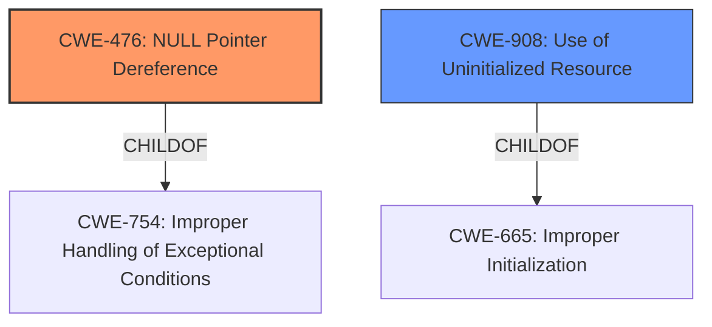

# Analysis for CVE-2024-56685

# Summary
| CWE ID | CWE Name | Confidence | CWE Abstraction Level | CWE Vulnerability Mapping Label | CWE-Vulnerability Mapping Notes |
|---|---|---|---|---|---|
| CWE-476 | NULL Pointer Dereference | 1.0 | Base | Primary | Allowed |
| CWE-908 | Use of Uninitialized Resource | 0.7 | Base | Secondary | Allowed |

## Evidence and Confidence

*   **Confidence Score:** 0.9
*   **Evidence Strength:** HIGH

## Relationship Analysis
The primary CWE is CWE-476 **(NULL Pointer Dereference)**, which occurs because the code attempts to dereference a pointer that is expected to be valid but is NULL. This is directly caused by accessing members of a dummy component before it's properly initialized. CWE-908 **(Use of Uninitialized Resource)** is a related weakness, as the null pointer dereference stems from using an uninitialized resource. CWE-476 is a child of CWE-754 **(Improper Handling of Exceptional Conditions)**, while CWE-908 is a child of CWE-665 **(Improper Initialization)**. Though **Improper Initialization** could be considered, the description specifically highlights the dereference of the NULL pointer as the more immediate cause of the vulnerability, making CWE-476 the more accurate and specific choice.

## Vulnerability Chain
The vulnerability chain starts with the **improper initialization** of the dummy component, leading to the **use of an uninitialized resource**, which then results in a **null pointer dereference** and ultimately a **kernel panic**.

Improper Initialization -> Use of Uninitialized Resource -> Null Pointer Dereference -> Kernel Panic

## Summary of Analysis
The analysis is heavily based on the provided evidence, specifically the vulnerability description and the CVE reference links content summary. The description explicitly states, "By omitting a dai link subnode in the sound cards node in the Devicetree, the default uninitialized dummy codec is used, and when its dai_name pointer gets passed to strcmp() it results in a null pointer dereference and a kernel panic." This directly supports the selection of CWE-476 **(NULL Pointer Dereference)** as the primary CWE. Additionally, the phrase "accessing any of the members of a dummy component during probe will result in undefined behavior" indicates that the dummy component is not properly initialized, supporting the inclusion of CWE-908 **(Use of Uninitialized Resource)** as a contributing factor.

The graph relationships helped solidify the understanding that while **Improper Initialization** might be present, the direct cause is the **NULL Pointer Dereference**.

The selected CWEs are at the optimal level of specificity because they accurately represent the root cause and contributing factors of the vulnerability. CWE-476 is a Base level CWE, providing sufficient detail about the nature of the error. CWE-908 is also a Base level CWE, highlighting the use of a resource that has not been initialized.

CWE-1284 **(Improper Validation of Specified Quantity in Input)**, CWE-125 **(Out-of-bounds Read)**, CWE-362 **(Concurrent Execution using Shared Resource with Improper Synchronization ('Race Condition')**, CWE-824 **(Access of Uninitialized Pointer)**, CWE-1285 **(Improper Validation of Specified Index, Position, or Offset in Input)**, and CWE-822 **(Untrusted Pointer Dereference)** were considered but not used, as they do not directly relate to the root cause or contributing factors described in the vulnerability.