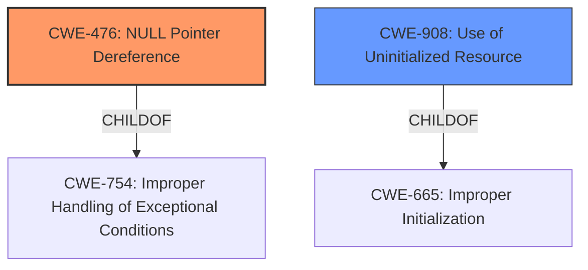

# Analysis Report for CVE-2024-56685

# Vulnerability Analysis Report: CVE-2024-56685

## Description

In the Linux kernel, the following vulnerability has been resolved ASoC mediatek Check num_codecs is not zero to avoid panic during probe Following commit 13f58267cda3 (ASoC soc.h dont create dummy Component via COMP_DUMMY()), COMP_DUMMY() became an array with zero length, and only gets populated with the dummy struct after the card is registered. Since the sound card drivers probe happens before the card registration, accessing any of the members of a dummy component during probe will result in undefined behavior. This can be observed in the mt8188 and mt8195 machine sound drivers. By omitting a dai link subnode in the sound cards node in the Devicetree, the default uninitialized dummy codec is used, and when its dai_name pointer gets passed to strcmp() it results in a null pointer dereference and a kernel panic. In addition to that, set_card_codec_info() in the generic helpers file, mtk-soundcard-driver.c, will populate a dai link with a dummy codec when a dai link node is present in DT but with no codec property. The result is that at probe time, a dummy codec can either be uninitialized with num_codecs = 0, or be an initialized dummy codec, with num_codecs = 1 and dai_name = snd-soc-dummy-dai. In order to accommodate for both situations, check that num_codecs is not zero before accessing the codecs fields but still check for the codecs dai name against snd-soc-dummy-dai as needed. While at it, also drop the check that dai_name is not null in the mt8192 driver, introduced in commit 4d4e1b6319e5 (ASoC mediatek mt8192 Check existence of dai_name before dereferencing), as it is actually redundant given the preceding num_codecs != 0 check.

## Vulnerability Description Key Phrases

- **Rootcause:** accessing members of dummy component during probe before registration
- **Vector:** omitting dai link subnode
- **Weakness:** array with zero length, null pointer dereference, undefined behavior
- **Product:** ['Linux kernel', 'mt8188', 'mt8195', 'mt8192']
- **Impact:** kernel panic

## Analysis (with Relationship Data)

# Summary
| CWE ID | CWE Name | Confidence | CWE Abstraction Level | CWE Vulnerability Mapping Label | CWE-Vulnerability Mapping Notes |
|---|---|---|---|---|---|
| CWE-476 | NULL Pointer Dereference | 1.0 | Base | Primary | Allowed |
| CWE-908 | Use of Uninitialized Resource | 0.7 | Base | Secondary | Allowed |

## Evidence and Confidence

*   **Confidence Score:** 0.9
*   **Evidence Strength:** HIGH

## Relationship Analysis
The primary CWE is CWE-476 **(NULL Pointer Dereference)**, which occurs because the code attempts to dereference a pointer that is expected to be valid but is NULL. This is directly caused by accessing members of a dummy component before it's properly initialized. CWE-908 **(Use of Uninitialized Resource)** is a related weakness, as the null pointer dereference stems from using an uninitialized resource. CWE-476 is a child of CWE-754 **(Improper Handling of Exceptional Conditions)**, while CWE-908 is a child of CWE-665 **(Improper Initialization)**. Though **Improper Initialization** could be considered, the description specifically highlights the dereference of the NULL pointer as the more immediate cause of the vulnerability, making CWE-476 the more accurate and specific choice.



## Vulnerability Chain
The vulnerability chain starts with the **improper initialization** of the dummy component, leading to the **use of an uninitialized resource**, which then results in a **null pointer dereference** and ultimately a **kernel panic**.

Improper Initialization -> Use of Uninitialized Resource -> Null Pointer Dereference -> Kernel Panic

## Summary of Analysis
The analysis is heavily based on the provided evidence, specifically the vulnerability description and the CVE reference links content summary. The description explicitly states, "By omitting a dai link subnode in the sound cards node in the Devicetree, the default uninitialized dummy codec is used, and when its dai_name pointer gets passed to strcmp() it results in a null pointer dereference and a kernel panic." This directly supports the selection of CWE-476 **(NULL Pointer Dereference)** as the primary CWE. Additionally, the phrase "accessing any of the members of a dummy component during probe will result in undefined behavior" indicates that the dummy component is not properly initialized, supporting the inclusion of CWE-908 **(Use of Uninitialized Resource)** as a contributing factor.

The graph relationships helped solidify the understanding that while **Improper Initialization** might be present, the direct cause is the **NULL Pointer Dereference**.

The selected CWEs are at the optimal level of specificity because they accurately represent the root cause and contributing factors of the vulnerability. CWE-476 is a Base level CWE, providing sufficient detail about the nature of the error. CWE-908 is also a Base level CWE, highlighting the use of a resource that has not been initialized.

CWE-1284 **(Improper Validation of Specified Quantity in Input)**, CWE-125 **(Out-of-bounds Read)**, CWE-362 **(Concurrent Execution using Shared Resource with Improper Synchronization ('Race Condition')**, CWE-824 **(Access of Uninitialized Pointer)**, CWE-1285 **(Improper Validation of Specified Index, Position, or Offset in Input)**, and CWE-822 **(Untrusted Pointer Dereference)** were considered but not used, as they do not directly relate to the root cause or contributing factors described in the vulnerability.


## CWE Relationship Analysis

Current CWEs represent these abstraction levels: .


### Vulnerability Chain Analysis

**Chain starting from CWE-1284:**
- 1284 (Improper Validation of Specified Quantity in Input) - ROOT


**Chain starting from CWE-476:**
- 476 (NULL Pointer Dereference) - ROOT


### CWE Relationship Diagram

```mermaid
graph TD
    classDef primary fill:#f96,stroke:#333,stroke-width:2px
    classDef secondary fill:#69f,stroke:#333
    classDef tertiary fill:#9e9,stroke:#333
```


*Report generated on 2025-07-13 23:53:42*
