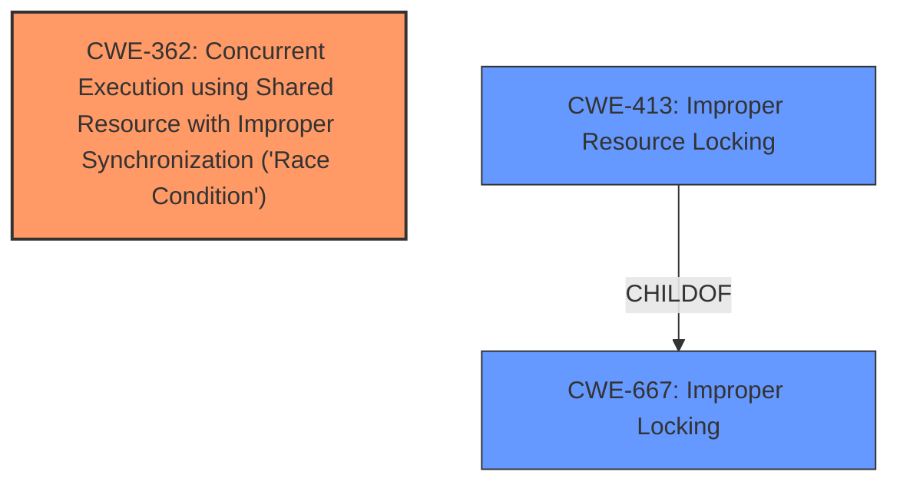

# Enhanced Analysis for CVE-2024-56687

# Summary
| CWE ID | CWE Name | Confidence | CWE Abstraction Level | CWE Vulnerability Mapping Label | CWE-Vulnerability Mapping Notes |
|---|---|---|---|---|---|
| CWE-362 | Concurrent Execution using Shared Resource with Improper Synchronization ('Race Condition') | 0.9 | Class | Primary | Allowed-with-Review |
| CWE-413 | Improper Resource Locking | 0.7 | Base | Secondary | Allowed |

## Evidence and Confidence

*   **Confidence Score:** 0.8
*   **Evidence Strength:** MEDIUM

## Relationship Analysis
The primary CWE is CWE-362, a Class-level weakness, which is related to concurrency issues. CWE-413, a Base-level weakness, is a child of CWE-667 (Improper Locking), and describes how improper locking of resources can lead to unexpected behavior. Although CWE-362 is a Class, I chose it to represent this vulnerability since there isn't a more specific Base-level CWE to describe this **Race Condition**.



## Vulnerability Chain
The vulnerability chain starts with a **race condition** (CWE-362) due to concurrent access to a shared resource. This leads to **improper resource locking** (CWE-413). The impact is a hardware lockup and potential denial of service.

## Summary of Analysis
The primary weakness is a **race condition** (CWE-362) that occurs during the handling of USB requests in the Linux kernel's MUSB driver. Specifically, a callback function is invoked from within `usb_ep_queue()`, which can lead to a deadlock. The evidence for this comes from the "CVE Reference Links Content Summary" section, which states: "A **race condition** exists where a USB request's callback could be invoked from within the `usb_ep_queue()` function, which is not allowed, potentially leading to a deadlock or hardware lockup."

The secondary weakness is **improper resource locking** (CWE-413) which arises because the interrupt flag (RXPKTRDY) is not cleared correctly when the request queue is empty. The "CVE Reference Links Content Summary" section supports this by stating: "Incorrect interrupt handling: The RXPKTRDY flag remains set even when there are no requests in the queue."

The retriever results show CWE-362 as a candidate, and the vulnerability description has the term "race condition". Although it is a Class, I believe it is a good fit. CWE-413 is related to locking, and the problem with the interrupt flag also hints at this.

Other CWEs considered but not used:

*   CWE-789: Memory Allocation with Excessive Size Value - This CWE does not fit the vulnerability, as there is no mention of memory allocation issues.
*   CWE-1284: Improper Validation of Specified Quantity in Input - This CWE does not fit the vulnerability, as there is no mention of quantity validation issues.
*   CWE-476: NULL Pointer Dereference - This CWE does not fit the vulnerability, as there is no mention of null pointer dereference.
*   CWE-367: Time-of-check Time-of-use (TOCTOU) Race Condition - While this is a race condition, the TOCTOU aspect is not present in the description.
*   CWE-863: Incorrect Authorization - This CWE is not relevant, as the vulnerability is not related to authorization.

# Enhanced Context (25 CWEs)
The following CWEs were identified as potentially relevant to this vulnerability:

## CWE-362: Concurrent Execution using Shared Resource with Improper Synchronization ('Race Condition')
**Abstraction Level**: Class
**Similarity Score**: 0.77
**Source**: dense

**Description**:
The product contains a concurrent code sequence that requires temporary, exclusive access to a shared resource, but a timing window exists in which the shared resource can be modified by another code sequence operating concurrently.

**Mapping Guidance**:
- Usage: Allowed-with-Review
- Rationale: This CWE entry is a Class and might have Base-level children that would be more appropriate

## CWE-413: Improper Resource Locking
**Abstraction Level**: base
**Similarity Score**: 2.47
**Source**: graph

**Description**:
CWE-413: Improper Resource Locking

**Mapping Guidance**:
- Usage: Allowed
- Rationale: This CWE entry is at the Base level of abstraction, which is a preferred level of abstraction for mapping to the root causes of vulnerabilities.

**Relationships**:
- PARENTOF -> CWE-591
- CHILDOF -> CWE-667
- PARENTOF -> CWE-413
- CHILDOF -> CWE-413


## CWE Relationship Analysis

Current CWEs represent these abstraction levels: .


### Vulnerability Chain Analysis

**Chain starting from CWE-863:**
- 863 (Incorrect Authorization) - ROOT


**Chain starting from CWE-1284:**
- 1284 (Improper Validation of Specified Quantity in Input) - ROOT


### CWE Relationship Diagram

```mermaid
graph TD
    classDef primary fill:#f96,stroke:#333,stroke-width:2px
    classDef secondary fill:#69f,stroke:#333
    classDef tertiary fill:#9e9,stroke:#333
```