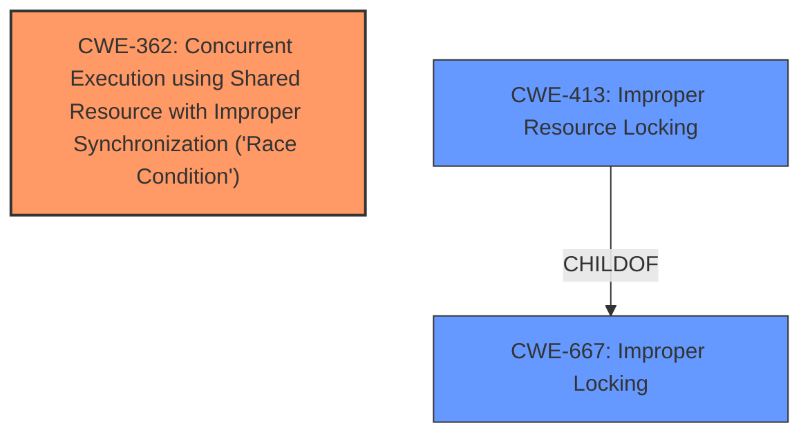

# Analysis Report for CVE-2024-56687

# Vulnerability Analysis Report: CVE-2024-56687

## Description

In the Linux kernel, the following vulnerability has been resolved usb musb Fix hardware lockup on first Rx endpoint request There is a possibility that a requests callback could be invoked from usb_ep_queue() (call trace below, supplemented with missing calls) req->complete from usb_gadget_giveback_request (drivers/usb/gadget/udc/core.c999) usb_gadget_giveback_request from musb_g_giveback (drivers/usb/musb/musb_gadget.c147) musb_g_giveback from rxstate (drivers/usb/musb/musb_gadget.c784) rxstate from musb_ep_restart (drivers/usb/musb/musb_gadget.c1169) musb_ep_restart from musb_ep_restart_resume_work (drivers/usb/musb/musb_gadget.c1176) musb_ep_restart_resume_work from musb_queue_resume_work (drivers/usb/musb/musb_core.c2279) musb_queue_resume_work from musb_gadget_queue (drivers/usb/musb/musb_gadget.c1241) musb_gadget_queue from usb_ep_queue (drivers/usb/gadget/udc/core.c300) According to the docstring of usb_ep_queue(), this should not happen Note that @reqs ->complete() callback must never be called from within usb_ep_queue() as that can create deadlock situations. In fact, a hardware lockup might occur in the following sequence 1. The gadget is initialized using musb_gadget_enable(). 2. Meanwhile, a packet arrives, and the RXPKTRDY flag is set, raising an interrupt. 3. If IRQs are enabled, the interrupt is handled, but musb_g_rx() finds an empty queue (next_request() returns NULL). The interrupt flag has already been cleared by the glue layer handler, but the RXPKTRDY flag remains set. 4. The first request is enqueued using usb_ep_queue(), leading to the call of req->complete(), as shown in the call trace above. 5. If the callback enables IRQs and another packet is waiting, step (3) repeats. The request queue is empty because usb_g_giveback() removes the request before invoking the callback. 6. The endpoint remains locked up, as the interrupt triggered by hardware setting the RXPKTRDY flag has been handled, but the flag itself remains set. For this scenario to occur, it is only necessary for IRQs to be enabled at some point during the complete callback. This happens with the USB Ethernet gadget, whose rx_complete() callback calls netif_rx(). If called in the task context, netif_rx() disables the bottom halves (BHs). When the BHs are re-enabled, IRQs are also enabled to allow soft IRQs to be processed. The gadget itself is initialized at module load (or at boot if built-in), but the first request is enqueued when the network interface is brought up, triggering rx_complete() in the task context via ioctl(). If a packet arrives while the interface is down, it can prevent the interface from receiving any further packets from the USB host. The situation is quite complicated with many parties involved. This particular issue can be resolved in several possible ways 1. Ensure that callbacks never enable IRQs. This would be difficult to enforce, as discovering how netif_rx() interacts with interrupts was already quite challenging and u_ether is not the only function driver. Similar bugs could be hidden in other drivers as well. 2. Disable MUSB interrupts in musb_g_giveback() before calling the callback and re-enable them afterwars (by calling musb_{dis,en}able_interrupts(), for example). This would ensure that MUSB interrupts are not handled during the callback, even if IRQs are enabled. In fact, it would allow IRQs to be enabled when releasing the lock. However, this feels like an inelegant hack. 3. Modify the interrupt handler to clear the RXPKTRDY flag if the request queue is empty. While this approach also feels like a hack, it wastes CPU time by attempting to handle incoming packets when the software is not ready to process them. 4. Flush the Rx FIFO instead of calling rxstate() in musb_ep_restart(). This ensures that the hardware can receive packets when there is at least one request in the queue. Once I ---truncated---

## Vulnerability Description Key Phrases

- **Impact:** hardware lockup
- **Vector:** first Rx endpoint request
- **Product:** Linux kernel
- **Component:** usb musb

## Analysis (with Relationship Data)

# Summary
| CWE ID | CWE Name | Confidence | CWE Abstraction Level | CWE Vulnerability Mapping Label | CWE-Vulnerability Mapping Notes |
|---|---|---|---|---|---|
| CWE-362 | Concurrent Execution using Shared Resource with Improper Synchronization ('Race Condition') | 0.9 | Class | Primary | Allowed-with-Review |
| CWE-413 | Improper Resource Locking | 0.7 | Base | Secondary | Allowed |

## Evidence and Confidence

*   **Confidence Score:** 0.8
*   **Evidence Strength:** MEDIUM

## Relationship Analysis
The primary CWE is CWE-362, a Class-level weakness, which is related to concurrency issues. CWE-413, a Base-level weakness, is a child of CWE-667 (Improper Locking), and describes how improper locking of resources can lead to unexpected behavior. Although CWE-362 is a Class, I chose it to represent this vulnerability since there isn't a more specific Base-level CWE to describe this **Race Condition**.



## Vulnerability Chain
The vulnerability chain starts with a **race condition** (CWE-362) due to concurrent access to a shared resource. This leads to **improper resource locking** (CWE-413). The impact is a hardware lockup and potential denial of service.

## Summary of Analysis
The primary weakness is a **race condition** (CWE-362) that occurs during the handling of USB requests in the Linux kernel's MUSB driver. Specifically, a callback function is invoked from within `usb_ep_queue()`, which can lead to a deadlock. The evidence for this comes from the "CVE Reference Links Content Summary" section, which states: "A **race condition** exists where a USB request's callback could be invoked from within the `usb_ep_queue()` function, which is not allowed, potentially leading to a deadlock or hardware lockup."

The secondary weakness is **improper resource locking** (CWE-413) which arises because the interrupt flag (RXPKTRDY) is not cleared correctly when the request queue is empty. The "CVE Reference Links Content Summary" section supports this by stating: "Incorrect interrupt handling: The RXPKTRDY flag remains set even when there are no requests in the queue."

The retriever results show CWE-362 as a candidate, and the vulnerability description has the term "race condition". Although it is a Class, I believe it is a good fit. CWE-413 is related to locking, and the problem with the interrupt flag also hints at this.

Other CWEs considered but not used:

*   CWE-789: Memory Allocation with Excessive Size Value - This CWE does not fit the vulnerability, as there is no mention of memory allocation issues.
*   CWE-1284: Improper Validation of Specified Quantity in Input - This CWE does not fit the vulnerability, as there is no mention of quantity validation issues.
*   CWE-476: NULL Pointer Dereference - This CWE does not fit the vulnerability, as there is no mention of null pointer dereference.
*   CWE-367: Time-of-check Time-of-use (TOCTOU) Race Condition - While this is a race condition, the TOCTOU aspect is not present in the description.
*   CWE-863: Incorrect Authorization - This CWE is not relevant, as the vulnerability is not related to authorization.

# Enhanced Context (25 CWEs)
The following CWEs were identified as potentially relevant to this vulnerability:

## CWE-362: Concurrent Execution using Shared Resource with Improper Synchronization ('Race Condition')
**Abstraction Level**: Class
**Similarity Score**: 0.77
**Source**: dense

**Description**:
The product contains a concurrent code sequence that requires temporary, exclusive access to a shared resource, but a timing window exists in which the shared resource can be modified by another code sequence operating concurrently.

**Mapping Guidance**:
- Usage: Allowed-with-Review
- Rationale: This CWE entry is a Class and might have Base-level children that would be more appropriate

## CWE-413: Improper Resource Locking
**Abstraction Level**: base
**Similarity Score**: 2.47
**Source**: graph

**Description**:
CWE-413: Improper Resource Locking

**Mapping Guidance**:
- Usage: Allowed
- Rationale: This CWE entry is at the Base level of abstraction, which is a preferred level of abstraction for mapping to the root causes of vulnerabilities.

**Relationships**:
- PARENTOF -> CWE-591
- CHILDOF -> CWE-667
- PARENTOF -> CWE-413
- CHILDOF -> CWE-413


## CWE Relationship Analysis

Current CWEs represent these abstraction levels: .


### Vulnerability Chain Analysis

**Chain starting from CWE-863:**
- 863 (Incorrect Authorization) - ROOT


**Chain starting from CWE-1284:**
- 1284 (Improper Validation of Specified Quantity in Input) - ROOT


### CWE Relationship Diagram

```mermaid
graph TD
    classDef primary fill:#f96,stroke:#333,stroke-width:2px
    classDef secondary fill:#69f,stroke:#333
    classDef tertiary fill:#9e9,stroke:#333
```


*Report generated on 2025-07-13 23:53:58*
