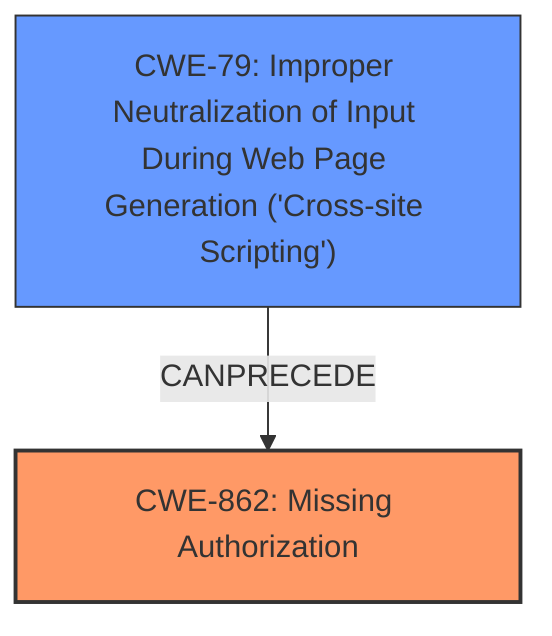

# Analysis for CVE-2024-5669

# Summary
| CWE ID  | CWE Name                                                                 | Confidence | CWE Abstraction Level | CWE Vulnerability Mapping Label | CWE-Vulnerability Mapping Notes |
| :-------- | :----------------------------------------------------------------------- | :--------- | :-------------------- | :------------------------------ | :------------------------------ |
| CWE-862   | Missing Authorization                                                      | 0.9        | Class                 | Primary                         | Allowed-with-Review             |
| CWE-79    | Improper Neutralization of Input During Web Page Generation ('Cross-site Scripting') | 0.7        | Base                  | Secondary                       | Allowed                         |

## Evidence and Confidence

*   **Confidence Score:** 0.8
*   **Evidence Strength:** HIGH

## Relationship Analysis

The primary weakness is a **missing authorization** check, represented by CWE-862. CWE-862 is a Class-level CWE, and while it has more specific children, the provided information doesn't point to a specific type of missing authorization. The exploitation of this **missing authorization** leads to the possibility of injecting and storing malicious scripts, which manifests as CWE-79 (Improper Neutralization of Input During Web Page Generation ('Cross-site Scripting')). CWE-79 is a Base-level CWE, representing the specific mechanism of the **cross-site scripting** vulnerability. Thus, CWE-862 *CanPrecede* CWE-79.

## Vulnerability Chain

The vulnerability chain starts with **missing authorization** (CWE-862) on the `ffw_activate_template` function. This **missing authorization** allows an attacker to inject malicious code. The injected code is then stored and executed in the context of other users, leading to **cross-site scripting** (CWE-79).
  - Root Cause: CWE-862 (Missing Authorization)
  - Weakness: CWE-79 (Improper Neutralization of Input During Web Page Generation ('Cross-site Scripting'))
  - Impact: Unauthorized modification of data, potential privilege escalation.

## Summary of Analysis

The initial assessment, based on the vulnerability description and CVE details, points to a **missing capability check** in the `ffw_activate_template` function. This directly translates to CWE-862 (Missing Authorization). The ability to then inject **cross-site scripting** is a direct result of this **missing authorization**, leading to CWE-79 (Improper Neutralization of Input During Web Page Generation ('Cross-site Scripting')).

The evidence provided clearly indicates that the root cause is the **missing authorization** check, allowing unauthorized users to access and modify data related to the template. The consequence of this is the introduction of **cross-site scripting**.

The selection of CWE-862 as the primary CWE is justified by its direct correspondence to the **missing authorization** check described in the vulnerability. While there are more specific child CWEs of CWE-862, none of them are specifically indicated in the evidence. CWE-79 is selected as a secondary CWE because the impact of the **missing authorization** leads to **cross-site scripting**.

Relevant CWE Information:

# Enhanced Context (25 CWEs)
The following CWEs were identified as potentially relevant to this vulnerability:

## CWE-352: Cross-Site Request Forgery (CSRF)
**Abstraction Level**: Compound
**Similarity Score**: 0.77
**Source**: dense

**Description**:
The web application does not, or can not, sufficiently verify whether a well-formed, valid, consistent request was intentionally provided by the user who submitted the request.

**Mapping Guidance**:
- Usage: Allowed
- Rationale: This is a well-known Composite of multiple weaknesses that must all occur simultaneously, although it is attack-oriented in nature.

*Reason for not using this CWE*: While CSRF could potentially be involved, the primary issue is the **missing authorization**, not the inability to verify the request's origin.

## CWE-425: Direct Request ('Forced Browsing')
**Abstraction Level**: Base
**Similarity Score**: 0.75
**Source**: dense

**Description**:
The web application does not adequately enforce appropriate authorization on all restricted URLs, scripts, or files.

**Mapping Guidance**:
- Usage: Allowed
- Rationale: This CWE entry is at the Base level of abstraction, which is a preferred level of abstraction for mapping to the root causes of vulnerabilities.

*Reason for not using this CWE*: Similar to CWE-862, but less specific. CWE-862 is more appropriate as the primary issue is a **missing** authorization check, not simply inadequate enforcement.

## CWE-472: External Control of Assumed-Immutable Web Parameter
**Abstraction Level**: Base
**Similarity Score**: 0.75
**Source**: dense

**Description**:
The web application does not sufficiently verify inputs that are assumed to be immutable but are actually externally controllable, such as hidden form fields.

**Mapping Guidance**:
- Usage: Allowed
- Rationale: This CWE entry is at the Base level of abstraction, which is a preferred level of abstraction for mapping to the root causes of vulnerabilities.

*Reason for not using this CWE*: This CWE is not relevant as the vulnerability doesn't involve external control of assumed immutable parameters.

## CWE-116: Improper Encoding or Escaping of Output
**Abstraction Level**: Class
**Similarity Score**: 0.73
**Source**: dense

**Description**:
The product prepares a structured message for communication with another component, but encoding or escaping of the data is either missing or done incorrectly. As a result, the intended structure of the message is not preserved.

**Mapping Guidance**:
- Usage: Allowed-with-Review
- Rationale: This CWE entry is a Class and might have Base-level children that would be more appropriate

*Reason for not using this CWE*: While related to the XSS, CWE-79 is a better fit because it is more specific to web page generation.

## CWE-434: Unrestricted Upload of File with Dangerous Type
**Abstraction Level**: Base
**Similarity Score**: 0.72
**Source**: dense

**Description**:
The product allows the upload or transfer of dangerous file types that are automatically processed within its environment.

**Mapping Guidance**:
- Usage: Allowed
- Rationale: This CWE entry is at the Base level of abstraction, which is a preferred level of abstraction for mapping to the root causes of vulnerabilities.

*Reason for not using this CWE*: This is not relevant as the vulnerability doesn't involve file uploads.

## CWE-639: Authorization Bypass Through User-Controlled Key
**Abstraction Level**: Base
**Similarity Score**: 0.72
**Source**: dense

**Description**:
The system's authorization functionality does not prevent one user from gaining access to another user's data or record by modifying the key value identifying the data.

**Mapping Guidance**:
- Usage: Allowed
- Rationale: This CWE entry is at the Base level of abstraction, which is a preferred level of abstraction for mapping to the root causes of vulnerabilities.

*Reason for not using this CWE*: This is not a bypass through a user controlled key, the authorization is simply **missing**.

## CWE-201: Insertion of Sensitive Information Into Sent Data
**Abstraction Level**: Base
**Similarity Score**: 0.71
**Source**: dense

**Description**:
The code transmits data to another actor, but a portion of the data includes sensitive information that should not be accessible to that actor.

**Mapping Guidance**:
- Usage: Allowed
- Rationale: This CWE entry is at the Base level of abstraction, which is a preferred level of abstraction for mapping to the root causes of vulnerabilities.

*Reason for not using this CWE*: The vulnerability does not involve sending sensitive information.

## CWE-80: Improper Neutralization of Script-Related HTML Tags in a Web Page (Basic XSS)
**Abstraction Level**: Variant
**Similarity Score**: 0.71
**Source**: dense

**Description**:
The product receives input from an upstream component, but it does not neutralize or incorrectly neutralizes special characters such as "<", ">", and "&" that could be interpreted as web-scripting elements when they are sent to a downstream component that processes web pages.

**Mapping Guidance**:
- Usage: Allowed
- Rationale: This CWE entry is at the Variant level of abstraction, which is a preferred level of abstraction for mapping to the root causes of vulnerabilities.

*Reason for not using this CWE*: While this is a variant of XSS, CWE-79 is a more general case that applies here.

## CWE-306: Missing Authentication for Critical Function
**Abstraction Level**: base
**Similarity Score**: 2.33
**Source**: graph

**Description**:
CWE-306: Missing Authentication for Critical Function

**Mapping Guidance**:
- Usage: Allowed
-