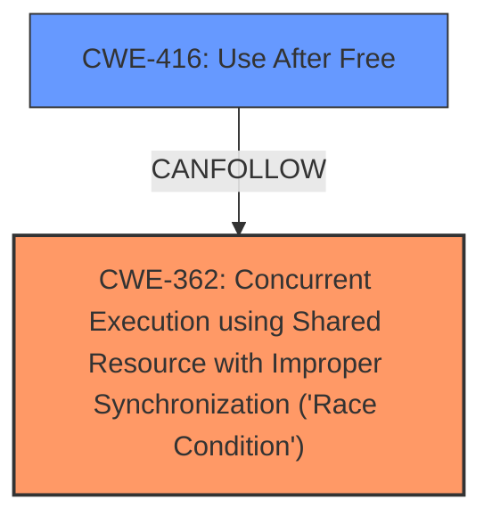

# Analysis for CVE-2024-56788

# Summary
| CWE ID | CWE Name | Confidence | CWE Abstraction Level | CWE Vulnerability Mapping Label | CWE-Vulnerability Mapping Notes |
|---|---|---|---|---|---|
| CWE-362 | Concurrent Execution using Shared Resource with Improper Synchronization ('**Race Condition**') | 1.0 | Class | Primary | Allowed-with-Review |
| CWE-416 | Use After Free | 0.7 | Variant | Secondary | Allowed |

## Evidence and Confidence

*   **Confidence Score:** 0.8
*   **Evidence Strength:** HIGH

## Relationship Analysis
The primary weakness is identified as CWE-362, a Class-level CWE representing a **race condition**. While CWE-362 is a Class, it directly reflects the vulnerability description's key phrase "**race condition**." A more specific Base CWE under CWE-362 could provide greater detail, but the provided description doesn't offer enough information to pinpoint the exact type of **race condition**. CWE-416 is considered as a secondary issue, possibly arising as a consequence of the **race condition** which causes an unhandled tx skb that could lead to a use-after-free scenario.

## Vulnerability Chain
The vulnerability chain begins with a **race condition** (CWE-362) in the management of tx skb pointers in the Linux kernel. This leads to a scenario where a tx skb is left unhandled, which could potentially lead to a use-after-free condition (CWE-416), and ultimately result in packet loss and memory leak.
  - Root cause: CWE-362 (**Race Condition**)
  - Impact: CWE-416 (Use After Free), Packet missing and memory leak.

## Summary of Analysis
The initial assessment strongly points to CWE-362 (Concurrent Execution using Shared Resource with Improper Synchronization ('**Race Condition**')) as the primary weakness, supported by the vulnerability description explicitly stating a "**race condition**" as the root cause. The retriever results also listed CWE-362 as the top candidate.

The relationship analysis considered alternative CWEs. However, the direct and explicit mention of "**race condition**" in the vulnerability description, combined with the high score in the retriever results, solidified the choice of CWE-362 as the primary weakness.

The final decision is based on the evidence within the vulnerability description. The selection of CWE-362, at the Class level, provides an accurate representation of the weakness.

Relevant CWE Information:

# Enhanced Context (25 CWEs)
The following CWEs were identified as potentially relevant to this vulnerability:

## CWE-366: Race Condition within a Thread
**Abstraction Level**: Base
**Similarity Score**: 0.75
**Source**: dense

**Description**:
If two threads of execution use a resource simultaneously, there exists the possibility that resources may be used while invalid, in turn making the state of execution undefined.

**Mapping Guidance**:
- Usage: Allowed
- Rationale: This CWE entry is at the Base level of abstraction, which is a preferred level of abstraction for mapping to the root causes of vulnerabilities.

## CWE-362: Concurrent Execution using Shared Resource with Improper Synchronization ('Race Condition')
**Abstraction Level**: Class
**Similarity Score**: 1.00
**Source**: retriever

**Description**:
The product contains a concurrent code sequence that requires temporary, exclusive access to a shared resource, but a timing window exists in which the shared resource can be modified by another code sequence operating concurrently.

**Mapping Guidance**:
- Usage: Allowed-with-Review
- Rationale: This CWE entry is a Class and might have Base-level children that would be more appropriate

## CWE-416: Use After Free
**Abstraction Level**: variant
**Similarity Score**: 2.49
**Source**: graph

**Description**:
CWE-416: Use After Free

**Mapping Guidance**:
- Usage: Allowed
- Rationale: This CWE entry is at the Variant level of abstraction, which is a preferred level of abstraction for mapping to the root causes of vulnerabilities.

**Relationships**:
- CANFOLLOW -> CWE-754
- CANFOLLOW -> CWE-364
- CANFOLLOW -> CWE-362
- CANFOLLOW -> CWE-1265
- CANPRECEDE -> CWE-123

### Detailed Analysis of Selected CWEs:

*   **CWE-362: Concurrent Execution using Shared Resource with Improper Synchronization ('Race Condition')**
    *   **Explanation:** The vulnerability description explicitly mentions a "**race condition**" in the handling of tx skb pointers between two threads. This aligns directly with the definition of CWE-362, where concurrent execution and improper synchronization lead to a timing window that allows a shared resource (tx skb pointers) to be modified unexpectedly.
    *   **Security Implications:** This **race condition** can lead to data corruption, denial of service, or other unpredictable behavior. In this specific case, it results in a packet missing and memory leak.
    *   **Relationship:** CWE-362 is a Class-level CWE. While more specific Base-level CWEs exist under CWE-362, the provided description doesn't offer enough detail to pinpoint the exact type of **race condition**.
    *   **Mapping Guidance:** The MITRE mapping guidance allows for using CWE-362 with review, acknowledging that more specific children might be appropriate. However, given the available information, CWE-362 is the most accurate and representative choice.
    *   **Evidence:** "**race condition** between reference pointers"
*   **CWE-416: Use After Free**
    *   **Explanation:** The vulnerability description describes a scenario where a tx skb can be left unhandled due to the **race condition**. This unhandled skb could potentially be freed while still being referenced by another part of the system, leading to a use-after-free condition.
    *   **Security Implications:** Use-after-free vulnerabilities can lead to arbitrary code execution, information disclosure, or denial of service.
    *   **Relationship:** CWE-416 is a variant of CWE-664: Improper Control of a Resource Through its Lifetime, and can follow CWE-362.
    *   **Mapping Guidance:** The MITRE mapping guidance allows for using CWE-416.
    *   **Evidence:** "Finally one of the tx skb will be left as unhandled, resulting packet missing and memory leak."

### Considered but Not Used:

*   **CWE-833: Deadlock:** While concurrency is involved, the description doesn't indicate a deadlock situation where threads are blocked indefinitely waiting for each other.
*   **CWE-476: NULL Pointer Dereference:** While the **race condition** can lead to null pointers being assigned, the core issue is the concurrency problem, not the direct dereference of a null pointer.
*   **CWE-824: Access of Uninitialized Pointer:** The issue isn't primarily about accessing an uninitialized pointer but about the **race condition** that leads to incorrect pointer management.
*   **CWE-252: Unchecked Return Value:** There's no mention of unchecked return values contributing to the vulnerability.
*   **CWE-366: Race Condition within a Thread:** While this is related to a **race condition**, CWE-362 is a more general and appropriate classification for the described scenario.
*   **CWE-123: Write-what-where Condition:** This is not directly applicable as the vulnerability isn't about writing arbitrary data to arbitrary locations.
*   **CWE-789: Memory Allocation with Excessive Size Value:** There's no indication of memory allocation with excessive size values in the description.