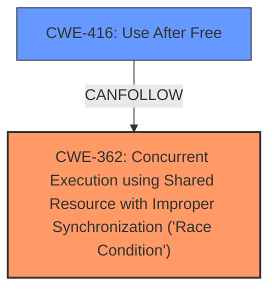

# Analysis Report for CVE-2024-56788

# Vulnerability Analysis Report: CVE-2024-56788

## Description

In the Linux kernel, the following vulnerability has been resolved net ethernet oa_tc6 fix tx skb **race condition** between reference pointers There are two skb pointers to manage tx skbs enqueued from n/w stack. waiting_tx_skb pointer points to the tx skb which needs to be processed and ongoing_tx_skb pointer points to the tx skb which is being processed. SPI thread prepares the tx data chunks from the tx skb pointed by the ongoing_tx_skb pointer. When the tx skb pointed by the ongoing_tx_skb is processed, the tx skb pointed by the waiting_tx_skb is assigned to ongoing_tx_skb and the waiting_tx_skb pointer is assigned with NULL. Whenever there is a new tx skb from n/w stack, it will be assigned to waiting_tx_skb pointer if it is NULL. Enqueuing and processing of a tx skb handled in two different threads. Consider a scenario where the SPI thread processed an ongoing_tx_skb and it moves next tx skb from waiting_tx_skb pointer to ongoing_tx_skb pointer without doing any NULL check. At this time, if the waiting_tx_skb pointer is NULL then ongoing_tx_skb pointer is also assigned with NULL. After that, if a new tx skb is assigned to waiting_tx_skb pointer by the n/w stack and there is a chance to overwrite the tx skb pointer with NULL in the SPI thread. Finally one of the tx skb will be left as unhandled, resulting packet missing and memory leak. - Consider the below scenario where the TXC reported from the previous transfer is 10 and ongoing_tx_skb holds an tx ethernet frame which can be transported in 20 TXCs and waiting_tx_skb is still NULL. tx_credits = 10 /* 21 are filled in the previous transfer */ ongoing_tx_skb = 20 waiting_tx_skb = NULL /* Still NULL */ - So, (tc6->ongoing_tx_skb || tc6->waiting_tx_skb) becomes true. - After oa_tc6_prepare_spi_tx_buf_for_tx_skbs() ongoing_tx_skb = 10 waiting_tx_skb = NULL /* Still NULL */ - Perform SPI transfer. - Process SPI rx buffer to get the TXC from footers. - Now lets assume previously filled 21 TXCs are freed so we are good to transport the next remaining 10 tx chunks from ongoing_tx_skb. tx_credits = 21 ongoing_tx_skb = 10 waiting_tx_skb = NULL - So, (tc6->ongoing_tx_skb || tc6->waiting_tx_skb) becomes true again. - In the oa_tc6_prepare_spi_tx_buf_for_tx_skbs() ongoing_tx_skb = NULL waiting_tx_skb = NULL - Now the below bad case might happen, Thread1 (oa_tc6_start_xmit) Thread2 (oa_tc6_spi_thread_handler) --------------------------- ----------------------------------- - if waiting_tx_skb is NULL - if ongoing_tx_skb is NULL - ongoing_tx_skb = waiting_tx_skb - waiting_tx_skb = skb - waiting_tx_skb = NULL ... - ongoing_tx_skb = NULL - if waiting_tx_skb is NULL - waiting_tx_skb = skb To overcome the above issue, protect the moving of tx skb reference from waiting_tx_skb pointer to ongoing_tx_skb pointer and assigning new tx skb to waiting_tx_skb pointer, so that the other thread cant access the waiting_tx_skb pointer until the current thread completes moving the tx skb reference safely.

## Vulnerability Description Key Phrases

- **Rootcause:** race condition
- **Impact:** ['packet missing', 'memory leak']
- **Product:** Linux kernel
- **Component:** net ethernet

## Analysis (with Relationship Data)

# Summary
| CWE ID | CWE Name | Confidence | CWE Abstraction Level | CWE Vulnerability Mapping Label | CWE-Vulnerability Mapping Notes |
|---|---|---|---|---|---|
| CWE-362 | Concurrent Execution using Shared Resource with Improper Synchronization ('**Race Condition**') | 1.0 | Class | Primary | Allowed-with-Review |
| CWE-416 | Use After Free | 0.7 | Variant | Secondary | Allowed |

## Evidence and Confidence

*   **Confidence Score:** 0.8
*   **Evidence Strength:** HIGH

## Relationship Analysis
The primary weakness is identified as CWE-362, a Class-level CWE representing a **race condition**. While CWE-362 is a Class, it directly reflects the vulnerability description's key phrase "**race condition**." A more specific Base CWE under CWE-362 could provide greater detail, but the provided description doesn't offer enough information to pinpoint the exact type of **race condition**. CWE-416 is considered as a secondary issue, possibly arising as a consequence of the **race condition** which causes an unhandled tx skb that could lead to a use-after-free scenario.



## Vulnerability Chain
The vulnerability chain begins with a **race condition** (CWE-362) in the management of tx skb pointers in the Linux kernel. This leads to a scenario where a tx skb is left unhandled, which could potentially lead to a use-after-free condition (CWE-416), and ultimately result in packet loss and memory leak.
  - Root cause: CWE-362 (**Race Condition**)
  - Impact: CWE-416 (Use After Free), Packet missing and memory leak.

## Summary of Analysis
The initial assessment strongly points to CWE-362 (Concurrent Execution using Shared Resource with Improper Synchronization ('**Race Condition**')) as the primary weakness, supported by the vulnerability description explicitly stating a "**race condition**" as the root cause. The retriever results also listed CWE-362 as the top candidate.

The relationship analysis considered alternative CWEs. However, the direct and explicit mention of "**race condition**" in the vulnerability description, combined with the high score in the retriever results, solidified the choice of CWE-362 as the primary weakness.

The final decision is based on the evidence within the vulnerability description. The selection of CWE-362, at the Class level, provides an accurate representation of the weakness.

Relevant CWE Information:

# Enhanced Context (25 CWEs)
The following CWEs were identified as potentially relevant to this vulnerability:

## CWE-366: Race Condition within a Thread
**Abstraction Level**: Base
**Similarity Score**: 0.75
**Source**: dense

**Description**:
If two threads of execution use a resource simultaneously, there exists the possibility that resources may be used while invalid, in turn making the state of execution undefined.

**Mapping Guidance**:
- Usage: Allowed
- Rationale: This CWE entry is at the Base level of abstraction, which is a preferred level of abstraction for mapping to the root causes of vulnerabilities.

## CWE-362: Concurrent Execution using Shared Resource with Improper Synchronization ('Race Condition')
**Abstraction Level**: Class
**Similarity Score**: 1.00
**Source**: retriever

**Description**:
The product contains a concurrent code sequence that requires temporary, exclusive access to a shared resource, but a timing window exists in which the shared resource can be modified by another code sequence operating concurrently.

**Mapping Guidance**:
- Usage: Allowed-with-Review
- Rationale: This CWE entry is a Class and might have Base-level children that would be more appropriate

## CWE-416: Use After Free
**Abstraction Level**: variant
**Similarity Score**: 2.49
**Source**: graph

**Description**:
CWE-416: Use After Free

**Mapping Guidance**:
- Usage: Allowed
- Rationale: This CWE entry is at the Variant level of abstraction, which is a preferred level of abstraction for mapping to the root causes of vulnerabilities.

**Relationships**:
- CANFOLLOW -> CWE-754
- CANFOLLOW -> CWE-364
- CANFOLLOW -> CWE-362
- CANFOLLOW -> CWE-1265
- CANPRECEDE -> CWE-123

### Detailed Analysis of Selected CWEs:

*   **CWE-362: Concurrent Execution using Shared Resource with Improper Synchronization ('Race Condition')**
    *   **Explanation:** The vulnerability description explicitly mentions a "**race condition**" in the handling of tx skb pointers between two threads. This aligns directly with the definition of CWE-362, where concurrent execution and improper synchronization lead to a timing window that allows a shared resource (tx skb pointers) to be modified unexpectedly.
    *   **Security Implications:** This **race condition** can lead to data corruption, denial of service, or other unpredictable behavior. In this specific case, it results in a packet missing and memory leak.
    *   **Relationship:** CWE-362 is a Class-level CWE. While more specific Base-level CWEs exist under CWE-362, the provided description doesn't offer enough detail to pinpoint the exact type of **race condition**.
    *   **Mapping Guidance:** The MITRE mapping guidance allows for using CWE-362 with review, acknowledging that more specific children might be appropriate. However, given the available information, CWE-362 is the most accurate and representative choice.
    *   **Evidence:** "**race condition** between reference pointers"
*   **CWE-416: Use After Free**
    *   **Explanation:** The vulnerability description describes a scenario where a tx skb can be left unhandled due to the **race condition**. This unhandled skb could potentially be freed while still being referenced by another part of the system, leading to a use-after-free condition.
    *   **Security Implications:** Use-after-free vulnerabilities can lead to arbitrary code execution, information disclosure, or denial of service.
    *   **Relationship:** CWE-416 is a variant of CWE-664: Improper Control of a Resource Through its Lifetime, and can follow CWE-362.
    *   **Mapping Guidance:** The MITRE mapping guidance allows for using CWE-416.
    *   **Evidence:** "Finally one of the tx skb will be left as unhandled, resulting packet missing and memory leak."

### Considered but Not Used:

*   **CWE-833: Deadlock:** While concurrency is involved, the description doesn't indicate a deadlock situation where threads are blocked indefinitely waiting for each other.
*   **CWE-476: NULL Pointer Dereference:** While the **race condition** can lead to null pointers being assigned, the core issue is the concurrency problem, not the direct dereference of a null pointer.
*   **CWE-824: Access of Uninitialized Pointer:** The issue isn't primarily about accessing an uninitialized pointer but about the **race condition** that leads to incorrect pointer management.
*   **CWE-252: Unchecked Return Value:** There's no mention of unchecked return values contributing to the vulnerability.
*   **CWE-366: Race Condition within a Thread:** While this is related to a **race condition**, CWE-362 is a more general and appropriate classification for the described scenario.
*   **CWE-123: Write-what-where Condition:** This is not directly applicable as the vulnerability isn't about writing arbitrary data to arbitrary locations.
*   **CWE-789: Memory Allocation with Excessive Size Value:** There's no indication of memory allocation with excessive size values in the description.


## CWE Relationship Analysis

Current CWEs represent these abstraction levels: .


### Vulnerability Chain Analysis

**Chain starting from CWE-123:**
- 123 (Write-what-where Condition) - ROOT


**Chain starting from CWE-416:**
- 416 (Use After Free) - ROOT


### CWE Relationship Diagram

```mermaid
graph TD
    classDef primary fill:#f96,stroke:#333,stroke-width:2px
    classDef secondary fill:#69f,stroke:#333
    classDef tertiary fill:#9e9,stroke:#333
```


*Report generated on 2025-07-13 23:57:45*
