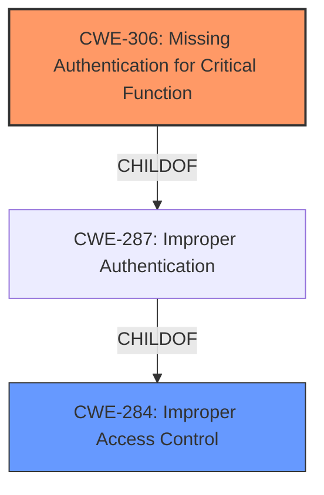

# Analysis Report for CVE-2024-56897

# Vulnerability Analysis Report: CVE-2024-56897

## Description

**Improper access control** in the HTTP server in YI Car Dashcam v3.88 allows unrestricted file downloads, uploads, and API commands. API commands can also be made to make unauthorized modifications to the device settings, such as disabling recording, disabling sounds, factory reset.

## Vulnerability Description Key Phrases

- **Rootcause:** Improper access control
- **Impact:** ['unrestricted file downloads', 'factory reset', 'API commands', 'uploads']
- **Product:** YI Car Dashcam
- **Version:** v3.88
- **Component:** HTTP server

## Analysis (with Relationship Data)

# Summary
| CWE ID | CWE Name | Confidence | CWE Abstraction Level | CWE Vulnerability Mapping Label | CWE-Vulnerability Mapping Notes |
|---|---|---|---|---|---|
| CWE-306 | Missing Authentication for Critical Function | 0.9 | Base | Primary | Allowed |
| CWE-284 | Improper Access Control | 0.7 | Pillar | Secondary | Discouraged |

## Evidence and Confidence

*   **Confidence Score:** 0.8
*   **Evidence Strength:** HIGH

## Relationship Analysis
The primary relationship is between CWE-284 (Improper Access Control) and CWE-306 (Missing Authentication for Critical Function). CWE-306 is a child of CWE-287 (Improper Authentication), which in turn is related to CWE-284. Since the vulnerability description explicitly points to a **lack of authentication** for critical functions, CWE-306 is the more specific and appropriate choice as the root cause. CWE-284 is too general and should be avoided when a more specific child CWE is applicable.



## Vulnerability Chain
The vulnerability chain starts with the **missing authentication** (CWE-306) on the HTTP server. This **lack of authentication** then leads to **improper access control**, allowing unauthorized file downloads, uploads, and API command executions, including modifications to device settings and factory resets.

CWE-306 (Root Cause) -> CWE-Other (Impact: Unauthorized Actions)

## Summary of Analysis
The initial analysis considered both CWE-284 (Improper Access Control) and CWE-306 (Missing Authentication for Critical Function). However, the vulnerability description and the CVE Reference Links Content Summary specifically mention the **lack of authentication** as the root cause, making CWE-306 the more accurate and specific choice. The "Authentication vs Authorization vs Access Control Guidance" clearly states that CWE-306 is used when no identity validation is enforced for sensitive functionality. The provided evidence and the relationship analysis support the selection of CWE-306 as the primary CWE.

The vulnerability description states: "**Improper access control** in the HTTP server in YI Car Dashcam v3.88 allows unrestricted file downloads, uploads, and API commands." and the CVE Reference Links Content Summary states "The vulnerability stems from an unrestricted HTTP server accessible on the YI Car Dashcam after connecting with default or weak credentials." This directly points to a **lack of authentication** for critical functions, aligning with the characteristics of CWE-306.

The selection of CWE-306 is at the optimal level of specificity because it directly addresses the root cause of the vulnerability, which is the **missing authentication** for critical functions on the HTTP server. This allows for a more targeted approach to mitigation, such as implementing proper authentication mechanisms to prevent unauthorized access.

Relevant CWE Information:

# Enhanced Context (25 CWEs)
The following CWEs were identified as potentially relevant to this vulnerability:

## CWE-425: Direct Request ('Forced Browsing')
**Abstraction Level**: Base
**Similarity Score**: 0.76
**Source**: dense

**Description**:
The web application does not adequately enforce appropriate authorization on all restricted URLs, scripts, or files.

**Mapping Guidance**:
- Usage: Allowed
- Rationale: This CWE entry is at the Base level of abstraction, which is a preferred level of abstraction for mapping to the root causes of vulnerabilities.

**CWE-425 (Direct Request ('Forced Browsing'))**: Considered but not chosen because the root cause is not related to authorization, but instead the **missing authentication**.

## CWE-1391: Use of Weak Credentials
**Abstraction Level**: Class
**Similarity Score**: 0.75
**Source**: dense

**Description**:
The product uses weak credentials (such as a default key or hard-coded password) that can be calculated, derived, reused, or guessed by an attacker.

**Mapping Guidance**:
- Usage: Allowed-with-Review
- Rationale: This CWE entry is a Class and might have Base-level children that would be more appropriate

**CWE-1391 (Use of Weak Credentials)**: This CWE is related to the use of default/weak passwords, which are mentioned in the description, but the main issue is the **lack of authentication** in the first place, making CWE-306 a more direct fit.

## CWE-472: External Control of Assumed-Immutable Web Parameter
**Abstraction Level**: Base
**Similarity Score**: 0.75
**Source**: dense

**Description**:
The web application does not sufficiently verify inputs that are assumed to be immutable but are actually externally controllable, such as hidden form fields.

**Mapping Guidance**:
- Usage: Allowed
- Rationale: This CWE entry is at the Base level of abstraction, which is a preferred level of abstraction for mapping to the root causes of vulnerabilities.

**CWE-472 (External Control of Assumed-Immutable Web Parameter)**: Not relevant as the vulnerability doesn't involve manipulating immutable web parameters.

## CWE-345: Insufficient Verification of Data Authenticity
**Abstraction Level**: Class
**Similarity Score**: 0.75
**Source**: dense

**Description**:
The product does not sufficiently verify the origin or authenticity of data, in a way that causes it to accept invalid data.

**Mapping Guidance**:
- Usage: Discouraged
- Rationale: This CWE entry is a level-1 Class (i.e., a child of a Pillar). It might have lower-level children that would be more appropriate

**CWE-345 (Insufficient Verification of Data Authenticity)**: Not applicable. The vulnerability is not related to verifying the authenticity of data.

## CWE-41: Improper Resolution of Path Equivalence
**Abstraction Level**: Base
**Similarity Score**: 0.74
**Source**: dense

**Description**:
The product is vulnerable to file system contents disclosure through path equivalence. Path equivalence involves the use of special characters in file and directory names. The associated manipulations are intended to generate multiple names for the same object.

**Mapping Guidance**:
- Usage: Allowed
- Rationale: This CWE entry is at the Base level of abstraction, which is a preferred level of abstraction for mapping to the root causes of vulnerabilities.

**CWE-41 (Improper Resolution of Path Equivalence)**: Not applicable. The vulnerability is not related to path equivalence issues.

## CWE-1390: Weak Authentication
**Abstraction Level**: Class
**Similarity Score**: 0.74
**Source**: dense

**Description**:
The product uses an authentication mechanism to restrict access to specific users or identities, but the mechanism does not sufficiently prove that the claimed identity is correct.

**Mapping Guidance**:
- Usage: Allowed-with-Review
- Rationale: This CWE entry is a Class and might have Base-level children that would be more appropriate

**CWE-1390 (Weak Authentication)**: This is similar to the use of weak credentials. But CWE-306 is more appropriate because it's about **missing authentication**.

## CWE-639: Authorization Bypass Through User-Controlled Key
**Abstraction Level**: Base
**Similarity Score**: 0.74
**Source**: dense

**Description**:
The system's authorization functionality does not prevent one user from gaining access to another user's data or record by modifying the key value identifying the data.

**Mapping Guidance**:
- Usage: Allowed
- Rationale: This CWE entry is at the Base level of abstraction, which is a preferred level of abstraction for mapping to the root causes of vulnerabilities.

**CWE-639 (Authorization Bypass Through User-Controlled Key)**: Not applicable as it pertains to authorization bypass, not a **missing authentication**.

## CWE-807: Reliance on Untrusted Inputs in a Security Decision
**Abstraction Level**: Base
**Similarity Score**: 0.74
**Source**: dense

**Description**:
The product uses a protection mechanism that relies on the existence or values of an input, but the input can be modified by an untrusted actor in a way that bypasses the protection mechanism.

**Mapping Guidance**:
- Usage: Allowed
- Rationale: This CWE entry is at the Base level of abstraction, which is a preferred level of abstraction for mapping to the root causes of vulnerabilities.

**CWE-807 (Reliance on Untrusted Inputs in a Security Decision)**: Not applicable. The vulnerability is not about security decisions based on untrusted inputs.

## CWE-668: Exposure of Resource to Wrong Sphere
**Abstraction Level**: Class
**Similarity Score**: 0.74
**


## CWE Relationship Analysis

Current CWEs represent these abstraction levels: .


### Vulnerability Chain Analysis

**Chain starting from CWE-1390:**
- 1390 (Weak Authentication) - ROOT


**Chain starting from CWE-345:**
- 345 (Insufficient Verification of Data Authenticity) - ROOT


### CWE Relationship Diagram

```mermaid
graph TD
    classDef primary fill:#f96,stroke:#333,stroke-width:2px
    classDef secondary fill:#69f,stroke:#333
    classDef tertiary fill:#9e9,stroke:#333
```


*Report generated on 2025-07-13 23:59:49*
