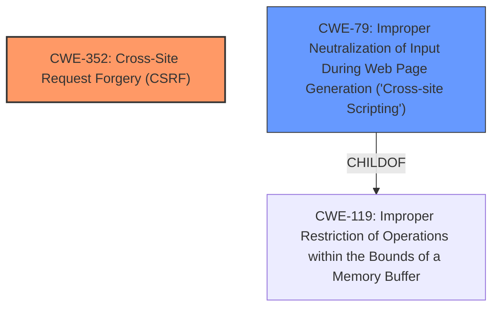

# Enhanced Analysis for CVE-2024-56924

# Summary
| CWE ID | CWE Name | Confidence | CWE Abstraction Level | CWE Vulnerability Mapping Label | CWE-Vulnerability Mapping Notes |
|---|---|---|---|---|---|
| CWE-352 | Cross-Site Request Forgery (CSRF) | 1.0 | Compound | Allowed | Primary CWE |
| CWE-79 | Improper Neutralization of Input During Web Page Generation ('Cross-site Scripting') | 0.7 | Base | Allowed | Secondary Candidate |

## Evidence and Confidence

*   **Confidence Score:** 0.85
*   **Evidence Strength:** HIGH

## Relationship Analysis
The primary weakness is CWE-352 [Cross-Site Request Forgery (CSRF)]. CWE-79 [Improper Neutralization of Input During Web Page Generation ('Cross-site Scripting')] is added as a secondary weakness because the CSRF vulnerability leads to the execution of arbitrary JavaScript. While CWE-79 is a child of CWE-119 [Improper Restriction of Operations within the Bounds of a Memory Buffer], this relationship does not directly impact the mapping as CWE-79 is directly related to the described impact. There isn't a direct chain relationship that dictates the mapping, rather, the two CWEs are related by the attack's method and its impact.



## Vulnerability Chain
The vulnerability chain starts with the **improper validation of user requests** leading to a **Cross-Site Request Forgery (CSRF)** vulnerability. This then allows remote attackers to execute arbitrary JavaScript, leading to unauthorized actions.

Root Cause: **Improper validation of user requests** -> Weakness: **Cross-Site Request Forgery (CSRF)** -> Impact: Execute arbitrary JavaScript.

## Summary of Analysis
The initial assessment identified CWE-352 [Cross-Site Request Forgery (CSRF)] as the primary weakness due to the **improper validation of user requests**, which allows an attacker to perform actions on behalf of an authenticated user. The vulnerability description and CVE reference links confirm this. The secondary weakness, CWE-79 [Improper Neutralization of Input During Web Page Generation ('Cross-site Scripting')], is added because the CSRF leads to the execution of arbitrary JavaScript.

The evidence for CWE-352 [Cross-Site Request Forgery (CSRF)] is: "A **Cross Site Request Forgery** (CSRF) vulnerability...allows remote attackers to execute arbitrary JavaScript... This vulnerability occurs due to **improper validation of user requests**".

The evidence for CWE-79 [Improper Neutralization of Input During Web Page Generation ('Cross-site Scripting')] is: "...allows remote attackers to execute arbitrary JavaScript on the admin page".

CWE-89 [Improper Neutralization of Special Elements used in an SQL Command ('SQL Injection')] was considered because of the potential for data modification, but it was discarded because the vulnerability description focuses on CSRF and JavaScript execution rather than SQL injection. CWE-918 [Server-Side Request Forgery (SSRF)] was also considered but deemed less relevant than CWE-352 [Cross-Site Request Forgery (CSRF)] as the core issue is the lack of CSRF protection, not the manipulation of server-side requests.
The selected CWEs are at the optimal level of specificity as they directly represent the vulnerability and its impact.


## CWE Relationship Analysis

Current CWEs represent these abstraction levels: .


### Vulnerability Chain Analysis

**Chain starting from CWE-89:**
- 89 (Improper Neutralization of Special Elements used in an SQL Command ('SQL Injection')) - ROOT


**Chain starting from CWE-79:**
- 79 (Improper Neutralization of Input During Web Page Generation ('Cross-site Scripting')) - ROOT


### CWE Relationship Diagram

```mermaid
graph TD
    classDef primary fill:#f96,stroke:#333,stroke-width:2px
    classDef secondary fill:#69f,stroke:#333
    classDef tertiary fill:#9e9,stroke:#333
```